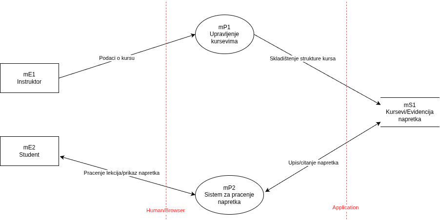
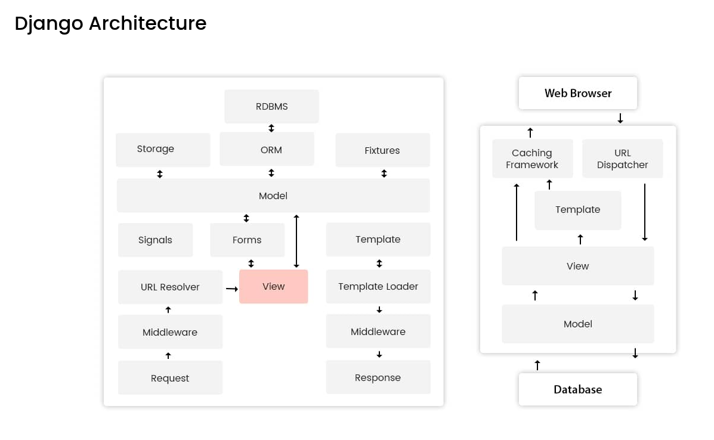
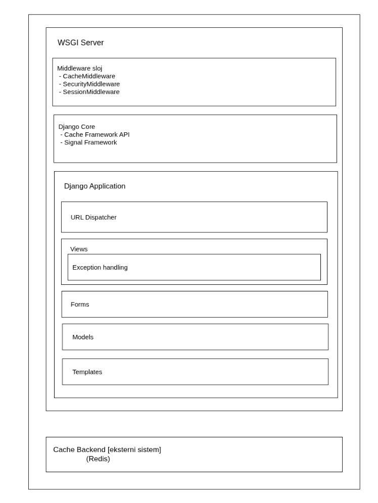
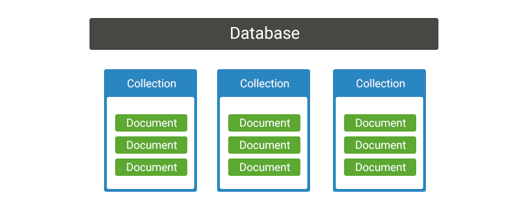
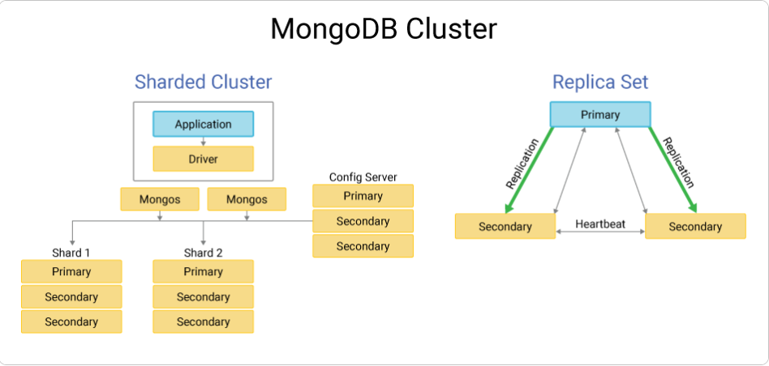

# Uvod

U okviru sistema **LearnHub**, jedan od ključnih funkcionalnih segmenata
jeste upravljanje kursevima i praćenje napretka studenata tokom njihovog
pohađanja kurseva. Ovaj deo sistema omogućava instruktorima da kreiraju
i ažuriraju kurseve, dok studentima pruža uvid u dostupne lekcije, kao i
pregled sopstvenog napretka kroz kurs.

Kako bi se jasnije prikazao način na koji podaci teku između učesnika
sistema, obrađen je **dijagram toka podataka (DFD)** koji se fokusira
isključivo na procese vezane za upravljanje kursevima i evidenciju
napretka studenata. Dijagram apstrahuje ostale funkcionalnosti sistema i
prikazuje samo osnovne tokove podataka relevantne za ovaj domen.

# Opis dijagrama toka podataka

Dijagram toka podataka prikazuje interakciju instruktora i studenata sa
sistemom LearnHub prilikom kreiranja kurseva, praćenja lekcija i
evidencije napretka. Centralni procesi sistema zaduženi su za obradu
podataka o kursevima i napretku, dok se svi relevantni podaci trajno
čuvaju u zajedničkom skladištu podataka.

Dijagram je modelovan na visokom nivou apstrakcije, sa ciljem da se
prikaže osnovna logika sistema bez ulaska u detalje implementacije ili
arhitekture. U nastavku sledi opis elemenata dijagrama.

## Eksterni entiteti

**Instruktor (mE1)**  
Instruktor predstavlja eksterni entitet koji kreira i održava kurseve na
platformi. On sistemu prosleđuje podatke o kursu, uključujući strukturu
kursa, lekcije i izmene postojećeg sadržaja.

**Student (mE2)**  
Student je eksterni entitet koji koristi sistem za pristup kursevima i
praćenje sopstvenog napretka. Student dobija informacije o završenim
lekcijama i trenutnom stanju napretka kroz kurs.

## Procesi

**Upravljanje kursevima (mP1)**  
Ovaj proces je zadužen za obradu podataka vezanih za kreiranje i
ažuriranje kurseva. Na osnovu ulaznih podataka koje prosleđuje
instruktor, sistem formira strukturu kursa i priprema je za
skladištenje.

**Sistem za praćenje napretka (mP2)**  
Proces za praćenje napretka evidentira aktivnosti studenta tokom
pohađanja kursa. On omogućava upis i čitanje informacija o završenim
lekcijama, kao i prikaz trenutnog napretka studentu.

## Skladište podataka

**Kursevi / Evidencija napretka (mS1)**  
Skladište podataka predstavlja centralnu bazu u kojoj se čuvaju
informacije o kursevima, njihovoj strukturi, kao i podaci o napretku
studenata kroz kurseve. Ovo skladište omogućava trajno čuvanje i kasnije
korišćenje podataka od strane sistema.

## Tokovi podataka

- **Podaci o kursu** – tok podataka kojim instruktor prosleđuje informacije o kursu procesu za upravljanje kursevima.

- **Skladištenje strukture kursa** – tok kojim se obrađeni podaci o kursu upisuju u bazu podataka.

- **Upis/čitanje napretka** – dvosmerni tok između sistema za praćenje napretka i baze, kojim se evidentira i učitava stanje napretka studenta.

- **Praćenje lekcija / prikaz napretka** – tok podataka kojim se studentu prikazuju informacije o završenim lekcijama i ukupnom napretku.

# Django arhitektura

U ovom poglavlju biće predstavljena arhitektura Django frameworka i
njegove osnovne komponente. Na slici ispod prikazan je dijagram koji
ilustruje kompletan pregled Django arhitekture sa svim njenim
komponentama i njihovim međusobnim vezama.

Za potrebe našeg sistema za kurseve i praćenje napretka studenata,
detaljno će biti opisane sljedeće komponente: URL Dispatcher, Caching
Framework, Template, View, Model, Signals, Forms, Middleware, Exception
handling i WSGI server. Ove komponente su izabrane jer direktno utiču na
funkcionalnost sistema i predstavljaju ključne elemente implementacije.

Komponente vezane za ORM sloj, kao što su Storage, RDBMS, Fixtures i
Template Loader, neće biti detaljno obrađene jer naš sistem koristi
MongoDB kao nerelacionu bazu podataka, te nam klasičan Django ORM
pristup nije potreban.

## Caching Framework

Django Cache Framework služi da aplikacija radi brže i stabilnije tako
što privremeno čuva već izračunate ili učitane podatke u memoriji. Ideja
je vrlo jednostavna: nema potrebe da server stalno ponavlja iste teške
operacije ako je rezultat već jednom dobio. Kod dinamičkih web
aplikacija, svaki zahtev obično znači prolazak kroz rute, slanje upita
bazi podataka, obradu poslovne logike i na kraju renderovanje stranice.
Ako veliki broj korisnika u isto vreme traži istu stranicu, server
iznova radi potpuno iste stvari, što može dovesti do usporenja ili čak
pada sistema. Keširanje rešava taj problem tako što sačuva rezultat
prvog zahteva i narednim korisnicima ga odmah isporuči, bez dodatnog
opterećenja servera. Na taj način vreme odziva se značajno smanjuje, a
baza podataka ostaje zaštićena od prevelikog broja upita.

Keširanje se najčešće koristi za podatke koji se ne menjaju često, kao
što su cenovnici, blog objave ili liste popularnih sadržaja. Takođe je
veoma korisno kod složenih proračuna nad velikim količinama podataka ili
pri pozivanju eksternih API servisa, kako se ti pozivi ne bi izvršavali
pri svakom učitavanju stranice.

ntegracija Django Cache Framework-a počinje u settings.py fajlu, gde se
definiše keš backend. U razvojnom okruženju obično se koristi
jednostavno rešenje, poput file-based keša ili Memcached-a, dok se u
produkciji najčešće bira Redis zbog brzine i pouzdanosti. Nakon toga se
odlučuje na kom nivou će se keš primenjivati. Najjednostavniji pristup
je keširanje celog view-a, čime se automatski čuva kompletan odgovor
koji taj view vraća. Druga opcija je keširanje samo delova HTML šablona
koji su statični, poput navigacije ili sidebar-a. Za potpunu kontrolu
postoji i low-level API, koji omogućava ručno keširanje konkretnih
podataka, na primer rezultata složenog upita koji spaja više tabela.
Važan deo keširanja je brisanje zastarelih podataka. Kada se podaci
promene, stari keš mora biti uklonjen kako korisnici ne bi dobijali
pogrešne informacije. To se može automatizovati pomoću Django signala
ili ručno, pozivanjem cache.delete() nakon izmene. Takođe, potrebno je
pažljivo podesiti vreme trajanja keša, jer nema smisla čuvati podatke
satima ako se oni često menjaju.

## URL Dispatcher

Django URL Dispatcher ima zadatak da poveže web adrese koje korisnici
posećuju sa odgovarajućim delovima koda koji treba da se izvrše. Možemo
ga posmatrati kao neku vrstu „saobraćajnog policajca“ u aplikaciji – on
odlučuje koja funkcija će se pokrenuti kada neko otvori određeni URL.
Ova komponenta rešava nekoliko važnih problema. Pre svega, omogućava da
izgled URL-ova bude odvojen od same logike aplikacije, što znači da
možemo menjati strukturu linkova bez potrebe da diramo Python kod.
Zatim, pomaže u kreiranju jasnih i čitljivih URL-ova koji su prijatniji
za korisnike i bolji za pretraživače. Na kraju, URL Dispatcher može da
„izvuče“ važne informacije direktno iz adrese, kao što su ID nekog
objekta ili naziv artikla, i prosledi ih dalje aplikaciji u obliku
podataka koje view odmah može da koristi. Bez ove komponente, aplikacija
ne bi znala šta da uradi kada korisnik poseti određenu stranicu, a i
najmanja promena u strukturi sajta zahtevala bi izmene na više mesta u
kodu.

URL Dispatcher se koristi stalno u svakoj Django aplikaciji, ali je
posebno važan kada radimo sa dinamičkim sadržajem. Umesto da ručno
definišemo ogroman broj različitih URL-ova, koristimo parametre unutar
putanja. Takođe je veoma koristan u većim projektima, gde URL-ove
organizujemo po aplikacijama kako bi kod ostao pregledan i lak za
održavanje. Integracija počinje u urls.py fajlu, gde se definišu putanje
pomoću path() funkcije. Ona prima šablon URL-a, view koji treba da se
izvrši i opcionalno ime rute. Delovi URL-a koji se nalaze u uglastim
zagradama služe za automatsko preuzimanje i proveru podataka. Na primer,
\<int:id\> osigurava da je prosleđena vrednost ceo broj, dok
\<slug:naslov\> dozvoljava samo određeni format teksta. Ti podaci se
zatim automatski prosleđuju view funkciji, bez potrebe za dodatnim
proverama.

Imenovanje ruta omogućava da se URL-ovi u HTML šablonima koriste na
fleksibilan način, bez ručnog upisivanja adresa. Ako se struktura URL-a
kasnije promeni, dovoljno je izmeniti je na jednom mestu. U većim
projektima, URL-ovi se dodatno organizuju pomoću include() funkcije,
čime se postiže bolja modularnost. Za većinu slučajeva path() je sasvim
dovoljan, dok se napredniji obrasci koriste samo kada je to zaista
neophodno.

## Template

Django Template predstavlja sloj aplikacije zadužen za prikaz sadržaja
korisniku. To su HTML fajlovi u koje se ubacuju dinamički podaci, ali
bez mešanja sa Python logikom. Na taj način se jasno razdvaja ono što
aplikacija radi od toga kako ona izgleda. Template sistem koristi Django
Template Language, jednostavan jezik namenjen isključivo za prikaz
podataka. View priprema podatke i prosleđuje ih template-u, a template
ih samo prikazuje u HTML-u. Ovo olakšava održavanje aplikacije, jer
promene u dizajnu ne zahtevaju izmene backend koda, i omogućava da se na
izgledu stranica radi nezavisno od programske logike. Dodatno, Django
automatski štiti aplikaciju od XSS napada tako što bezbedno obrađuje sve
promenljive pre nego što se prikažu u browser-u. Posebno važna
karakteristika je nasleđivanje template-a, koje omogućava da se
zajednički delovi sajta definišu na jednom mestu i ponovo koriste na
svim stranicama.

Template koristimo za sve stranice koje prikazuju podatke korisnicima,
kao što su liste sadržaja, detalji pojedinačnih objekata ili korisnički
profili. Integracija počinje podešavanjem template sistema u
settings.py, nakon čega Django automatski pronalazi i renderuje
odgovarajuće HTML fajlove. U samim template-ima koristimo promenljive za
prikaz podataka, osnovne uslove i petlje za kontrolu toka, kao i filtere
za jednostavne transformacije vrednosti. View funkcija prosleđuje
podatke template-u kao kontekst, a template ih prikazuje u finalnom
HTML-u. Za organizaciju većeg broja stranica koristi se bazni template
koji sadrži zajedničku strukturu, dok se konkretan sadržaj definiše u
posebnim template-ima koji ga nasleđuju. Ovakav pristup čini kod
preglednijim i smanjuje ponavljanje istog HTML-a kroz aplikaciju.

## View

Django View je deo aplikacije koji odlučuje šta će se desiti kada
korisnik pošalje zahtev na određeni URL. View prima zahtev od korisnika
i vraća odgovor, bilo da je to HTML stranica, JSON podaci, preusmerenje
ili neka druga vrsta odgovora. Može se posmatrati kao centralno mesto
gde se obrađuje logika aplikacije. Osnovni problem koji view rešava je
organizacija obrade zahteva. Kada korisnik poseti neku adresu, server
mora da zna koji kod treba da se izvrši, koje podatke treba dohvatiti i
kako da se oni vrate korisniku. View razdvaja tu logiku od URL strukture
i od samog izgleda stranice. Na taj način aplikacija ostaje pregledna, a
odgovornosti su jasno podeljene. Django podržava view-e pisane kao
obične funkcije i kao klase, što omogućava izbor između jednostavnog i
fleksibilnijeg pristupa u zavisnosti od potrebe.

View koristimo za svaki deo aplikacije koji obrađuje korisnički zahtev,
kao što su prikaz liste podataka, obrada forme, čuvanje izmena ili
vraćanje podataka za API. Logika se definiše u views.py fajlu, gde view
prima request objekat sa informacijama o zahtevu i vraća odgovarajući
odgovor. U jednostavnijim slučajevima koristi se function-based view,
koji je obična Python funkcija. Za složenije scenarije koriste se
class-based view-i, koji omogućavaju bolju organizaciju koda i ponovnu
upotrebu logike. Django takođe nudi gotove generičke view-e za najčešće
situacije, poput prikaza liste objekata ili detalja jednog zapisa, čime
se smanjuje količina koda koju programer mora da piše. View-i se
povezuju sa URL-ovima u urls.py fajlu, a često koriste pomoćne funkcije
za renderovanje template-a, preusmeravanje korisnika ili bezbedno
dohvatane podataka. Na ovaj način view postaje ključna tačka koja
povezuje URL, modele i template-e u jedinstven request–response ciklus.

## Model

Django Model predstavlja način na koji aplikacija opisuje i čuva
podatke. U suštini, model je Python klasa koja govori Djangu kako podaci
treba da izgledaju u bazi i kako da se sa njima radi. On je veza između
aplikacije i baze podataka i omogućava da sa podacima radimo kroz Python
objekte, bez pisanja SQL upita. Glavni problem koji model rešava je
složen i nepregledan rad sa bazom. Umesto da ručno pravimo tabele,
pišemo SQL upite i brinemo o razlikama između baza, Django to radi za
nas. Kada definišemo model, Django automatski zna kako da napravi
odgovarajuće tabele, kolone i relacije. Ako ne definišemo primarni
ključ, Django sam dodaje id polje koje se automatski uvećava. Na ovaj
način se smanjuje količina koda, izbegavaju se greške i aplikacija
postaje lakša za održavanje i nadogradnju.

Modele koristimo u svim situacijama gde aplikacija treba trajno da čuva
podatke, kao što su korisnički nalozi, kursevi, lekcije, proizvodi ili
porudžbine. Modeli se definišu u models.py fajlu, gde svako polje modela
predstavlja jednu kolonu u bazi. Django nudi veliki broj gotovih tipova
polja, poput tekstualnih, numeričkih, datuma ili email adresa, kao i
opcije kojima precizno određujemo ponašanje tih polja. Nakon što
definišemo ili izmenimo model, koristimo sistem migracija. Prvo se
generišu migracije koje opisuju šta se menja u strukturi baze, a zatim
se te promene automatski primenjuju. Na taj način ne moramo ručno da
menjamo tabele, već Django vodi računa o svemu.

Pristup podacima se vrši preko model managera, najčešće kroz objects,
koji omogućava jednostavno pretraživanje, dodavanje, izmenu i brisanje
podataka. Sve operacije se obavljaju kroz čitljive Python pozive, bez
direktnog kontakta sa SQL-om. Django modeli takođe podržavaju
povezivanje podataka, pa lako možemo definisati odnose između tabela,
kao što su veze jedan-prema-više ili više-prema-više. Pored samih polja,
modeli mogu imati i metode koje opisuju ponašanje objekta, na primer
kako će se prikazati kao tekst ili kako se generiše njegov URL. Django
dodatno omogućava i nasledjivanje modela, što je korisno kada više
modela deli ista polja ili logiku, bez nepotrebnog dupliranja koda.

## Signals

Django Signals su mehanizam koji omogućava da različiti delovi
aplikacije reaguju na neki događaj, bez da budu direktno povezani jedni
sa drugima. Kada se u aplikaciji nešto desi, na primer kada se objekat
sačuva ili obriše, signal se emituje, a svi delovi koda koji su
zainteresovani za taj događaj automatski se izvršavaju. Glavni problem
koji signali rešavaju je prevelika povezanost koda. Umesto da jedan deo
aplikacije direktno poziva drugi i time stvara zavisnosti, signal samo
obaveštava da se neki događaj dogodio. Ko će na to reagovati nije
njegova briga. Na taj način aplikacija ostaje fleksibilnija i lakša za
proširenje, jer možemo dodavati novu logiku bez menjanja postojećeg
koda. Django već dolazi sa signalima koji pokrivaju najčešće situacije,
posebno one vezane za životni ciklus modela i tok HTTP zahteva.

Signale koristimo kada želimo da se određena akcija automatski pokrene
kao posledica nekog događaja, ali bez direktnog pozivanja koda. Tipični
primeri su automatsko kreiranje povezanih objekata, slanje obaveštenja,
brisanje pratećih podataka ili osvežavanje keša nakon izmene zapisa u
bazi. Integracija signala podrazumeva definisanje funkcija koje
„slušaju“ određeni signal i izvršavaju se kada se on okine. Te funkcije
se najčešće grupišu u poseban fajl unutar aplikacije i registruju
prilikom pokretanja aplikacije. Kada se signal emituje, svi registrovani
handleri se izvršavaju redom, pre nego što se osnovna operacija smatra
završenom. Iako su veoma korisni, signali se ne koriste u svakoj
situaciji. Kada su delovi koda jasno povezani i nalaze se u istoj
logičkoj celini, direktan poziv funkcije je često jednostavniji i
čitljiviji. Signali su najpogodniji za situacije gde više nezavisnih
delova sistema treba da reaguje na isti događaj ili kada želimo da se
„ukačimo“ na ponašanje koda koji ne kontrolišemo. Na taj način, Django
Signals omogućavaju diskretnu i fleksibilnu komunikaciju unutar
aplikacije, bez narušavanja njene strukture i čitljivosti.

## Forms

Django Forms predstavlja centralni mehanizam za prikupljanje, validaciju
i obradu korisničkog unosa, i funkcioniše kao most između HTML forme u
pregledaču i backend logike aplikacije. Njena osnovna svrha je da
eliminiše ručni, ponavljajući i potencijalno nesiguran rad sa
korisničkim podacima. Bez ove komponente, programer bi morao samostalno
da definiše HTML input elemente, ručno proverava ispravnost podataka
(npr. format email-a, obavezna polja, opsege vrednosti), vodi računa o
CSRF zaštiti i konvertuje sve vrednosti iz string formata u odgovarajuće
Python tipove. Django Forms automatizuje ovaj proces kroz deklarativni
pristup: polja se definišu kao Python atributi sa jasno određenim
tipovima i pravilima, a Django na osnovu toga generiše HTML, primenjuje
validaciju i vraća već obrađene, tipizirane podatke spremne za dalju
upotrebu. Validacija se odvija na više nivoa — na nivou pojedinačnih
polja, na nivou specifičnih field-ova i na nivou cele forme — čime se
omogućava precizna i kontrolisana provera podataka. Posebno važan deo
sistema su *ModelForme*, koje direktno povezuju formu sa modelom baze
podataka, uklanjajući dupliranje koda i omogućavajući jednostavno
čuvanje validiranih podataka.

Forms komponenta se koristi u svim situacijama gde aplikacija prima
korisnički input: registracija i prijava, kontakt forme, kreiranje i
izmena sadržaja, komentari, filteri i slično. Forma može biti u dva
stanja: *unbound*, kada se prvi put prikazuje korisniku, i *bound*, kada
je povezana sa podacima poslatim putem zahteva i spremna za validaciju.
Integracija započinje definisanjem forme u forms.py. Kod običnih formi
koristi se forms.Form, dok se za rad sa modelima koristi
forms.ModelForm, uz definisanje povezane model klase i polja koja se
uključuju ili isključuju. U view-u se forma instancira u zavisnosti od
tipa zahteva: za GET se koristi prazna forma, dok se za POST prosleđuju
request.POST i eventualno request.FILES. U template-ima se forma može
renderovati automatski ili ručno, uz obavezno uključivanje CSRF tokena.

## Middleware

Django Middleware je komponenta koja se nalazi između HTTP zahteva i
view-a i ima ulogu opšteg filtera kroz koji prolazi svaki zahtev i svaki
odgovor u aplikaciji. Može se zamisliti kao sloj koji obavija ceo
sistem: kada zahtev dolazi ka aplikaciji, middleware ga presreće pre
nego što stigne do view-a, a kada se odgovor vraća korisniku, isti taj
middleware ga ponovo obrađuje pre slanja. Svrha middleware-a je da na
jednom mestu reši stvari koje su zajedničke za celu aplikaciju. Umesto
da u svakom view-u proveravamo da li je korisnik prijavljen, da li ima
dozvolu, da li zahtev treba da se loguje ili da li je bezbedan, sve te
provere se obavljaju centralno. Na taj način se izbegava ponavljanje
koda i aplikacija ostaje preglednija. Middleware može da proveri i
izmeni zahtev pre nego što stigne do aplikacione logike, ali i da doradi
odgovor nakon što view završi svoj posao, na primer dodavanjem header-a
ili dodatnih informacija.

Middleware koristimo kada želimo da se neka logika automatski primeni na
skoro svaki zahtev u aplikaciji. To uključuje bezbednosne mehanizme,
upravljanje sesijama, autentifikaciju korisnika, merenje performansi,
određivanje jezika korisnika ili privremeno blokiranje pristupa
aplikaciji. Integracija se vrši kroz MIDDLEWARE listu u settings.py, gde
se određuje redosled izvršavanja. Taj redosled je bitan jer se
middleware-i prilikom dolaska zahteva izvršavaju jednim smerom, a
prilikom slanja odgovora obrnutim. Svaki middleware ima priliku da
obradi zahtev pre view-a i odgovor posle view-a, a po potrebi može i
potpuno da zaustavi dalju obradu i odmah vrati odgovor korisniku. Django
dolazi sa već pripremljenim middleware-ima koji pokrivaju najčešće
potrebe, kao što su bezbednost, sesije i autentifikacija, dok po potrebi
možemo pisati i sopstvene. Na ovaj način middleware predstavlja važan
deo arhitekture koji povezuje ceo request–response tok i omogućava da se
globalna pravila aplikacije primenjuju dosledno i na jednom mestu.

## Exception

Django Exceptions je sistem ugrađenih izuzetaka koji služe za
kontrolisano rukovanje greškama u aplikaciji. Njegova osnovna svrha je
da omogući jasan i standardizovan način prekida normalnog toka programa
kada dođe do problema, bez oslanjanja na nejasne povratne vrednosti ili
kompleksne provere u kodu. Ova komponenta omogućava komunikaciju između
različitih delova aplikacije tako što greška postaje eksplicitan objekat
sa informacijama o uzroku problema. Django koristi sopstvene exception
klase koje automatski mapiraju različite greške na odgovarajuće HTTP
odgovore i standardizuju ponašanje aplikacije, čime se postiže čistija
struktura koda i dosledno rukovanje greškama.

Django Exceptions se koriste u svim situacijama kada je potrebno
prekinuti izvršavanje i signalizirati grešku, bilo da se radi o
problemima u podacima, pristupu resursima, neispravnim operacijama ili
sistemskim greškama. Exception sistem standardizuje rad sa greškama,
uključujući i one povezane sa bazom podataka, čime se obezbeđuje
dosledno ponašanje aplikacije bez obzira na specifičan sloj koji grešku
generiše. Rukovanje greškama može se prilagoditi kroz definisanje
sopstvenih stranica za prikaz grešaka ili override-ovanjem default
handler-a, a razvojno okruženje pruža detaljne informacije za
otklanjanje problema dok se u produkciji prikazuju generičke stranice
radi zaštite bezbednosti aplikacije.

## WSGI server

Django WSGI (Web Server Gateway Interface) je standardni sloj koji
omogućava da Django aplikacija komunicira sa web serverom. Njegova
osnovna uloga je da primi HTTP zahtev koji dolazi sa web servera i
prosledi ga Django aplikaciji na obradu, a zatim da rezultat te obrade
vrati nazad web serveru kao HTTP odgovor. Na taj način, WSGI predstavlja
most između spoljašnjeg sveta (browsera i web servera) i unutrašnje
Django arhitekture.

U arhitekturi Django aplikacije, WSGI server okružuje čitavu Django
strukturu. Unutar tog WSGI sloja nalaze se middleware mehanizam i sama
Django aplikacija sa svim svojim komponentama — URL dispatcher,
view-ovi, modeli i template sistem. WSGI ne sadrži poslovnu logiku
aplikacije, već obezbeđuje okruženje u kome se Django aplikacija
izvršava i kroz koje svi zahtevi i odgovori prolaze. Ovaj standard
rešava problem kompatibilnosti između različitih web servera i Python
web framework-a. Zahvaljujući WSGI-ju, Django aplikacija nije vezana za
konkretan server — ista aplikacija može da radi iza različitih WSGI
servera bez ikakvih promena u kodu. Time se jasno razdvaja odgovornost:
web server se bavi mrežnom komunikacijom i statičkim sadržajem, WSGI
server izvršavanjem Python aplikacije, a Django obradom zahteva.

WSGI komponenta se koristi u svakom produkcionom okruženju Django
aplikacije. Django automatski generiše wsgi.py fajl koji predstavlja
ulaznu tačku aplikacije i koji WSGI server koristi da pokrene Django.
Kada zahtev stigne, WSGI server ga prosleđuje Django aplikaciji, koja
zatim prolazi kroz middleware sloj, URL mapiranje i view logiku, a
generisani odgovor se istim putem vraća nazad.U tipičnoj arhitekturi,
web server prima zahteve od korisnika i prosleđuje dinamičke zahteve
WSGI serveru, dok statičke fajlove servira direktno. WSGI server zatim
izvršava Django aplikaciju i vraća rezultat web serveru. Ovakav raspored
omogućava dobru skalabilnost i stabilnost aplikacije, jer se izvršavanje
Python koda odvaja od mrežnog sloja. Iako Django danas podržava i ASGI
za asinhrone scenarije, WSGI ostaje standardni i najčešće korišćeni
mehanizam za klasične, sinhrone Django web aplikacije i predstavlja
osnovu većine produkcionih Django sistema.

***Grafički prikaz Django arhitekture *****-** Na osnovu analize
ključnih Django komponenti, može se sagledati celokupna arhitektura
sistema i međusobna pozicija njegovih delova(prikazano na slici ispod).
Django aplikacija je u potpunosti obuhvaćena WSGI serverom, koji
predstavlja spoljašnji izvršni okvir i omogućava komunikaciju sa web
serverom. Unutar tog okvira nalazi se middleware sloj, koji presreće
svaki HTTP zahtev pre ulaska u aplikaciju i svaki odgovor pre slanja
klijentu, omogućavajući globalnu obradu zahteva i odgovora. Sama Django
aplikacija čini centralni deo sistema i sastoji se od URL dispatcher-a
kao ulazne tačke, view-ova kao glavnog mesta obrade zahteva, modela za
rad sa podacima, formi za validaciju korisničkog unosa i template
sistema za generisanje HTML odgovora, pri čemu je rukovanje izuzecima
prirodno integrisano u proces obrade zahteva. Pored ovih komponenti,
određeni mehanizmi poput cache sistema i signala funkcionišu kao
zajednički servisi dostupni različitim delovima aplikacije, bez striktne
vezanosti za jedan sloj. Eksterni sistemi, kao što su baza podataka i
cache backend, nalaze se izvan WSGI servera i koriste se za trajno
čuvanje podataka i optimizaciju performansi. Ovakva organizacija
omogućava jasan protok zahteva kroz sistem, dobru razdvojenost
odgovornosti i stabilnu osnovu za razvoj i održavanje Django aplikacija.

# MongoDB arhitektura

Na slici je prikazana osnovna logička struktura MongoDB sistema.
Dijagram ilustruje hijerarhijski odnos između dokumenata, kolekcija i
baza podataka, koji zajedno čine temelj organizacije podataka u
MongoDB-u. U nastavku najpre će biti opisane ove osnovne komponente i
komponenta indeksi, koja ima ključnu ulogu u optimizaciji pretrage i
rada sa podacima, iako nije direktno prikazana na dijagramu.

### Document

Document predstavlja osnovnu i najvažniju jedinicu podataka u MongoDB
sistemu. Svaki dokument opisuje jedan konkretan entitet i sadrži sva
njegova polja, uključujući ugnježdene objekte i nizove podataka.
Dokumenti su samostalne celine koje se čuvaju u BSON formatu, što
omogućava efikasan zapis i čitanje podataka. Glavna prednost dokumenta
je što omogućava da svi povezani podaci budu smešteni zajedno, u okviru
jedne strukture. Na taj način se eliminiše potreba za spajanjem podataka
iz više tabela, kao što je to čest slučaj u relacionim bazama. Dokument
može sadržati jednostavne vrednosti, ali i složenije strukture, što
omogućava prirodno modelovanje podataka u skladu sa logikom aplikacije.
Struktura dokumenta je fleksibilna, što znači da dokumenti u istoj
kolekciji ne moraju imati potpuno ista polja. Ova osobina omogućava lak
razvoj i postepenu evoluciju sistema, jer se nova polja mogu dodavati
bez promena postojeće strukture baze i bez prekida rada aplikacije.

Dokumenti se koriste u svim operacijama rada sa MongoDB bazom. Svaki
unos, izmena, pretraga ili brisanje podataka odnosi se upravo na
dokumente. Aplikacije komuniciraju sa dokumentima preko MongoDB drivera,
koji automatski pretvaraju aplikacione objekte u BSON format i obrnuto.
U praksi, prilikom dizajna sistema donosi se odluka kako će podaci biti
organizovani unutar dokumenata. Povezani podaci koji se često koriste
zajedno obično se smeštaju unutar istog dokumenta, dok se u drugim
slučajevima koriste reference ka dokumentima u drugim kolekcijama. Ovaj
način rada omogućava balans između jednostavnosti, performansi i
fleksibilnosti. Integracija dokumenata je potpuno transparentna za
ostatak sistema. Dokumenti su osnovni građevinski elementi na koje se
nadovezuju ostale MongoDB komponente, kao što su indeksi, replica set i
sharding. Na taj način, dokument predstavlja temelj celokupnog modela
podataka i direktno utiče na performanse, skalabilnost i čitljivost
sistema.

### Collection

Collection je logička grupa dokumenata unutar baze podataka. Može se
posmatrati kao skup sličnih zapisa koji predstavljaju istu vrstu
podataka, na primer korisnike, proizvode ili porudžbine. Za razliku od
tabela u relacionim bazama, kolekcije ne nameću strogu šemu, što znači
da dokumenti unutar iste kolekcije mogu imati različita polja. Glavni
problem koji kolekcije rešavaju jeste fleksibilno organizovanje
podataka. One omogućavaju da se podaci grupišu po nameni, bez potrebe za
složenim povezivanjem između različitih struktura, čime se
pojednostavljuje model podataka i ubrzava rad sa bazom.

Kolekcije se, kao i baze, najčešće kreiraju automatski pri prvom upisu
dokumenata. Aplikacija nad kolekcijama izvršava osnovne operacije kao
što su dodavanje, čitanje, izmena i brisanje dokumenata. Nad svakom
kolekcijom se mogu definisati indeksi, pravila validacije i druga
podešavanja, nezavisno od ostalih kolekcija u istoj bazi. U praksi,
pravilno definisane kolekcije olakšavaju rad programerima, jer jasno
razdvajaju različite tipove podataka i omogućavaju jednostavnije i
efikasnije upite.

### Database

Database predstavlja najviši logički kontejner u MongoDB sistemu u kome
se nalaze kolekcije. Njena osnovna uloga je da omogući jasnu
organizaciju i izolaciju podataka unutar jednog MongoDB servera ili
klastera. Svaka baza ima sopstveni prostor imena, što znači da kolekcije
sa istim nazivom mogu postojati u različitim bazama bez konflikta. Ova
komponenta rešava problem razdvajanja podataka po projektima,
okruženjima ili korisnicima. Na primer, podaci za razvoj, testiranje i
produkciju mogu se držati u odvojenim bazama, čime se smanjuje rizik od
grešaka i olakšava upravljanje sistemom. Takođe, baza omogućava
postavljanje prava pristupa, pa različiti korisnici ili aplikacije mogu
imati dozvole samo nad određenim bazama.

U praksi, baza se kreira automatski u trenutku kada se u njoj prvi put
upišu podaci. Aplikacija se prilikom povezivanja na MongoDB obično
vezuje za konkretnu bazu, nad kojom zatim izvršava sve operacije. Jedna
aplikacija može koristiti jednu ili više baza, u zavisnosti od potreba
sistema i arhitekture rešenja.

### Index

Indeksi predstavljaju pomoćnu strukturu u MongoDB sistemu koja služi za
ubrzavanje pristupa podacima. Njihova osnovna uloga je da omoguće brzo
pronalaženje, sortiranje i filtriranje dokumenata u kolekcijama, bez
potrebe da se svaki dokument pojedinačno pregleda. Bez indeksa, MongoDB
bi za svaki upit morao da prolazi kroz celu kolekciju, što postaje veoma
sporo kada količina podataka poraste. Indeks čuva sortirane vrednosti
određenog polja (ili više polja) zajedno sa referencama na dokumente
kojima te vrednosti pripadaju. Na taj način baza može direktno da
pronađe relevantne dokumente, umesto da ih traži redom. U savremenim
verzijama MongoDB-a, indeksi su implementirani kao B-tree strukture
unutar storage engine-a, što omogućava efikasnu pretragu čak i nad veoma
velikim skupovima podataka.

MongoDB podržava različite vrste indeksa kako bi odgovorio na različite
potrebe aplikacija. Postoje jednostavni indeksi nad jednim poljem,
složeni indeksi nad više polja, indeksi nad nizovima, tekstualni indeksi
za pretragu teksta, geografski indeksi za rad sa lokacijama, kao i
specijalizovani indeksi koji indeksiraju samo deo dokumenata ili služe
za automatsko brisanje podataka nakon određenog vremena. Ova
fleksibilnost omogućava prilagođavanje indeksa stvarnim obrascima
korišćenja baze. Važno je naglasiti da indeksi, pored koristi, imaju i
cenu. Svaki indeks zauzima dodatni prostor na disku i u memoriji, a
svaka izmena podataka zahteva i ažuriranje indeksa. Zbog toga se indeksi
ne prave proizvoljno, već pažljivo, u skladu sa stvarnim potrebama
sistema.

Indeksi se koriste u svim MongoDB sistemima gde je važno postići dobre
performanse upita. Čak i u najjednostavnijim kolekcijama postoji bar
jedan indeks – indeks nad \_id poljem, koji MongoDB automatski kreira. U
složenijim aplikacijama, indeksi se dodaju na polja koja se često
koriste u pretragama, filtriranju, sortiranju ili spajanju podataka.
Integracija indeksa započinje analizom načina na koji aplikacija koristi
podatke. Na osnovu najčešćih upita određuje se koja polja treba
indeksirati i u kom redosledu. Indeksi se zatim definišu na nivou
kolekcije i postaju deo njene strukture. Nakon toga, MongoDB automatski
koristi indekse prilikom izvršavanja upita, bez potrebe za dodatnim
kodom u aplikaciji. U praksi je važno pratiti korišćenje indeksa i
redovno ih prilagođavati. Indeksi koji se ne koriste predstavljaju
nepotrebno opterećenje, dok nedostatak odgovarajućeg indeksa može
ozbiljno usporiti rad sistema. Zbog toga indeksi čine važan deo
optimizacije baze i predstavljaju most između strukture podataka i
stvarnih performansi aplikacije.

## Osnovne izvršne komponente: mongod i Storage Engine

### MongoDB server (mongod)

mongod predstavlja centralni serverski proces MongoDB sistema i osnovnu
tačku kroz koju prolazi sav rad sa bazom podataka. On je zadužen za
prihvatanje zahteva aplikacija, obradu operacija čitanja i pisanja,
upravljanje bezbednošću i koordinaciju svih internih mehanizama baze.
Može se posmatrati kao sloj koji povezuje spoljašnji svet (aplikacije i
klijente) sa internim strukturama u kojima se podaci čuvaju. Svi podaci
kojima MongoDB upravlja dostupni su isključivo kroz mongod proces. Bez
njega, sadržaj na disku ne bi imao nikakvo značenje niti bi postojao
način da se nad podacima izvršavaju upiti. mongod obezbeđuje da se
operacije izvršavaju na kontrolisan i konzistentan način, čak i kada
veliki broj klijenata istovremeno pristupa bazi.

Jedna od ključnih uloga mongod procesa jeste upravljanje konkurentnim
pristupom podacima. On omogućava istovremeni rad velikog broja
operacija, pri čemu se čitanje i pisanje ne blokiraju međusobno. Time se
postiže stabilan rad sistema i pod velikim opterećenjem. Pored toga,
mongod sprovodi autentifikaciju korisnika i proveru prava pristupa, čime
se obezbeđuje kontrolisan i bezbedan pristup podacima. Proces mongod
takođe ima odgovornost za oporavak sistema u slučaju grešaka ili
nepredviđenog prekida rada. Kroz mehanizme zapisivanja promena i
kontrolisanog restartovanja, obezbeđuje se da podaci ostanu konzistentni
i da se sistem može pouzdano vratiti u stabilno stanje. U praksi, mongod
se koristi u svim scenarijima rada sa MongoDB bazom – od lokalnog
razvoja, preko samostalno hostovanih produkcionih sistema, do složenih
arhitektura koje uključuju replica set-ove i sharded klastere. U
zavisnosti od potreba sistema, može raditi kao pojedinačna instanca ili
kao deo distribuirane infrastrukture.

### Storage Engine

Storage Engine predstavlja najniži sloj MongoDB arhitekture i zadužen je
za fizičko skladištenje podataka. Njegova osnovna uloga je da upravlja
načinom na koji se dokumenti zapisuju na disk, učitavaju u memoriju i
održavaju u konzistentnom stanju. Ova komponenta obezbeđuje da se
logičke operacije nad podacima pretvore u pouzdane i efikasne disk
operacije. Savremene verzije MongoDB-a koriste WiredTiger kao
podrazumevani storage engine. On omogućava efikasno korišćenje memorije,
brzo izvršavanje operacija i stabilan rad sistema. Podaci se keširaju u
radnoj memoriji kako bi se ubrzao pristup često korišćenim
informacijama, dok se trajni zapisi čuvaju na disku. Jedan od ključnih
zadataka storage engine-a jeste očuvanje trajnosti podataka. Promene se
najpre beleže kroz mehanizme koji omogućavaju oporavak sistema u slučaju
pada, a zatim se periodično zapisuju u trajno skladište u obliku
konzistentnih snimaka stanja. Na taj način se obezbeđuje da podaci ne
budu izgubljeni i da baza može nastaviti rad nakon restarta.

Storage Engine funkcioniše u potpunosti u pozadini i nije direktno
vidljiv aplikacijama. On ne komunicira direktno sa klijentima, već sve
zahteve dobija posredno, preko mongod procesa. Upravo ta podela
odgovornosti omogućava jasnu arhitekturu sistema: mongod upravlja
logikom i komunikacijom, dok storage engine brine isključivo o pouzdanom
čuvanju podataka. U praksi, konfiguracija storage engine-a ima veliki
uticaj na performanse baze. Način korišćenja memorije, kompresije i disk
resursa direktno utiče na brzinu upita i stabilnost sistema, zbog čega
se ova komponenta pažljivo prilagođava u produkcionim okruženjima.

## Komponente za arhitekturu i upravljanje klasterom

U okviru ove arhitekture izdvojene su ključne komponente: Replica Set,
Sharding, Config Server i Query Router (mongos). Svaka od ovih
komponenti ima jasno definisanu ulogu i doprinosi pouzdanom i efikasnom
radu sistema, bilo kroz obezbeđivanje dostupnosti podataka, raspodelu
opterećenja ili koordinaciju rada između više instanci baze.U nastavku
poglavlja biće detaljno objašnjena svrha svake od navedenih komponenti,
kao i način njihove međusobne saradnje u okviru sistema.

### Replica Set

Replica Set predstavlja osnovnu strukturnu jedinicu MongoDB-a za visoku
dostupnost podataka. To je skup više mongod instanci koje zajedno
održavaju iste podatke, pri čemu je u svakom trenutku jedan čvor glavni,
a ostali služe kao njegove kopije. Na ovaj način sistem eliminiše
zavisnost od jednog servera i obezbeđuje da baza ostane dostupna čak i u
slučaju kvara pojedinačnog čvora. Struktura Replica Set-a se zasniva na
jasno definisanim ulogama. Primary čvor je centralna tačka seta – on
prima sve operacije upisa i vodi glavnu verziju podataka. Secondary
čvorovi održavaju svoje kopije podataka tako što kontinuirano prate
promene koje se dešavaju na Primary čvoru i primenjuju ih redom. Ovaj
odnos omogućava da svi čvorovi u setu imaju isti logički sadržaj baze,
uz minimalno kašnjenje. Ključni element ove strukture je oplog
(operations log) – interna kolekcija u kojoj Primary zapisuje sve
promene nad podacima. Secondary čvorovi čitaju oplog i ponavljaju iste
operacije na svojim kopijama baze. Na taj način Replica Set ne replicira
„ceo fajl“, već precizno prenosi promene, čime se postiže efikasna i
pouzdana sinhronizacija.

Replica Set uključuje i mehanizam automatskog preuzimanja uloge
(failover). Ako Primary čvor postane nedostupan, preostali čvorovi kroz
election proces biraju novog Primary čvora bez potrebe za ručnom
intervencijom. Ovaj proces je deo same strukture komponente i omogućava
kontinuitet rada sistema. Da bi izbor bio moguć, neophodno je da većina
čvorova bude dostupna, zbog čega se Replica Set najčešće sastoji od
neparnog broja članova.Pored Primary i Secondary čvorova, struktura
Replica Set-a može uključivati i Arbiter čvor, koji ne čuva podatke, već
učestvuje isključivo u procesu glasanja. Arbiter se koristi u
specifičnim slučajevima kada je potrebno obezbediti većinu, ali nema
uslova za dodatni data-bearing čvor. Replica Set takođe omogućava
razdvajanje opterećenja kroz read preference mehanizam, gde aplikacije
mogu čitati podatke sa Secondary čvorova, dok se upisi uvek izvršavaju
na Primary čvoru. Na ovaj način Replica Set ne služi samo kao zaštita od
kvara, već i kao struktura koja poboljšava skalabilnost čitanja.

Replica Set se koristi kao standardna arhitektura u produkcionim MongoDB
sistemima, bez obzira na veličinu aplikacije. Njegova uloga je da
obezbedi dostupnost podataka, otpornost na kvarove i stabilnu osnovu za
dalje skaliranje, uključujući i sharding. Integracija Replica Set-a
započinje pokretanjem više mongod instanci sa istim imenom seta, nakon
čega se skup inicijalizuje i formira logička celina. Nakon
inicijalizacije, MongoDB automatski određuje Primary čvor i raspoređuje
ostale u Secondary uloge. Od tog trenutka, Replica Set funkcioniše kao
jedinstvena komponenta, iako je fizički raspoređen na više servera.
Aplikacije se ne povezuju na pojedinačne čvorove, već na Replica Set kao
celinu, navodeći sve njegove članove u connection string-u. MongoDB
driver preuzima odgovornost za detekciju Primary čvora, preusmeravanje
upisa, izbor odgovarajućih Secondary čvorova za čitanje i reagovanje na
promene u topologiji seta. U širem sistemu, Replica Set se često
pojavljuje kao osnovni građevinski blok. Svaki shard u sharded klasteru
je najčešće implementiran upravo kao Replica Set, čime se kombinuju
horizontalno skaliranje i visoka dostupnost. Na taj način Replica Set ne
funkcioniše izolovano, već kao ključna komponenta MongoDB arhitekture u
celini.

### Sharding

Sharding predstavlja mehanizam kojim MongoDB omogućava horizontalno
skaliranje baze podataka, tako što se podaci jedne logičke baze
raspodeljuju na više fizičkih servera, koji se nazivaju shard-ovi. Ova
komponenta rešava osnovni problem velikih sistema – trenutak kada jedan
server više ne može da podnese količinu podataka ili broj zahteva, bez
obzira na to koliko je hardverski snažan. Osnovna ideja sharding-a je da
se veliki skup podataka podeli na manje delove, koji se nazivaju
chunk-ovi, i da se ti delovi rasporede na različite shard-ove. Svaki
dokument se smešta na shard u zavisnosti od vrednosti shard key-a,
posebno izabranog polja (ili kombinacije polja) koje određuje gde će se
podaci fizički nalaziti. Za aplikaciju, ceo sistem i dalje izgleda kao
jedna baza podataka, iako se u pozadini podaci nalaze na više servera.

Sharding se oslanja na zajednički rad tri ključne komponente sistema.
Shard-ovi čuvaju stvarne podatke i najčešće su implementirani kao
replica set-ovi radi visoke dostupnosti. Config serveri čuvaju
metapodatke o raspodeli podataka i strukturi klastera, dok mongos
routeri primaju zahteve aplikacije i, na osnovu tih metapodataka,
odlučuju kojem shard-u treba proslediti upit ili operaciju. Kako bi se
obezbedila ravnomerna raspodela opterećenja, MongoDB koristi balancer
proces, koji stalno prati koliko chunk-ova ima svaki shard. Kada primeti
da je neki shard preopterećen, balancer automatski pokreće migraciju
chunk-ova ka manje opterećenim shard-ovima. Ovaj proces se odvija u
pozadini i ne zahteva prekid rada sistema.

Postoje različite strategije shardovanja. Kod rangiranog shardinga,
dokumenti se raspoređuju na osnovu opsega vrednosti shard key-a, što
omogućava efikasne upite nad intervalima, ali može dovesti do
neravnomerne raspodele ako se podaci stalno dodaju na kraj opsega. Kod
heširanog shardinga, vrednosti shard key-a se heširaju, čime se postiže
ravnomerna distribucija podataka, ali se gubi mogućnost efikasnih range
upita. Naprednije tehnike omogućavaju i vezivanje određenih opsega
podataka za konkretne shard-ove, što je posebno važno u
geo-distribuiranim sistemima. Izbor shard key-a je najkritičnija odluka
u celom sharded sistemu. Loše izabran shard key može dovesti do toga da
većina podataka i zahteva završi na jednom shard-u, čime se gubi smisao
shardinga. Zbog toga se shard key bira tako da ima veliki broj
različitih vrednosti, ravnomernu raspodelu i da se često pojavljuje u
upitima aplikacije.

Sharding se koristi u situacijama kada količina podataka ili intenzitet
rada sistema prevazilazi mogućnosti jednog servera ili jednog replica
seta. Tipični primeri su sistemi sa ogromnim bazama podataka, aplikacije
sa velikim brojem upisa u kratkom vremenskom periodu, kao i sistemi koji
zahtevaju geografsku distribuciju podataka iz regulatornih ili
performansnih razloga. Uvođenje shardinga zahteva pažljivo planiranje.
Prvi korak je procena da li je sharding zaista neophodan, jer on uvodi
dodatnu složenost u sistem. Nakon toga se analizira način na koji
aplikacija koristi podatke kako bi se odabrao odgovarajući shard key.
Tek kada je shard key definisan, pristupa se tehničkoj konfiguraciji
klastera. Proces integracije započinje postavljanjem config server
replica seta, zatim pokretanjem jednog ili više mongos routera, nakon
čega se dodaju shard-ovi u klaster. Kada je infrastruktura spremna,
omogućava se sharding na nivou baze podataka i definiše se shard key za
kolekcije koje će biti distribuirane. Ovim korakom MongoDB automatski
započinje kreiranje i raspodelu chunk-ova između shard-ova. Sa aspekta
aplikacije, promene su minimalne. Jedina razlika je što se aplikacija
povezuje na mongos umesto direktno na bazu. Svi upiti se i dalje pišu na
isti način, ali njihova efikasnost u velikoj meri zavisi od toga da li
sadrže shard key. Upiti koji koriste shard key mogu biti direktno
usmereni na tačno jedan shard, dok upiti bez shard key-a moraju biti
poslati svim shard-ovima, što značajno utiče na performanse. Održavanje
sharded sistema podrazumeva stalno praćenje raspodele podataka, rada
balancera i opterećenja pojedinačnih shard-ova. Po potrebi, sistem se
može dodatno proširivati jednostavnim dodavanjem novih shard-ova, čime
se postiže skaliranje bez prekida rada aplikacije.

### Config Server

Config Server je posebna komponenta MongoDB sistema čija je osnovna
uloga da čuva i održava metapodatke o celom sharded klasteru. On ne
sadrži aplikacijske podatke, već informacije koje opisuju kako je
klaster organizovan, gde se podaci nalaze i kako su raspoređeni između
shard-ova. Bez ove komponente, sharding ne bi mogao da funkcioniše, jer
ne bi postojalo centralno mesto koje zna kako su podaci podeljeni. Uloga
Config Servera je da omogući da svi delovi sistema imaju jedinstven i
konzistentan pogled na strukturu klastera. On čuva podatke o
shard-ovima, bazama, kolekcijama, shard key-evima i chunk-ovima, kao i
informacije o svim promenama koje su se dogodile tokom rada sistema. Na
osnovu tih informacija, mongos router može da donosi odluke o tome kojem
shard-u treba proslediti određeni upit ili operaciju. Metapodaci se
čuvaju u posebnoj bazi pod nazivom config, koja sadrži nekoliko ključnih
kolekcija. U njima su zapisani opsezi shard key vrednosti i njihova
pripadnost shard-ovima, definicije shardovanih kolekcija, informacije o
replica setovima koji čine shard-ove, kao i evidencija svih promena u
klasteru. Ovi podaci su relativno mali po obimu, ali su kritični za
ispravan rad sistema, jer bez njih nije moguće znati gde se koji podaci
nalaze.

Config Server mora raditi kao replica set, što obezbeđuje visoku
dostupnost i otpornost na pad pojedinačnih čvorova. Ako Config Server
replica set postane privremeno nedostupan, klaster može nastaviti da
obrađuje postojeće upite koristeći keširane informacije u mongos
procesima, ali sve administrativne operacije vezane za sharding tada
prestaju da rade. Zbog toga je stabilnost i dostupnost ove komponente od
ključnog značaja. Pored čuvanja metapodataka, Config Server ima važnu
ulogu u balansiranju podataka. Proces balancera, koji se izvršava kao
deo primarnog čvora Config Server replica seta, prati raspodelu
chunk-ova između shard-ova i automatski pokreće migracije kada primeti
da je opterećenje neujednačeno. Na taj način se sprečava da jedan shard
postane usko grlo sistema. Config Server se koristi isključivo u
okruženjima gde je implementiran sharded klaster. U jednostavnijim
arhitekturama, gde se koristi samo jedan server ili replica set bez
shardinga, ova komponenta nije potrebna. Njena uloga postaje neophodna u
trenutku kada se sistem proširuje horizontalno i kada je potrebno
raspodeliti podatke na više shard-ova.

Postavljanje Config Servera predstavlja prvi korak u kreiranju sharded
klastera. On se pokreće kao poseban replica set sa specijalnom
konfiguracijom koja jasno označava da se radi o Config Serverima. Nakon
inicijalizacije, mongos procesi se povezuju na ovaj replica set i
preuzimaju informacije o strukturi klastera, koje zatim keširaju u
memoriji radi bržeg rutiranja upita. Aplikacije nikada ne komuniciraju
direktno sa Config Serverom. Sav pristup ide posredno, preko mongos
routera, koji koristi podatke sa Config Servera kako bi znao gde da
prosledi zahteve. Kada dođe do promene u raspodeli podataka, kao što je
migracija chunk-ova, Config Server ažurira metapodatke, a mongos
instance osvežavaju svoj keš kako bi nastavile da rutiraju upite
ispravno. U produkcionim sistemima, Config Server replica set se obično
postavlja na odvojene servere, nezavisne od data shard-ova, kako bi se
smanjio rizik od istovremenog gubitka i podataka i konfiguracije
klastera. Iako sam Config Server ne zahteva mnogo prostora niti resursa,
njegova pouzdanost je presudna, jer gubitak ovih metapodataka znači
gubitak informacija o tome gde se podaci fizički nalaze. Zbog svoje
kritične uloge, Config Server zahteva redovan monitoring i backup.
Backup ove komponente je posebno važan, jer bez sačuvanih metapodataka
klaster ne može biti rekonstruisan čak i ako su svi shard-ovi sa
podacima i dalje dostupni. Iz tog razloga, u ozbiljnim produkcionim
okruženjima, backup i sigurnosne politike za Config Server imaju isti
prioritet kao i zaštita samih podataka.

### Query router (mongos)

mongos je proces koji ima ulogu centralnog posrednika u sharded MongoDB
sistemu. On predstavlja jedinu tačku komunikacije između aplikacija i
distribuirane baze podataka. Aplikacije se nikada direktno ne povezuju
na shard-ove, već sve zahteve – kako za čitanje, tako i za upis – šalju
isključivo ka mongos procesu. Na osnovu tih zahteva, mongos odlučuje gde
se podaci fizički nalaze i prosleđuje operacije odgovarajućim mongod
instancama. Glavni problem koji mongos rešava jeste kompleksnost rada sa
distribuiranim podacima. Kada se baza podeli na više shard-ova, podaci
više nisu na jednom mestu i nije trivijalno znati koji shard sadrži
tražene dokumente. Bez mongos procesa, aplikacija bi morala sama da vodi
evidenciju o raspodeli podataka, da šalje upite na više servera i da
spaja rezultate, što bi značajno zakomplikovalo arhitekturu sistema.
mongos preuzima svu tu logiku na sebe i aplikaciji pruža iluziju rada sa
jednom, jedinstvenom bazom.

Kako bi mogao da obavlja ovu ulogu, mongos koristi metadata informacije
koje dobija od config servera. Te informacije opisuju kako su kolekcije
podeljene, koji shard sadrži koje opsege shard key vrednosti i kako je
cluster konfigurisan. Ovi podaci se keširaju u memoriji mongos procesa i
redovno osvežavaju, što omogućava brzo donošenje odluka o rutiranju
upita. mongos je stateless proces, što znači da ne čuva nikakve trajne
podatke niti stanje na disku. On ne skladišti dokumente, ne poseduje
podatke i ne održava sopstvene kolekcije. Zbog toga troši relativno malo
resursa i može se bez problema pokretati u više instanci paralelno.
Gubitak jedne mongos instance ne utiče na integritet podataka, jer se
sve informacije o cluster-u nalaze u config serverima.

U zavisnosti od strukture upita, mongos primenjuje različite strategije
rutiranja. Ako upit sadrži shard key ili njegov prefiks, mongos može
precizno da odredi koji shard sadrži tražene podatke i tada šalje
operaciju samo tom shard-u. Ovakve operacije se nazivaju targeted
operacije i predstavljaju najefikasniji način rada u sharded okruženju.
Sa druge strane, ako upit ne sadrži shard key, mongos je primoran da
izvrši broadcast (scatter/gather) operaciju, gde šalje isti upit svim
shard-ovima, prikuplja njihove odgovore i zatim objedini rezultate pre
nego što ih vrati aplikaciji. Ovakve operacije su znatno skuplje i mogu
trajati duže, posebno kod velikog broja shard-ova. mongos se koristi
isključivo u sistemima koji koriste sharding. Ako baza radi na jednom
serveru ili koristi samo replica set radi visoke dostupnosti, mongos
nije potreban i aplikacija se povezuje direktno na bazu. Njegova uloga
postaje neophodna tek u trenutku kada količina podataka, broj upisa ili
performansni zahtevi prevazilaze mogućnosti jednog servera i kada se
podaci moraju horizontalno raspodeliti.

Pre pokretanja mongos procesa, neophodno je postaviti config servere,
koji čuvaju konfiguracione informacije i mapiranje podataka na
shard-ove. Tek nakon toga se mongos pokreće sa parametrom koji ukazuje
na config server replica set. U tom trenutku mongos postaje operativna
ulazna tačka ka celom cluster-u. Aplikacije se povezuju na mongos
koristeći standardni connection string, pri čemu se umesto adrese baze
navodi adresa jednog ili više mongos routera. Uobičajena praksa je da se
navede više mongos instanci radi otpornosti na greške, jer aplikacija
automatski može da pređe na drugi router ako jedan postane nedostupan.
Kada aplikacija pošalje upit, mongos prvo analizira query i, na osnovu
keširanih metadata, određuje koji shard-ovi treba da učestvuju u
njegovom izvršavanju. Zatim otvara cursor-e ka tim shard-ovima i
prikuplja rezultate. Za nesortirane rezultate, dokumenti se vraćaju
naizmenično iz više shard-ova, dok se kod sortiranih rezultata koristi
mehanizam inkrementalnog spajanja kako bi se očuvao redosled pre slanja
podataka klijentu.

Operacije koje ograničavaju broj rezultata, kao što je limit(),
prosleđuju se shard-ovima, ali se dodatno primenjuju i na konačan
rezultat pre vraćanja aplikaciji. Za razliku od toga, skip() se ne može
efikasno distribuirati na shard-ove, pa mongos prikuplja rezultate i tek
onda preskače odgovarajući broj dokumenata. Kod write operacija, mongos
nameće stroga pravila: operacije koje menjaju ili brišu jedan dokument
moraju sadržati shard key ili \_id, dok se operacije nad više dokumenata
tretiraju kao broadcast ako shard key nije kompletno specificiran. Kod
agregacionih upita, mongos deli pipeline na delove koji se mogu
izvršavati paralelno na shard-ovima i fazu spajanja rezultata. Merge
faza se može izvršiti ili na samom mongos-u ili na određenom shard-u, u
zavisnosti od prirode operacija u pipeline-u. Dodatno, mongos podržava
optimizacije poput hedged reads, gde se read zahtevi šalju ka više
replica set članova kako bi se smanjilo kašnjenje i dobio najbrži mogući
odgovor.
