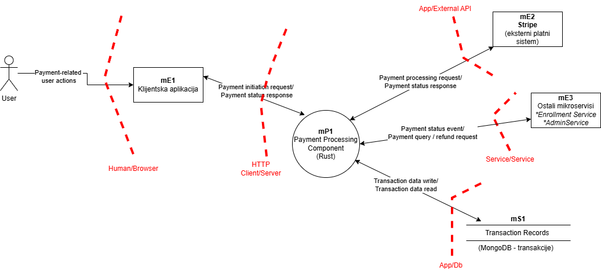
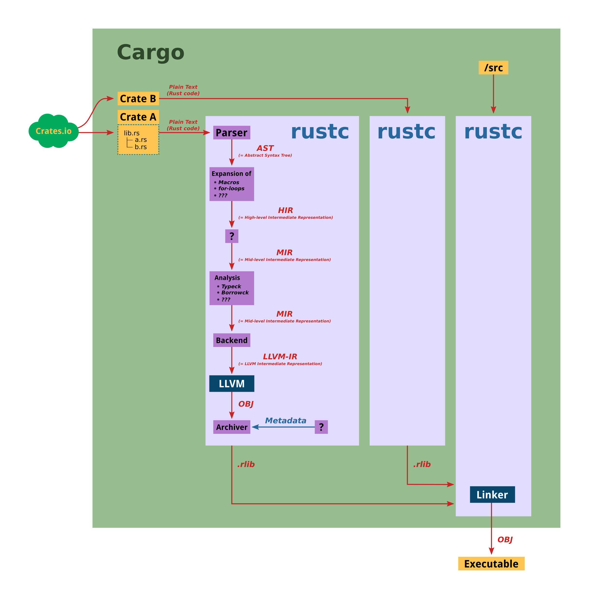

# Payment Service
## Analiza modula

Payment Service je Rust mikroservis u okviru LearnHub platforme koji je zadužen za obradu finansijskih transakcija vezanih za kupovinu online kurseva. Njegova osnovna uloga je da obezbijedi pouzdanu i bezbjednu obradu plaćanja, kao i integraciju sa eksternim platnim sistemom.  
Payment Service omogućava:

- iniciranje i obradu plaćanja koja studenti izvršavaju prilikom kupovine kurseva,
- komunikaciju sa Stripe eksternim platnim sistemom radi autorizacije i realizacije transakcija,
- obradu refundacija po zahtjevu administracije,
- evidenciju i praćenje stanja transakcija tokom njihovog životnog ciklusa,
- distribuciju informacija o statusu plaćanja ostalim mikroservisima sistema.

Payment Service ne vrši direktne isplate instruktorima. Umjesto toga, servis inicira i prati finansijske transakcije i isplate putem eksternog platnog sistema Stripe, koji je odgovoran za upravljanje novčanim tokovima i isplatama. Instruktori ostvaruju uvid u stanje zarade i isplata putem klijentske aplikacije, dok se sama realizacija isplata obavlja izvan sistema LearnHub.

### Dijagram toka podataka 
Dijagram toka podataka (slika 1) prikazuje interakciju korisnika, klijentske aplikacije, Payment Service-a, eksternog platnog sistema Stripe, ostalih mikroservisa i baze podataka za evidenciju transakcija.

_Slika 1_ - Dijagram toka podataka

## Rust ekosistem - Arhitektura i komponente

**Uvod**

Rust je sistemski programski jezik koji kombinuje niske performanse sa memorijskom sigurnošću bez potrebe za garbage collector-om. Za razliku od platformi kao što su JVM ili .NET CLR koje zavise od virtualnih mašina, Rust funkcioniše kroz ahead-of-time kompajliranje u native kod.  
Rust platforma se sastoji od nekoliko nezavisnih ali međusobno povezanih komponenti: jezika sa sistemom tipova i pravilima vlasništva, kompajlera koji provodi statičku analizu, alata za upravljanje zavisnostima i izgradnju projekata, minimalne runtime biblioteke, te ekosistema eksternih paketa.

**Dekompozicija komponenti po slojevima**

**Language Core - Jezgro jezika**

Jezgro Rust-a definišu pravila koja omogućavaju memorijsku sigurnost bez runtime overhead-a.

**Ownership sistem**

Ownership je fundamentalni mehanizam jezgra Rust jezika koji definiše kako se memorija upravlja isključivo u compile-time fazi, bez garbage collectora i bez runtime kontrole. Svaka vrijednost u programu ima tačno jednog vlasnika koji je odgovoran za njen životni vijek, a memorija se deterministički oslobađa kada vlasnik izađe iz scope-a.  
Ovaj model je primarno usmjeren na heap memoriju, gdje dinamička alokacija i dijeljenje podataka između funkcija, modula i niti ne obezbjeđuju automatsko pravilo o vlasništvu i oslobađanju memorije. Ownership rješava problem vlasništva nad podacima, njihovog trajanja i dozvoljenog pristupa, čime se eliminišu klase grešaka poput use-after-free, double free, dangling pointer i data race.  
Ownership pravila omogućavaju privremeno posuđivanje podataka putem referenci bez prenosa vlasništva, uz strogo ograničenje da reference ne mogu nadživjeti podatke na koje se odnose. Ova pravila ownership sistema provjerava borrow checker tokom kompajliranja, što znači da se greška ne može potkrasti u radu jer ne postoji runtime provjera i program koji krši ova pravila se uopšte ne pokreće.

**Borrowing i reference**

Borrowing je osnovni mehanizam jezgra Rust jezika koji proizlazi iz ownership-a, i omogućava privremeni pristup podacima bez prenosa vlasništva nad memorijom. Njegova svrha je bezbijedno dijeljenje i izmjena podataka uz strogu kontrolu pristupa koja se sprovodi u compile-time fazi. Rust razlikuje dva režima pristupa podacima: višestruki read-only pristup ili isključivi write pristup, koji ne mogu postojati istovremeno nad istim podatkom. Na taj način se strukturalno sprječava konkurentna modifikacija i nekontrolisano dijeljenje memorije.  
Borrowing pravila su direktno povezana sa pravilima trajanja podataka, koja su definisana ownership mehanizmom jezgra jezika. Svaka pozajmljena referenca mora biti važeća isključivo tokom trajanja podatka na koji se odnosi, što znači da nijedan pristup podatku ne smije nadživjeti podatak čija je memorija već oslobođena.  
Borrow checker je komponenta jezgra koja provjerava pravila borrowinga i sprječava nevažeće reference i data race uslove prije izvršavanja programa. Data race se javlja ako dva ili više izvršnih tokova istovremeno pristupa istom podatku i najmanje jedan pokušava da piše, bez mehanizma za kontrolu pristupa. Kako su borrowing pravila zasnovana na principu „više čitača ili jedan pisac", a borrow checker sprovodi sve provjere tokom kompajliranja, Rust eliminiše ovu klasu grešaka - data races i nevažeće reference - na compile-time, bez runtime troška. Zahvaljujući garancijama koje borrow checker pruža u compile-time fazi, većina Rust API-ja je dizajnirana tako da funkcije primaju reference umjesto da preuzimaju vlasništvo nad podacima. Ovo omogućava efikasnu i bezbjednu saradnju između komponenti sistema, jer se sigurno dijeljenje i privremeni pristup podacima kontrolišu tokom kompajliranja.

**Lifetime sistem**

Lifetime sistem je komponenta jezgra Rust jezika koja formalno modeluje validnost referenci kroz puteve izvršavanja programa, provjeravajući ih u compile-time fazi.  
Za razliku od ownership-a, koji određuje vlasništvo nad memorijom, i borrowing-a, koji kontroliše režime pristupa, lifetime sistem definiše regione izvršavanja u kojima referenca mora ostati validna. Ovi regioni se automatski konstruišu analizom kontrolnog toka i ne odgovaraju nužno statičkim scope-ovima u kodu. Mogu sadržavati diskontinuitete gdje se referenca invalidira i ponovo inicijalizuje.  
Svrha lifetime sistema je da omogući kompajleru da garantuje da nijedna referenca ne pokazuje na memoriju koja je oslobođena.Na taj način lifetime sistem eliminiše mogućnost nastanka dangling pointer-a, jer borrow checker koristi informacije o lifetimes da provjeri da pozajmljene vrijednosti (borrows) ne nadživljavaju podatke na koje pokazuju. Kao posledica, sprečavaju se use-after-free greške - kompajler ne dozvoljava programu da uopšte dođe u situaciju gdje bi koristio nevažeću memoriju.  
Automatsko zaključivanje lifetimes (elision) omogućava kompajleru da unutar funkcija sam zaključi trajanje referenci, čineći kod čitljivim i prirodnim, dok se na granicama funkcija primjenjuju pravila elisiona koja automatski zaključuju lifetimes, ili se moraju eksplicitno navesti ako pravila nisu dovoljna.  
Unsafe kod predstavlja kritičnu tačku, jer može kreirati unbounded lifetimes - reference bez definisanog gornjeg limita trajanja, npr. dereferenciranjem raw pointer-a (&\*ptr) ili korišćenjem transmute. Takve reference zaobilaze sve garancije lifetime sistema i zahtevaju ručno ograničavanje (bounding) da bi se očuvala sigurnost memorije. Najsigurnija praksa je povezivanje takvih referenci sa bounded lifetime-om, npr. kroz funkcijske signature ili strukture sa eksplicitnim lifetime parametrom.

**Type sistem**

Type sistem je komponenta jezgra Rust jezika koja definiše kako se memorija interpretira i koje operacije su dozvoljene nad podacima. Svaki podatak ima tip poznat u compile-time, što omogućava kompajleru (rustc) da verifikuje sigurnost prije izvršavanja programa. Rust koristi statički tip sistem sa automatskim zaključivanjem tipova (type inference). Kompajler (rustc) analizira kod i zaključuje tipove bez potrebe za eksplicitnim anotacijama, ali svi tipovi moraju biti razrješivi u compile-time fazi.  
Rust razlikuje sized tipove, čija je veličina poznata u compile-time i koji se mogu direktno alocitati na stack, i unsized tipove (DST), čija veličina zavisi od runtime vrijednosti, što zahtijeva indirekciju kroz pointer sa metapodacima.  
Type sistem garantuje type safety - memorija se ne može interpretirati kao pogrešan tip bez eksplicitnog unsafe koda. Zajedno sa ownership i lifetime sistemom, sprječava memory corruption kroz compile-time verifikaciju i strukturalno onemogućava type confusion napade u safe Rust-u.  
Generički kod se kroz proces monomorphization-a kompajlira u specijalizovane verzije za svaki konkretan tip koji se koristi.  
Built-in tipovi (primitivni tipovi, reference, raw pointer-i) su integrisani u kompajler, pri čemu samo safe reference uživaju potpune sigurnosne garancije. User-defined tipovi (struct, enum) moraju poštovati ownership i borrowing pravila, što omogućava kompajleru da garantuje sigurnost memorije.  
Trait-ovi definišu zajedničko ponašanje preko različitih tipova. Koriste static dispatch po defaultu - tačna implementacija je poznata u compile-time. Dynamic dispatch zahtijeva eksplicitnu indirekciju i nosi runtime overhead (vtable lookup-a).  
Unsafe kod može zaobići type sistem kroz transmute, pristup union tipovima bez provjere taga i raw pointer cast-ove. Ove operacije omogućavaju type confusion, gdje memorija alocirana za jedan tip biva interpretirana kao drugi, što može dovesti do arbitrary memory access i ozbiljnih sigurnosnih propusta.

**Compiler Toolchain - Kompajlerski lanac**

**Rust Compiler Toolchain - rustc**

Rust kompajler, _rustc_, je zvanični kompajler Rust jezika i koristi LLVM infrastrukturu za generisanje optimizovanog native koda. Njegova uloga je da transformiše Rust source kod kroz niz unutrašnjih reprezentacija i sprovede sve statičke provjere sigurnosti pre nego što napravi konačni izvršni fajl. Rustc se od drugih kompajlera razlikuje po tome što obavlja specifične provjere, poput _borrow checking_, koje provjerava pravila vlasništva i trajanja promenljivih, i koristi _query_ sistem koji omogućava efikasnu inkrementalnu kompilaciju - kompajler obrađuje samo delove koda koji su se promijenili, čime štedi vrijeme i resurse.  
Proces kompajliranja može se posmatrati kao niz uzastopnih faza kroz koje kod prolazi (slika 2). Na početku, sirovi tekst programa prolazi kroz lexer (rustc_lexer), koji tekst pretvara u tokene - osnovne jedinice koda poput identifikatora, ključnih riječi i simbola. Nakon toga, _parser_ (rustc_parse) koristi te tokene da izgradi _Abstract Syntax Tree_ (AST), strukturu koja precizno predstavlja kod koji je programer napisao. AST omogućava dalje provjere tipova, macro-ekspanziju i optimizacije, a takođe pruža sve potrebne informacije IDE alatima i proceduralnim makroima.  
Nakon toga slijedi _macro expansion_ i validacija AST-a. U ovoj fazi se vrši _name resolution_ (provjera da li svi identifikatori imaju definisan smisao) i rani _linting_ (provjera potencijalnih problema i nepoželjnih obrazaca u kodu). Ovo osigurava da je kod konzistentan prije nego što se transformiše u viši nivo interne reprezentacije. AST se zatim pretvara u _High-Level Intermediate Representation_ (HIR), uprošćenu verziju AST-a pogodnu za kompajler. HIR uklanja skraćene ili implicitne konstrukte, kao što su pojednostavljene _loop_ strukture ili _async_ funkcije, i priprema kod za _type inference_ (automatsko zaključivanje tipova) i _trait solving_ (provjera i povezivanje implementacija interfejsa/trait-ova).  
U fazi _type checking_ kompajler provjerava da li su tipovi ispravni i da li su svi trait-ovi pravilno implementirani, čime se osigurava _type safety_, tj. da memorija ne može biti interpretirana kao pogrešan tip. Ovo je posebno važno u slučaju korišćenja _unsafe_ koda, jer pomaže u detekciji potencijalnih grešaka i napada kroz _type confusion_. HIR se potom dalje pretvara u _Mid-Level Intermediate Representation_ (MIR), jednostavniji prikaz kontrolnog toka programa, koji je osnova za _borrow checker_. MIR omogućava dodatne optimizacije i priprema kod za _monomorphization_, gdje se generički kod specijalizuje za konkretne tipove, uklanjajući runtime overhead i ubrzavajući izvršavanje.  
MIR se zatim prevodi u _LLVM-IR_, tipizirani jezik sličan asembleru, što omogućava dalja optimizovanja. LLVM backend generiše native kod za ciljne platforme (x86, ARM, WASM itd.) i povezuje različite biblioteke u konačni izvršni fajl. Tokom ovog procesa rustc koristi _query_ sistem, gde se svaka analiza ili transformacija tretira kao upit, a rezultati se keširaju u centralnoj strukturi _TyCtxt._ Ovo omogućava da, kada se kod promijeni, kompajler ponovo obrađuje samo dijelove koji su se promijenili.  
Kompajler takođe podržava paralelizaciju, naročito u fazi generisanja koda i optimizacija. On je i sam _bootstrapovan_ - starija verzija kompajlera koristi se za kompajliranje novije verzije, što omogućava stalno testiranje jezika kroz njegovu stvarnu upotrebu, poznato i kao „eating our own dogfood". Na ovaj način rustc kombinuje rigorozne statičke provjere sa efikasnom organizacijom rada i generisanjem optimizovanog koda za različite platforme.

_Slika 2_ - Rust internals

**Borrow Checker**  
Jedna od ključnih komponenti rustc-a je borrow checker, koji garantuje odsustvo grešaka poput _use-after-free_, dangling pointer-a i _data race_\-ova, bez dodatnog runtime overhead-a. Borrow checker radi nad MIR reprezentacijom, što ima ključne prednosti: MIR je daleko jednostavniji i uniformniji od HIR-a, što smanjuje mogućnost grešaka u samom borrow checkeru, a što je još važnije, omogućava korišćenje non-lexical lifetimes (NLL) - preciznih opsega u okviru kontrolnog toka u kojima referenca mora biti validna.  
Borrow checker osigurava poštovanje sljedećih pravila: sve promenljive moraju biti inicijalizovane prije upotrebe, vrijednost se ne može premjestiti dva puta, vrijednost se ne može koristiti dok je pozajmljena, mjestu se ne može pristupiti dok je ono mutabilno pozajmljeno (osim preko te mutabilne reference), mjesto se ne može mijenjati dok je ono immutabilno pozajmljeno.  
Analiza se odvija kroz nekoliko faza: kreira se lokalna kopija MIR-a, svi regioni se zamjenjuju novim _inference_ varijablama, izvršavaju se dataflow analize koje prate kretanje podataka, vrši se druga iteracija type checkinga radi utvrđivanja constraints između regiona, izvršava se region inference koji određuje tačke u kontrolnom toku gdje svaki lifetime mora biti validan, računa se koji borrows su aktivni u svakoj tački programa, i na kraju se prolazi kroz MIR da se prijave greške na osnovu svih prethodnih analiza.

**LLVM Backend**

Nakon što MIR reprezentacija bude spremna i sve statičke provjere izvršene, rustc koristi LLVM infrastrukturu za generisanje konačnog izvršnog koda. Rustc prevodi MIR u LLVM-IR (intermedijarnu reprezentaciju sličnu asembleru), nakon čega LLVM izvršava platformski-nezavisne optimizacije i generiše mašinski kod za različite ciljne arhitekture (x86, ARM, WASM itd.).  
LLVM backend povezuje sve biblioteke i kreira konačni izvršni fajl. Tokom ovog procesa LLVM omogućava paralelnu kompilaciju i dodatne optimizacije, kao što su eliminacija mrtvog koda, umetanje funkcija direktno u pozive (inlining) i optimizacije petlji, čime se poboljšavaju performanse.  
Sa sigurnosne strane, LLVM ne vrši direktne provjere memorijske sigurnosti - te provjere su već obavljene u ranijim fazama kompajlera (tip sistem, borrow checker). Međutim, greške u procesu generisanja koda (odnosno, u fazi prevođenja MIR-a u LLVM-IR i konačni mašinski kod) ili agresivne LLVM optimizacije mogu narušiti garancije koje su tip sistem i borrow checker osigurali. LLVM koristi C/C++ model "undefined behavior", što znači da kod koji ispolji undefined behavior može biti optimizovan na nepredvidive načine.  
Rustc koristi tier sistem za podržane platforme: Tier 1 platforme imaju potpunu podršku i aktivno se testiraju, pa su najpouzdanije; Tier 2 platforme rade, ali nisu podjednako testirane i mogu imati ograničenja; dok su Tier 3 platforme eksperimentalne i mogu imati greške u prevođenju koda koje utiču na sigurnost programa.

**Build i Dependency Management**

**Cargo**

Cargo je zvanični build sistem i package manager za Rust i predstavlja centralnu tačku za upravljanje zavisnostima i procesom izgradnje aplikacije. On automatizuje preuzimanje paketa, njihovu rezoluciju i pozivanje kompajlera, čime direktno utiče na to koji se kod izvršava tokom build procesa.  
Rezolucija zavisnosti se zasniva na informacijama iz \`Cargo.toml\` fajla i podataka iz javnog registra. Cargo automatski uključuje i tranzitivne zavisnosti, čime se značajan dio koda koji ulazi u aplikaciju preuzima indirektno, bez eksplicitne kontrole programera. Tačna verzija svih paketa se fiksira u \`Cargo.lock\` fajlu, čime se omogućavaju reproducibilni build-ovi, ali se istovremeno uvodi model povjerenja u prvi preuzeti set zavisnosti (Trust On First Use).  
Cargo upravlja i izvršavanjem build script-ova (\`build.rs\`), koji se pokreću prije kompajliranja glavnog koda i mogu izvršavati proizvoljan kod na host sistemu sa punim privilegijama build procesa. Ovo predstavlja važnu sigurnosnu granicu, jer build skripte dolaze iz zavisnosti i izvršavaju se bez dodatnih sandbox mehanizama.  
Sa bezbjednosnog aspekta, Cargo ne sprovodi provjeru pouzdanosti ili namjene paketa koje preuzima. Integritet preuzetih fajlova se provjerava putem checksum-a, ali se ne vrši analiza sadržaja koda, što znači da sigurnost build procesa u velikoj mjeri zavisi od povjerenja u ekosistem zavisnosti.

**Crates.io Registry**

Crates.io je centralni javni registar Rust paketa i predstavlja ključnu komponentu Rust supply chain-a. Cargo se oslanja na ovaj registar kao primarni izvor zavisnosti, što crates.io čini implicitnom tačkom povjerenja u procesu izgradnje aplikacije.  
Registar funkcioniše kroz Git repository (crates.io-index) koji sadrži metapodatke o svim paketima - nazive, verzije, zavisnosti i checksume. Cargo lokalno klonira ovaj index, što omogućava brzu pretragu, dok se sam source kod preuzima sa CDN-a tek kada je potreban. Objavljivanje paketa je otvoreno i ne uključuje obaveznu provjeru koda - svako sa GitHub nalogom može objaviti paket putem cargo publish komande ako ime još nije zauzeto. Vlasništvo nad paketima se dodjeljuje po principu "ko prvi objavi". Ovakav model olakšava distribuciju, ali istovremeno omogućava da maliciozan ili kompromitovan kod dospije u registar bez prethodne kontrole.  
Yanking je mehanizam za povlačenje problematične verzije, ali ne uklanja kod sa servera - verzija ostaje dostupna za postojeće Cargo.lock fajlove, dok se novi projekti ne mogu osloniti na nju. Ovo čuva stabilnost build-ova, ali ne eliminiše već distribuirani kod.  
Sa bezbjednosnog aspekta, odsustvo code review procesa omogućava objavljivanje malicioznog koda bez detekcije. Najčešći attack vektori uključuju: dependency confusion (paket sa imenom sličnim internom paketu organizacije), typosquatting (paket sa imenom sličnim popularnom paketu), i kompromitaciju naloga vlasnika paketa. Zaštitni mehanizmi su ograničeni na checksum validaciju preuzetih fajlova, dok se analiza sadržaja prepušta eksternim alatima kao što je cargo-audit.

**Rustup - Toolchain installer**

Rustup je zvanični alat za instalaciju i upravljanje Rust toolchain-ima i predstavlja ulaznu tačku za kompajler i prateće alate koji učestvuju u build procesu. Kroz rustup se određuje koja verzija kompajlera i alata se koristi, što ga čini važnim dijelom Rust supply chain-a.  
Rust podržava više toolchain kanala, od kojih su najvažniji stable i nightly. Izbor kanala direktno utiče na ponašanje kompajlera i rezultat build-a. Stable kanal pruža garantovanu kompatibilnost i preporučuje se za produkciju, dok nightly omogućava korišćenje nestabilnih feature-a bez garancija konzistentnosti.  
Rustup omogućava precizno upravljanje verzijama toolchain-a, uključujući definisanje verzije po projektu putem rust-toolchain.toml fajla. Ovim mehanizmom se obezbjeđuje konzistentnost build-a između različitih razvojnih okruženja, ali se istovremeno uvodi povjerenje u distribuciju i integritet preuzetog toolchain-a.  
Sa bezbjednosnog aspekta, rustup preuzima toolchain-e sa zvaničnih Rust servera koristeći HTTPS, čime se štiti od man-in-the-middle napada. Međutim, automatizovana ažuriranja i korišćenje nightly verzija mogu dovesti do nepredvidivih promjena u ponašanju build procesa, što predstavlja potencijalni rizik u kontekstu supply chain sigurnosti.

**Runtime Components**

Rust runtime je minimalna infrastruktura koja omogućava predvidljivo i determinističko izvršavanje programa sa malim overhead-om. Standardna biblioteka (std) pruža osnovne tipove, kolekcije, I/O operacije, mrežno komuniciranje, threading, sinhronizaciju i API-je za interakciju sa operativnim sistemom, dok high-level funkcionalnosti poput web framework-a, kriptografije ili async runtime-a nisu uključene. Biblioteke core i alloc omogućavaju Rust razvoj u okruženjima bez OS-a ili sa minimalnim runtime-om. Core sadrži osnovne tipove i trait-ove za no_std okruženja kao što su firmware i embedded sistemi, dok alloc omogućava tipove koji zahtijevaju heap alokaciju, uključujući pametne pokazivače i kolekcije. Rust runtime obuhvata inicijalizaciju prije main(), stack unwinding u slučaju panika, panic handler, threading i default globalni allocator, ali ne posjeduje garbage collector, JIT, reflection ili automatsko exception handling. Panic je mehanizam kojim program signalizira nepopravljivu grešku tokom izvršavanja, pri čemu trenutni thread prekida normalno izvršavanje i stack se odmotava (unwinding), pozivajući destruktore svih lokalnih promenljivih. Alternativno, proces može abortirati momentalno bez odmotavanja stack-a. Ovakav pristup omogućava predvidljiv tok izvršavanja, ali neuhvaćeni panici, naročito pri interakciji sa kodom iz drugih jezika (FFI - foreign function interface), mogu izazvati greške ili poremetiti stanje programa.

**Ekosistem (External Crates)**

**Async Runtime (Tokio)**

Rust nema ugrađeni async runtime - async/await sintaksa je dio jezika, ali izvršavanje asinhronog koda zahtijeva eksterni runtime. Tokio je najkorišteniji async runtime u Rust ekosistemu i osnova za većinu serverskih aplikacija sa visokim stepenom konkurentnosti. Tokio funkcioniše kroz nekoliko ključnih komponenti: task scheduler koji koristi work-stealing algoritam za efikasnu raspodjelu posla između threadova, reactor koji se integriše sa OS-level mehanizmima za non-blocking I/O, asinhronih sinhronizacionih primitiva kao što su async Mutex, Semaphore i Channel. Async funkcije u Rust-u ne izvršavaju se odmah prilikom poziva - tek kada se pozove .await operator, funkcija se izvršava kroz runtime koji upravlja njenim izvršavanjem. Ovo omogućava da veliki broj task-ova deli mali broj OS thread-ova, što značajno smanjuje memorijski i kontekstualni overhead. Sa sigurnosnog aspekta, ključni rizici uključuju: blocking pozive unutar async koda koji mogu blokirati cijeli executor i zaustaviti sve task-ove, panic u task-u koji ne ruši cijeli runtime ali može dovesti do curenja resursa, i cancellation safety probleme gdje nepravilno otkazivanje async operacije može ostaviti sistem u nekonzistentnom stanju.

**Web Frameworks (Axum / Actix-web)**

Rust nema zvanični web framework, već ekosistem nudi više opcija baziranih na async runtime-ima. Axum je moderan framework izgrađen na Tokio runtime-u i Tower middleware sistemu. Fokusira se na type-safe routing gdje se compile-time type sistem koristi za validaciju request-a i automatsku deserializaciju u Rust tipove putem extractors. Handleri su asinhrone funkcije, a middleware stack omogućava ponovnu upotrebu komponenti za timeout, kompresiju, i autorizaciju. Ključna prednost Axum-a je da ne implementira sopstveni middleware sistem već koristi tower::Service, što omogućava dijeljenje middleware-a sa drugim aplikacijama koje koriste Hyper ili Tonic. Actix-web je stariji framework poznat po visokim performansama i integrisanom sistemu za routing, middleware i TLS, ali zahteva pažnju zbog istorijskih problema sa unsafe kodom. Sa bezbjednosnog aspekta, web framework-ovi predstavljaju attack surface preko kojeg ulaze svi HTTP zahtjevi. Neispravna validacija input-a, problemi sa deserializacijom (kroz Serde), i miješanje blocking/async koda mogu dovesti do ranjivosti.

**Serialization (Serde)**

Serde je standard za serializaciju i deserializaciju podataka u Rust-u i koristi derive makroe za automatsko implementiranje Serialize i Deserialize trait-ova za prilagođene tipove. Arhitektura je format-agnostic, što znači da isti API može da se koristi za JSON, TOML, YAML ili binarne formate, a podržana je i zero-copy deserializacija za bolje performanse. Serde omogućava da eksterne podatke (npr. JSON) automatski mapira u tipove definisane u programu, pri čemu Rust type sistem osigurava validnost tipova. Ipak, nepravilna obrada neproverenog input-a, veoma veliki payload-ovi ili duboko ugnježdene strukture mogu izazvati DoS napade ili kreirati nevalidna interna stanja.

**Kriptografija (RustTLS / ring)**

Rust nema standardnu kriptografsku biblioteku u std, već ekosistem nudi različite crate-ove sa prednostima i kompromisima između performansi i sigurnosti. RustTLS je pure-Rust implementacija TLS 1.2 i TLS 1.3 protokola. Ključna prednost je odsustvo dependency-ja na OpenSSL i C biblioteke, što eliminiše cijelu klasu ranjivosti vezanih za FFI granicu i memory unsafe C kod. RustTLS je prošao security audit-e i koristi se u production okruženjima gdje je pouzdanost kritična. Ring pruža kriptografske primitive i zasnovan je na BoringSSL-u (Google fork OpenSSL-a). Za razliku od RustTLS-a, ring koristi unsafe kod radi performansi i uključuje C kod iz BoringSSL-a. Biblioteke kao Argon2, bcrypt služe za heširanje lozinki. Sigurnost zavisi od ispravne konfiguracije cipher suites, key sizes, modova i parametara, jer nepravilna konfiguracija ili neconstant-time implementacije mogu dovesti do side-channel napada ili kompromitovanja tajni u memoriji.

## Stripe API - arhitektura i ključni koncepti

Stripe API predstavlja eksterni payment servis koji omogućava aplikacijama da bez direktnog rukovanja osjetljivim podacima o platnim karticama realizuju procese naplate, refundacija i upravljanja plaćanjima. Stripe je dizajniran kao **API-first platforma**, što znači da kompletna funkcionalnost postoji iza HTTP API-ja, dok su klijentske biblioteke samo pomoćni sloj. Integracija sa Stripe-om uvodi jasnu sigurnosnu granicu između aplikacije i payment infrastrukture, pri čemu se dio rizika (npr. PCI compliance) prebacuje na Stripe, dok aplikacija zadržava odgovornost za ispravnu upotrebu API-ja i zaštitu sopstvenih kredencijala.

**Glavni koncepti Stripe API-ja**

**API ključevi i autentikacija**

Stripe koristi **API ključeve** kao primarni mehanizam autentikacije. Svaki API poziv mora sadržati validan ključ koji identifikuje Stripe nalog aplikacije. Postoje jasno razdvojeni ključevi za testno i produkciono okruženje, kao i razlika između tajnih (secret) i javnih (publishable) ključeva. Ovim se uvodi striktna podjela odgovornosti između server-side i client-side komponenti. Stripe dodatno podržava restricted API ključeve, koji omogućavaju granularno ograničavanje dozvoljenih operacija, čime se smanjuje potencijalna šteta u slučaju kompromitacije ključa.  
Autentikacija preko API ključeva predstavlja jednu od najkritičnijih tačaka sistema, jer kompromitovan ključ omogućava napadaču direktan pristup Stripe resursima bez dodatne autentikacije.

**HTTPS i transportni sloj**

Svi Stripe API zahtjevi moraju se izvršavati isključivo preko HTTPS protokola. Time se osigurava povjerljivost i integritet podataka tokom prenosa. Stripe odbija zahtjeve koji se šalju preko nebezbjednog transporta, čime se eliminišu napadi poput presretanja saobraćaja (MITM) na nivou mreže.

**Resursno-orijentisana arhitektura**

Stripe API je dizajniran oko **resursa**, kao što su: Customer, PaymentIntent, Charge, Refund, Subscription, Invoice, Webhook endpoint. Svaki resurs ima svoj životni ciklus i stanje, a aplikacija upravlja plaćanjem kroz tranzicije tih stanja. Ovakav model olakšava audit, ali uvodi rizike vezane za nekonzistentno stanje ukoliko aplikacija pogrešno rukuje asinhronim događajima ili prekidima u komunikaciji.

**Payment Intents i tok plaćanja**

Centralni koncept modernih Stripe integracija je PaymentIntent, koji predstavlja stanje jedne namjere plaćanja. PaymentIntent prolazi kroz više faza (created, requires_action, succeeded, failed), a aplikacija mora pravilno reagovati na svaku promjenu stanja. Ovaj mehanizam je uveden kako bi se podržali dodatni sigurnosni zahtjevi kao što su Strong Customer Authentication (SCA) i 3D Secure.

Sa sigurnosnog aspekta, nepravilno upravljanje ovim stanjima može dovesti do duplih naplata, neusaglašenosti između Stripe-a i interne baze podataka, ili logičkih grešaka koje napadač može zloupotrijebiti.

**Tokenizacija i PCI odgovornost**

Stripe omogućava tokenizaciju osjetljivih podataka (npr. brojeva kartica), čime se ti podaci nikada ne pojavljuju u backend sistemu aplikacije. Umjesto toga, aplikacija rukuje tokenima koji nemaju vrijednost van Stripe sistema. Ovim se značajno smanjuje PCI scope aplikacije, ali se uvodi zavisnost od pravilne upotrebe Stripe klijentskih komponenti i backend validacije.

**Webhook mehanizam**

Webhook-ovi predstavljaju asinhroni komunikacioni kanal kroz koji Stripe obavještava aplikaciju o događajima koji su se desili u Stripe sistemu. To uključuje potvrde plaćanja, neuspješne naplate, refundacije i promjene stanja pretplata.  
Webhook endpoint je kritična ulazna tačka u sistem i mora se tretirati kao nepoverljiv izvor podataka. Stripe omogućava verifikaciju webhook poruka pomoću potpisanih payload-ova, ali je odgovornost aplikacije da pravilno implementira verifikaciju i zaštiti endpoint od replay napada i DoS scenarija.

**Stripe API kao komponenta sistema (Data Flow perspektiva)**

U tipičnoj integraciji Stripe API-ja sa aplikacijom, što je u ovom slučaju Rust backend servis, tok podataka se odvija na sljedeći način:

- Klijentska aplikacija inicira proces plaćanja koristeći publishable API ključ.
- Backend aplikacija (Rust servis) koristi secret API ključ za komunikaciju sa Stripe API-jem.
- Stripe obrađuje plaćanje i rukuje osjetljivim podacima (npr. brojevima kartica), koji nikada ne prolaze kroz naš backend.
- Stripe šalje webhook događaje nazad backend aplikaciji, obavještavajući o statusu plaćanja, neuspjelim naplatama, refundacijama i promjenama pretplata.
- Backend aplikacija sinhronizuje stanje Stripe resursa sa internom poslovnom logikom i bazom podataka.

Ovaj tok jasno definiše granice povjerenja:

- Klijent - Backend: klijent koristi publishable ključ i inicira PaymentIntent, backend verifikuje i obrađuje.
- Backend - Stripe: backend koristi secret ključ za sigurno upravljanje plaćanjima.
- Stripe - Webhook endpoint: asinhroni kanal preko kojeg Stripe šalje događaje i koji se tretira kao nepovjerljiv izvor podataka i mora biti zaštićen od potencijalnih napada.
