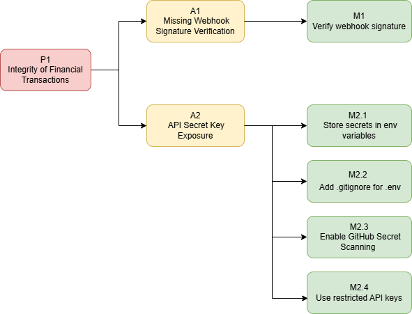

# **P1. Narušavanje integriteta poslovne logike naplate – analiza prijetnje**

Slika ispod prikazuje napade koji ostvaruju prijetnju P1 i bezbjednosne kontrole koje se izvlače iz analizirane prijetnje.

Napadač eksploatiše ranjivost u webhook integracionom kanalu između Stripe-a i Rust backend servisa kako bi aplikacija aktivirala pristup plaćenom sadržaju bez verifikacije stvarnog plaćanja. Webhook endpoint predstavlja granicu povjerenja između Stripe-a i backend aplikacije — na ovoj granici Stripe garantuje autentičnost događaja kroz kriptografski potpis, ali odgovornost za verifikaciju tog potpisa leži na aplikaciji. Narušeno sigurnosno svojstvo prema CIA trijadi je **Integritet (I)** — sistem procesuira neautorizovane payment evente kao legitimne.

U nastavku su opisani napadi koji realizuju ovu prijetnju: jedan praktično sproveden (A1) i jedan teorijski napad (A2) koji ostvaruju istu prijetnju kroz drugačije vektore napada.

**Sekvencijalni tok podataka**

Prije opisa napada, neophodno je razumjeti normalan tok podataka između komponenti sistema, jer napad živi na tački povjerenja između Stripe-a i backend servisa. Korisnik prvo inicira kupovinu, backend kreira PaymentIntent i šalje ga Stripe-u. Kada Stripe potvrdi uspešno plaćanje, šalje webhook event nazad na backend. Backend tada aktivira pristup kursu u bazi podataka.
Napad koji je opisan u nastavku se desava na koraku kada webhook stigne — napadač se lažno predstavlja kao Stripe i šalje **forged webhook event** direktno na /webhook endpoint.

**A1 — Praktično realizovan napad: Missing Webhook Signature Verification**

U nastavku je opisan konkretan napad A1, sa priloženim videom sprovedenog napada na metu. U prvom segmentu videa napadač napada ranjivu verziju webhook handlera i ostvaruje prijetnju P1, a u drugom segmentu videa prikazana je mitigacija M1 gdje komentari naglašavaju linije koda koje predstavljaju konkretnu bezbjednosnu kontrolu.

[linkovi do videa](https://drive.google.com/file/d/1ijqAxZsmNI95wtGEG6EFbT2N8-E4xqM8/view?usp=drive_link)

Da bi napad stavili u siri kontekst sigurnosnih propusta i olaksali identifikaciju slicnih ranjivosti u drugim sistemima, u nastavku je opisana klasa ranjiovsti koja je eksploatisana.

**Klasa ranjivosti — CWE-290: Authentication Bypass by Spoofing**

CWE-290 opisuje situaciju gdje sistem implementira autentikacijski mehanizam koji može biti zaobiđen spoofingom — lažiranjem identiteta legitimnog izvora. Napadač se ne probija kroz autentikaciju, nego je u potpunosti zaobilazi jer provjera identiteta nije implementirana.

U kontekstu Stripe webhook integracije, Stripe garantuje autentičnost svakog webhook eventa kroz Stripe-Signature header — HMAC-SHA256 kriptografski potpis izračunat kombinacijom timestamp-a i raw request body-a, korištenjem webhook signing secret-a koji je poznat samo Stripe-u i aplikaciji. Ako aplikacija ne verifikuje ovaj potpis, ne postoji nikakva razlika između legitimnog Stripe eventa i lažnog requesta koji šalje napadač.

Ista klasa greške je dokumentovana kroz CVE-2026-21894 gdje n8n platforma nije verifikovala Stripe-Signature header u svom StripeTrigger webhook handleru, dozvoljavajući bilo kom HTTP klientu koji zna webhook URL da triggeruje workflow slanjem proizvoljnog JSON payloada sa odgovarajućim type poljem.

U nastavku je objasnjeno kako se ostvaruje prijetnju P1 i ranjivost CWE-290 – autentifikacija se može zaobići spoofingom.

**Ranjivost**

Meta napada je `/webhook` endpoint u Rust Payment backend servisu — jedina ulazna tačka kroz koju Stripe komunicira sa aplikacijom o statusu plaćanja. Ovaj endpoint je javno dostupan jer Stripe šalje POST requestove na njega direktno. Upravo ta javna dostupnost čini verifikaciju potpisa kritičnom.

Ugrožena komponenta je **Stripe Webhook Event System** — konkretno mehanizam verifikacije Stripe-Signature headera koji Stripe uključuje uz svaki webhook request kao dokaz autentičnosti.

Ranjivi webhook handler prihvata sve POST requestove na `/webhook`, parsira JSON body, i na osnovu type polja odlučuje o akciji, bez ikakve provjere da li je request zaista došao od Stripe-a.

**Vektor napada**

U prvom dijelu videa je demonstrirano kako napadač šalje HTTP POST request direktno na `/webhook` endpoint sa lažnim `payment\_intent.succeeded` eventom. Napadač ne treba nikakav specijalni pristup ni poznavanje webhook signing secret-a — endpoint je javno dostupan i ne vrši nikakvu provjeru identiteta pošiljaoca. Video pokazuje kako napadač unosi maliciozni payload, a backend ga prihvata kao legitimnu transakciju jer ne provjerava Stripe-Signature header. Kao rezultat backend aktivira pristup kursu za korisnika kojeg je napadač naveo u payloadu. Napadač dobija sadržaj koji je nominalno plaćen, bez stvarnog plaćanja.

**Mitigacija — M1: Stripe HMAC verifikacija**

Da bi se spriječila ranjivost CWE-290 i osigurao integritet poslovne logike, u mitigiranoj verziji /webhook endpointa primijenjene su sve ključne bezbjednosne kontrole, koje zajedno čine jednu integrisanu verifikaciju Stripe webhook requestova. Glavni koraci ove kontrole su:

1. Provjera postojanja Stripe-Signature headera — request-ovi koji nemaju ovaj header odmah se odbijaju sa 401 Unauthorized.
2. Učitavanje tajnog webhook ključa iz environment varijable STRIPE\_WEBHOOK\_SECRET, čime se sprječava njegovo izlaganje u kodu ili build artefaktima.
3. HMAC-SHA256 verifikacija potpisa requesta, poredeći izračunati HMAC sa vrijednošću u Stripe-Signature headeru.
4. Provjera timestamp-a u headeru za zaštitu od replay napada — stari ili ponovljeni requestovi se odbacuju.
5. Odbacivanje neautorizovanih ili nevalidnih requestova bez izvršavanja poslovne logike.

Tok verifikacije funkcioniše tako da svaki dolazni POST request prvo prolazi kroz ove korake. Ako request prođe sve provjere, deserializuje se u WebhookEvent, a poslovna logika se izvršava isključivo za validne događaje, npr. payment\_intent.succeeded. Na ovaj način, pristup kursu ili plaćenom sadržaju može biti aktiviran samo nakon što Stripe potvrdi transakciju, dok pokušaji napadača da pošalju lažne eventove preko Postmana ili bilo kog HTTP klijenta ne uspijevaju.

Video demonstracija pokazuje da maliciozni request koji je ranije omogućavao neautorizovani pristup sada biva odmah odbijen, pristup kursu se ne aktivira, a originalni Stripe event ostaje netaknut. Svi navedeni koraci rade zajedno i čuvaju integritet poslovne logike i autentičnost webhook komunikacije.

Pored praktičnog napada A1, prijetnja P1 može se ostvariti i kroz ranjivosti koje se pojavljuju na drugim dijelovima Stripe integracije. U nastavku je opisan teorijski napad koji pokazuje isti problem, ali kroz drugačiji vektor napada.

**A2 — API Secret Key Exposure**

Ovaj napad pripada dvjema CWE klasama koje opisuju različite načine nastanka iste ranjivosti.

**Klase ranjivosti**

**CWE-798: Use of Hard-coded Credentials** opisuje situaciju gdje developer direktno upiše tajni ključ u izvorni kod aplikacije. Ključ tada postaje dio Git istorije i svaki komit koji ga sadrži ostaje trajno vidljiv, čak i ako developer u kasnijem komitu ukloni ključ iz koda.

**CWE-522: Insufficiently Protected Credentials** opisuje širu klasu koja predstavlja slucajeve ključ možda nije direktno u kodu, ali se čuva na način koji nije dovoljno zaštićen. Najčešći primjer je .env fajl koji developer zaboravi dodati u .gitignore, pa završi u javnom repozitorijumu.

**Ranjivost**

Ugrožen je **Stripe Secret API Key autentikacijski mehanizam** — konkretno `sk\_live\_...` ključ koji backend koristi za svaki poziv Stripe API-ju. Stripe koristi ovaj ključ kao jedini mehanizam autentikacije — svako ko posjeduje validan ključ ima direktan pristup svim Stripe resursima bez ikakve dodatne provjere identiteta.

Truffle Security je 2024. godine objavio istraživanje koje dokumentuje konkretne scenarije zloupotrebe eksponiranog Stripe API ključa. Istraživači su analizirali Stripe API dokumentaciju i identifikovali pet različitih putanja napada koje napadač može slijediti nakon pronalaska validnog `sk\_live\_...` ključa. Kako istraživanje eksplicitno napominje, ne radi se o ranjivostima u Stripe platformi, nego o načinima na koje napadač može zloupotrijebiti legitimnu Stripe funkcionalnost korištenjem ukradenog ključa.

**Vektor Napada**

Vektor napada je konzistentan u svim dokumentovanim slučajevima: napadač pretražuje javne GitHub repozitorijume koristeći GitHub Search ili automatizovane alate poput TruffleHog-a koji skeniraju repozitorijume u potrazi za poznatim obrascima API ključeva. Stripe secret ključevi imaju prepoznatljiv format `sk\_live\_ ` koji je lako pretraživati. Kada napadač pronađe ključ, bilo da je on u aktivnom kodu ili samo u Git istoriji, ima trenutni pristup cijelom Stripe nalogu.

Vrijedi istaći da ovaj napad istovremeno narušava sva tri svojstva CIA trijade — integritet, povjerljivost i dostupnost — što ga čini jednim od najširih vektora prijetnji u Stripe integraciji. U nastavku su navedene bezbjednosne kontrole koje se mogu primjeniti pojedinačno ili kombinovano, pri čemu potpunu zaštitu garantuje jedino primjena svih kontrola zajedno — prve dvije sprječavaju eksponiranje ključa, dok treća i četvrta smanjuju potencijalnu štetu u slučaju kompromitacije.

**Mitigacije M2**

Mitigacija A2 napada zahtijeva višeslojni pristup. Četiri kontrole označene kao M2.1 do M2.4 mogu se primjeniti pojedinačno, ali potpunu zaštitu garantuje jedino njihova kombinacija — prve dvije sprječavaju eksponiranje ključa, dok treća i četvrta smanjuju potencijalnu štetu u slučaju kompromitacije.

**M2.1 — Environment varijable** je primarna i neophodna kontrola. Ključ se nikada ne pojavljuje u izvornom kodu ni u konfiguracionim fajlovima koji se komituju. U Rust aplikaciji to znači čitanje ključa kroz std::env::var("STRIPE\_SECRET\_KEY") umjesto direktnog upisivanja vrijednosti. Sama po sebi potpuno štiti od CWE-798, ali ne štiti ako .env fajl slučajno završi u repozitorijumu.
**M2.2 — .gitignore konfiguracija** direktno adresira taj slučaj — eksplicitno isključuje .env fajlove iz Git repozitorijuma. Zajedno sa M2.1 čini kompletnu preventivnu zaštitu od eksponiranja ključa.
**M2.3 — GitHub Secret Scanning** je reaktivna kontrola koja djeluje nakon što eksponiranje već nastupi. GitHub automatski skenira javne repozitorijume u potrazi za poznatim formatima API ključeva, uključujući Stripe `sk\_live\_` format. Stripe je partner u partner u GitHub Secret Scanning programu, što znači da GitHub direktno obavještava Stripe kada detektuje eksponiran ključ, a Stripe može automatski invalidovati kompromitovani ključ.
**M2.4 — Restricted API Keys** primjenjuje princip minimalnih privilegija na nivou Stripe autentikacije. Umjesto jednog ključa sa punim pristupom, kreira se ključ sa isključivo onim dozvolama koje su potrebne za konkretnu operaciju. Ključ koji kreira PaymentIntent ne treba dozvole za refunde, payoute ni čitanje korisničkih podataka. Ova kontrola ne sprječava eksponiranje ključa, ali značajno ograničava potencijalnu štetu — kompromitovani ključ sa ograničenim dozvolama napadaču daje samo djelimičan pristup Stripe nalogu umjesto potpunog.

**Reference**

CWE-290: Authentication Bypass by Spoofing — cwe.mitre.org/data/definitions/290.html

CVE-2026-21894 — n8n Missing Stripe-Signature Verification – gecko.security/blog/cve-2026-21894 | nvd.nist.gov/vuln/detail/CVE-2026-21894

Stripe dokumentacija — Webhook Signatures — docs.stripe.com/webhooks#webhook-signatures

hookdeck.com — *Webhook Security Vulnerabilities Guide* – hookdeck.com/webhooks/guides/webhook-security-vulnerabilities-guide

CWE-798: Use of Hard-coded Credentials — cwe.mitre.org/data/definitions/798.html

CWE-522: Insufficiently Protected Credentials — cwe.mitre.org/data/definitions/522.html

Truffle Security — *The Risks of a Leaked Stripe API Key* (2024) – trufflesecurity.com/blog/the-risks-of-a-leaked-stripe-api-key

GitHub Secret Scanning Partners — docs.github.com/en/code-security/secret-scanning
